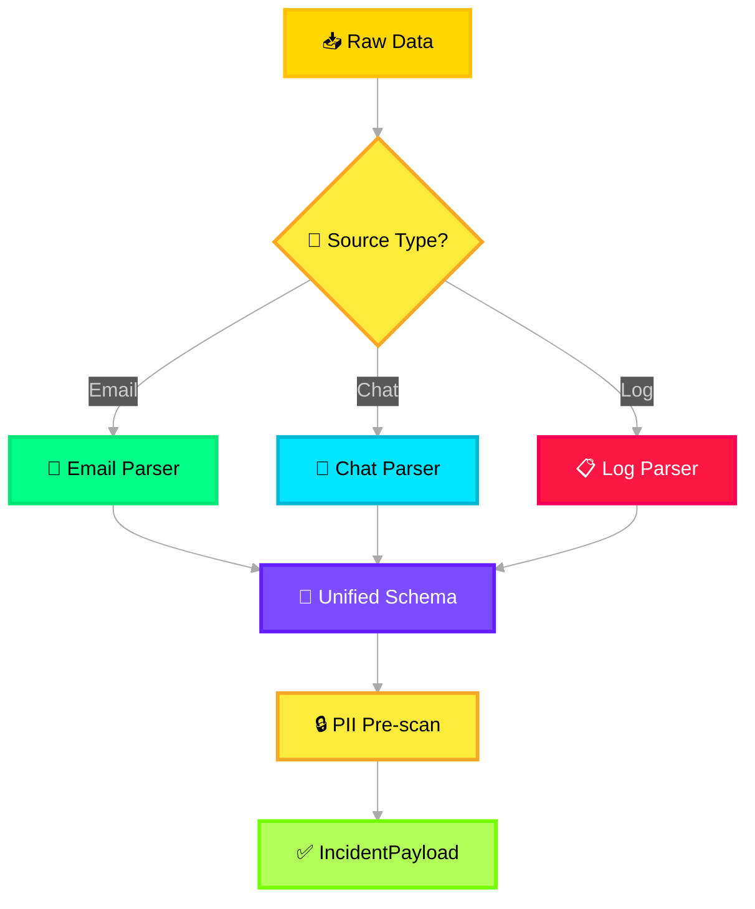

# 📨 Input Layer

> **Purpose**: Single entry point for all raw incident data. Normalizes heterogeneous inputs into a unified schema.

---

## What It Does

The Input Layer receives raw, unstructured incident data from multiple source types and transforms them into a common internal format before passing downstream. It does **not** perform any AI reasoning — it is a pure data ingestion and normalization layer.

## Input Sources

| Source | Format | Example |
|---|---|---|
| **Emails** | MIME/EML, raw text | Customer escalation emails, auto-generated alert emails |
| **Chat Transcripts** | JSON, structured messages | Teams/Slack ICM channel conversations, bridge call transcripts |
| **System Logs** | Syslog, JSON, CSV | Application logs, infrastructure alerts, monitoring output |

## Processing Logic



### Processing Steps

1. **Source Detection** — Identify incoming data type by content headers, file extension, or API endpoint
2. **Type-Specific Parsing** — Extract structured fields from each format using dedicated parsers
3. **Schema Unification** — Map all parsed data into the unified `IncidentPayload` schema
4. **PII Pre-scan** — Tag fields likely to contain PII (email addresses, phone numbers, names) for downstream masking
5. **Validation** — Reject malformed payloads with structured error responses

## Output Contract

```json
{
  "incident_id": "INC-2026-001234",
  "session_id": "uuid-v4",
  "timestamp": "2026-02-10T17:00:00Z",
  "source_type": "email | chat | log",
  "raw_content": "...",
  "parsed_fields": {
    "subject": "...",
    "participants": ["..."],
    "severity_hint": "sev2",
    "error_codes": ["E4012"],
    "timeline_entries": [
      { "timestamp": "...", "actor": "...", "action": "...", "content": "..." }
    ]
  },
  "pii_tags": ["field_x", "field_y"],
  "metadata": {
    "ingestion_time": "...",
    "parser_version": "1.0",
    "byte_size": 4096
  }
}
```

## Failure Handling

| Scenario | Action |
|---|---|
| **Malformed input** | Return 400 with validation errors; do not forward downstream |
| **Unsupported source type** | Log warning, queue for manual review |
| **Oversized payload** | Truncate to configurable max (default 100KB), attach truncation flag |

## Azure Mapping

| Component | Azure Service |
|---|---|
| Ingestion endpoint | Azure Functions (HTTP trigger) or Azure API Management |
| Queue buffering | Azure Service Bus |
| Blob storage (raw) | Azure Blob Storage |
