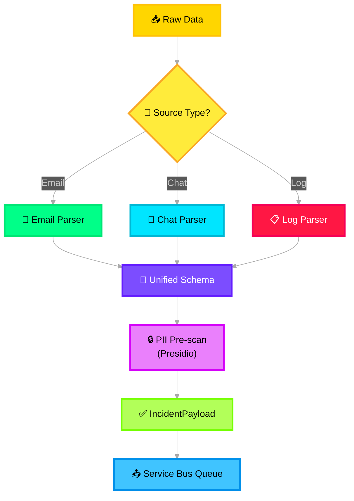

# 📨 Input Layer — Deep Dive

> **Purpose**: Single entry point for all raw incident data. Normalizes heterogeneous inputs into a unified `IncidentPayload` schema and performs PII pre-scanning before any downstream processing.

---

## Architecture Overview



---

## Azure Service Mapping

| Component | Azure Service | SKU / Config |
|---|---|---|
| Ingestion endpoint | **Azure Functions** (HTTP trigger, Python v2) | Consumption plan (auto-scale) |
| Raw blob archival | **Azure Blob Storage** | Hot tier, LRS redundancy |
| Async queue | **Azure Service Bus** | Standard tier, single topic `incident-ingested` |
| PII detection | **Microsoft Presidio** (self-hosted) | Runs in-process inside Azure Function |
| Monitoring | **Application Insights** | Connected via OpenTelemetry SDK |

---

## Azure Functions — HTTP Trigger Implementation

The Input Layer is deployed as an **Azure Function** (Python v2 programming model) that receives HTTP POST requests and publishes to Azure Service Bus:

```python
# src/icm_agents/core/input_layer.py

import azure.functions as func
from azure.servicebus import ServiceBusClient, ServiceBusMessage
from azure.storage.blob import BlobServiceClient
from azure.identity import DefaultAzureCredential
from presidio_analyzer import AnalyzerEngine
from pydantic import ValidationError
import json, os, hashlib
from datetime import datetime, timezone
from icm_agents.models.incident import IncidentPayload

# ── Clients ──────────────────────────────────────────────
credential = DefaultAzureCredential()
blob_client = BlobServiceClient(
    account_url=os.getenv("STORAGE_ACCOUNT_URL"),
    credential=credential,
)
sb_client = ServiceBusClient(
    fully_qualified_namespace=os.getenv("SERVICE_BUS_NAMESPACE"),
    credential=credential,
)
analyzer = AnalyzerEngine()  # Presidio PII analyzer

app = func.FunctionApp()


@app.function_name("IngestIncident")
@app.route(route="ingest", methods=["POST"], auth_level=func.AuthLevel.FUNCTION)
async def ingest_incident(req: func.HttpRequest) -> func.HttpResponse:
    """
    HTTP trigger: receive raw incident data → parse → PII scan → enqueue.
    """
    # 1. Detect source type from Content-Type or explicit header
    source_type = req.headers.get("X-Source-Type", _detect_source(req))

    # 2. Parse raw body
    raw_body = req.get_body().decode("utf-8")

    # 3. Archive raw data to Blob Storage (immutable audit trail)
    blob_name = f"{datetime.now(timezone.utc).strftime('%Y/%m/%d')}/{hashlib.sha256(raw_body.encode()).hexdigest()[:16]}.json"
    container = blob_client.get_container_client("raw-incidents")
    container.upload_blob(blob_name, raw_body, overwrite=False)

    # 4. Route to type-specific parser
    parser = _get_parser(source_type)
    parsed_fields = parser.parse(raw_body)

    # 5. PII pre-scan with Presidio
    pii_results = analyzer.analyze(text=raw_body, language="en")
    pii_tags = list({r.entity_type for r in pii_results})

    # 6. Build IncidentPayload (Pydantic validation)
    try:
        payload = IncidentPayload(
            incident_id=f"INC-{datetime.now(timezone.utc).strftime('%Y')}-{hashlib.sha256(raw_body.encode()).hexdigest()[:6]}",
            source_type=source_type,
            raw_content=raw_body,
            parsed_fields=parsed_fields,
            pii_tags=pii_tags,
            metadata={
                "ingestion_time": datetime.now(timezone.utc).isoformat(),
                "parser_version": "1.0",
                "byte_size": len(raw_body),
                "blob_ref": blob_name,
            },
        )
    except ValidationError as e:
        return func.HttpResponse(
            body=json.dumps({"status": "rejected", "errors": e.errors()}),
            status_code=400,
            mimetype="application/json",
        )

    # 7. Publish to Service Bus for async downstream processing
    sender = sb_client.get_topic_sender("incident-ingested")
    message = ServiceBusMessage(
        body=payload.model_dump_json(),
        content_type="application/json",
        subject=source_type,
        application_properties={"incident_id": payload.incident_id},
    )
    await sender.send_messages(message)

    return func.HttpResponse(
        body=json.dumps({"status": "accepted", "incident_id": payload.incident_id}),
        status_code=202,
        mimetype="application/json",
    )


def _detect_source(req: func.HttpRequest) -> str:
    content_type = req.headers.get("Content-Type", "")
    if "message/rfc822" in content_type or "eml" in content_type:
        return "email"
    elif "application/json" in content_type:
        return "chat"
    return "log"


def _get_parser(source_type: str):
    from icm_agents.core.parsers import EmailParser, ChatParser, LogParser
    return {"email": EmailParser, "chat": ChatParser, "log": LogParser}[source_type]()
```

---

## Pydantic Data Contract

```python
# src/icm_agents/models/incident.py

from pydantic import BaseModel, Field
from typing import Literal
from datetime import datetime
import uuid


class TimelineEntry(BaseModel):
    timestamp: datetime
    actor: str
    action: str
    content: str


class ParsedFields(BaseModel):
    subject: str | None = None
    participants: list[str] = Field(default_factory=list)
    severity_hint: str | None = None
    error_codes: list[str] = Field(default_factory=list)
    timeline_entries: list[TimelineEntry] = Field(default_factory=list)


class IncidentPayload(BaseModel):
    """Canonical schema for all ingested incident data."""
    incident_id: str
    session_id: str = Field(default_factory=lambda: str(uuid.uuid4()))
    timestamp: datetime = Field(default_factory=lambda: datetime.now())
    source_type: Literal["email", "chat", "log"]
    raw_content: str
    parsed_fields: ParsedFields
    pii_tags: list[str] = Field(default_factory=list)
    metadata: dict = Field(default_factory=dict)
```

---

## Presidio PII Pre-scan Configuration

```python
# src/icm_agents/governance/pii_masking.py

from presidio_analyzer import AnalyzerEngine, PatternRecognizer, Pattern
from presidio_anonymizer import AnonymizerEngine
from presidio_anonymizer.entities import OperatorConfig

# Custom recognizer for Azure resource IDs
azure_resource_pattern = Pattern(
    name="azure_resource_id",
    regex=r"/subscriptions/[a-f0-9\-]{36}/resourceGroups/[\w\-]+",
    score=0.85,
)
azure_recognizer = PatternRecognizer(
    supported_entity="AZURE_RESOURCE_ID",
    patterns=[azure_resource_pattern],
)

# Initialize engines
analyzer = AnalyzerEngine()
analyzer.registry.add_recognizer(azure_recognizer)
anonymizer = AnonymizerEngine()

# Recognized PII entities
ENTITIES = [
    "PERSON", "EMAIL_ADDRESS", "PHONE_NUMBER", "IP_ADDRESS",
    "CREDIT_CARD", "US_SSN", "AZURE_RESOURCE_ID",
]


def scan_and_tag(text: str) -> tuple[list[str], str]:
    """Scan text for PII, return (tags, redacted_text)."""
    results = analyzer.analyze(text=text, entities=ENTITIES, language="en")
    tags = list({r.entity_type for r in results})

    redacted = anonymizer.anonymize(
        text=text,
        analyzer_results=results,
        operators={
            "PERSON": OperatorConfig("replace", {"new_value": "[PERSON]"}),
            "EMAIL_ADDRESS": OperatorConfig("replace", {"new_value": "[EMAIL]"}),
            "IP_ADDRESS": OperatorConfig("replace", {"new_value": "[IP_ADDR]"}),
            "DEFAULT": OperatorConfig("replace", {"new_value": "[REDACTED]"}),
        },
    )
    return tags, redacted.text
```

---

## Failure Handling

| Scenario | Action | Azure Service |
|---|---|---|
| **Malformed input** | Return 400 with Pydantic errors; do not forward | Azure Functions HTTP response |
| **Unsupported source type** | Log warning, queue for manual review | App Insights warning + Service Bus dead-letter |
| **Oversized payload** | Truncate to 100KB, set `truncated=true` flag | Blob Storage archives full payload |
| **Service Bus unavailable** | Retry with exponential backoff (3 attempts) | Azure Functions retry policy |
| **Presidio failure** | Skip PII scan, flag `pii_scan_failed=true`, continue | Degraded mode with alert |

---

## Environment Variables

```env
STORAGE_ACCOUNT_URL=https://<account>.blob.core.windows.net
SERVICE_BUS_NAMESPACE=<namespace>.servicebus.windows.net
APPLICATIONINSIGHTS_CONNECTION_STRING=InstrumentationKey=...
```

---

## Foundry Integration Point

The Input Layer is a **non-agent module** — it does not use Azure AI Foundry Agent Service directly. However, it feeds the pipeline by publishing `IncidentPayload` messages to Azure Service Bus, which are consumed by the Context Manager. The Foundry agents downstream receive already-parsed, PII-tagged data.
