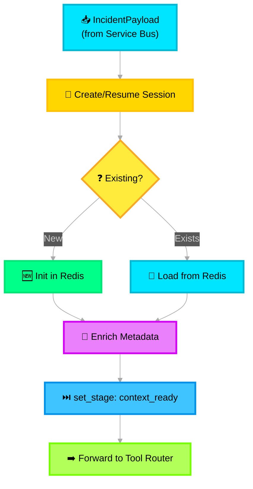

# 📋 Context Manager — Deep Dive

> **Purpose**: Manage session context across the pipeline using Azure Cache for Redis (hot) and Azure Cosmos DB (warm). Tracks conversation state, incident metadata, and stage transitions.

---

## Architecture Overview



---

## Azure Service Mapping

| Component | Azure Service | Config |
|---|---|---|
| Hot session store | **Azure Cache for Redis** | Premium P1, 6GB, cluster mode |
| Warm archive | **Azure Cosmos DB** (NoSQL) | Serverless, `sessions` container, partition key: `/incident_id` |
| Session TTL | Redis `EXPIRE` | 24 hours (86400s) |
| Eviction on expiry | Redis keyspace notifications → Azure Function | Archive to Cosmos DB before eviction |

---

## Redis Session Implementation

```python
# src/icm_agents/core/context_manager.py

import redis.asyncio as redis
import json, os
from datetime import datetime, timezone
from typing import Optional
from azure.identity import DefaultAzureCredential
from azure.cosmos.aio import CosmosClient
from icm_agents.models.incident import IncidentPayload
from pydantic import BaseModel, Field


class SessionContext(BaseModel):
    """Mutable context object that flows through every pipeline module."""
    session_id: str
    incident_id: str
    created_at: str = Field(default_factory=lambda: datetime.now(timezone.utc).isoformat())
    current_stage: str = "ingested"
    stage_history: list[dict] = Field(default_factory=list)
    incident_metadata: dict = Field(default_factory=dict)
    accumulated_data: dict = Field(default_factory=dict)
    flags: dict = Field(default_factory=dict)


class ContextManager:
    """
    Manages session lifecycle with Redis (hot) + Cosmos DB (warm).
    
    Azure Cache for Redis stores active sessions with 24h TTL.
    On TTL expiry, sessions are archived to Cosmos DB for long-term analysis.
    """

    SESSION_TTL = 86400  # 24 hours
    REDIS_PREFIX = "session:"

    def __init__(self):
        # Azure Cache for Redis (TLS required on Azure)
        self.redis = redis.Redis(
            host=os.getenv("REDIS_HOST"),            # <name>.redis.cache.windows.net
            port=6380,
            password=os.getenv("REDIS_KEY"),
            ssl=True,
            decode_responses=True,
        )
        # Azure Cosmos DB (async client)
        self.cosmos = CosmosClient(
            url=os.getenv("COSMOS_ENDPOINT"),
            credential=DefaultAzureCredential(),
        )
        self.cosmos_db = self.cosmos.get_database_client("icm-system")
        self.cosmos_container = self.cosmos_db.get_container_client("sessions")

    async def get_or_create(self, payload: IncidentPayload) -> SessionContext:
        """
        Load existing session for the incident, or create a new one.
        Enables multi-turn incident processing.
        """
        key = f"{self.REDIS_PREFIX}{payload.incident_id}"
        existing = await self.redis.get(key)

        if existing:
            ctx = SessionContext.model_validate_json(existing)
            ctx.current_stage = "context_resumed"
            self._append_stage(ctx, "context_resumed", "context_manager")
        else:
            ctx = SessionContext(
                session_id=payload.session_id,
                incident_id=payload.incident_id,
                incident_metadata={
                    "source_type": payload.source_type,
                    "severity_hint": payload.parsed_fields.severity_hint,
                    "participants": payload.parsed_fields.participants,
                },
                flags={
                    "pii_detected": len(payload.pii_tags) > 0,
                    "high_priority": payload.parsed_fields.severity_hint in ("sev0", "sev1"),
                },
            )
            self._append_stage(ctx, "ingested", "input_layer")
            self._append_stage(ctx, "context_ready", "context_manager")

        ctx.current_stage = "context_ready"
        await self._persist(ctx)
        return ctx

    async def update_stage(self, incident_id: str, stage: str, module: str) -> SessionContext:
        """Advance the pipeline stage with audit trail."""
        ctx = await self._load(incident_id)
        ctx.current_stage = stage
        self._append_stage(ctx, stage, module)
        await self._persist(ctx)
        return ctx

    async def enrich(self, incident_id: str, key: str, data: dict) -> None:
        """Append data to accumulated_data (downstream modules write here)."""
        ctx = await self._load(incident_id)
        ctx.accumulated_data[key] = data
        await self._persist(ctx)

    async def archive_to_cosmos(self, incident_id: str) -> None:
        """Archive session to Cosmos DB (called before Redis TTL eviction)."""
        ctx = await self._load(incident_id)
        await self.cosmos_container.upsert_item(
            body={
                "id": ctx.session_id,
                "incident_id": ctx.incident_id,
                "partitionKey": ctx.incident_id,
                **ctx.model_dump(),
            }
        )

    # ── Private helpers ─────────────────────────────────
    async def _load(self, incident_id: str) -> SessionContext:
        key = f"{self.REDIS_PREFIX}{incident_id}"
        data = await self.redis.get(key)
        if not data:
            raise KeyError(f"Session not found: {incident_id}")
        return SessionContext.model_validate_json(data)

    async def _persist(self, ctx: SessionContext) -> None:
        key = f"{self.REDIS_PREFIX}{ctx.incident_id}"
        await self.redis.setex(key, self.SESSION_TTL, ctx.model_dump_json())

    def _append_stage(self, ctx: SessionContext, stage: str, module: str) -> None:
        ctx.stage_history.append({
            "stage": stage,
            "timestamp": datetime.now(timezone.utc).isoformat(),
            "module": module,
        })
```

---

## Redis Data Layout

```
KEY:   session:INC-2026-001234
TYPE:  String (JSON serialized SessionContext)
TTL:   86400 seconds (24 hours)

VALUE: {
  "session_id": "uuid-v4",
  "incident_id": "INC-2026-001234",
  "current_stage": "context_ready",
  "stage_history": [...],
  "incident_metadata": {...},
  "accumulated_data": {},
  "flags": {"pii_detected": true, "high_priority": false}
}
```

---

## Cosmos DB Session Archive Schema

```json
{
  "id": "session-uuid-v4",
  "incident_id": "INC-2026-001234",
  "partitionKey": "INC-2026-001234",
  "created_at": "2026-02-10T17:00:00Z",
  "current_stage": "output_ready",
  "stage_history": [
    {"stage": "ingested",       "timestamp": "...", "module": "input_layer"},
    {"stage": "context_ready",  "timestamp": "...", "module": "context_manager"},
    {"stage": "summarizing",    "timestamp": "...", "module": "summarizer_agent"},
    {"stage": "categorized",    "timestamp": "...", "module": "summarizer_agent"},
    {"stage": "delegating",     "timestamp": "...", "module": "supervisor_agent"},
    {"stage": "output_ready",   "timestamp": "...", "module": "output_layer"}
  ],
  "accumulated_data": {
    "categorization": {"noise_signals": [...], "impact_signals": [...]},
    "evaluation": {"composite_score": 0.87}
  },
  "_ts": 1707580800
}
```

> **Cosmos DB config**: Serverless capacity mode, `/incident_id` partition key, default indexing policy. The `_ts` system property enables time-range queries for analytics.

---

## Stage Transition Validation

```python
# Valid state transitions (enforced by set_stage)
VALID_TRANSITIONS = {
    "ingested":               ["context_ready"],
    "context_ready":          ["summarizing"],
    "summarizing":            ["categorized", "error"],
    "categorized":            ["delegating"],
    "delegating":             ["processing_noise", "processing_impact", "processing_mitigation"],
    "processing_noise":       ["evaluated"],
    "processing_impact":      ["evaluated"],
    "processing_mitigation":  ["output_ready"],  # WF-25 bypasses Evaluator
    "evaluated":              ["output_ready"],
    "error":                  ["summarizing"],    # Retry
}
```

---

## Environment Variables

```env
REDIS_HOST=icm-redis.redis.cache.windows.net
REDIS_KEY=<primary-access-key>
COSMOS_ENDPOINT=https://icm-cosmos.documents.azure.com:443/
```

---

## Foundry Integration Point

The Context Manager is a **non-agent infrastructure module**. It does not run as a Foundry Hosted Agent. However, every Foundry-hosted agent (Summarizer, Noise, Impact, Mitigation) calls back to the Context Manager to:
- Read session state before processing
- Write stage transitions after processing
- Append results to `accumulated_data`

The MAF Supervisor workflow accesses the Context Manager through the Tool Router to check session state before delegation.
