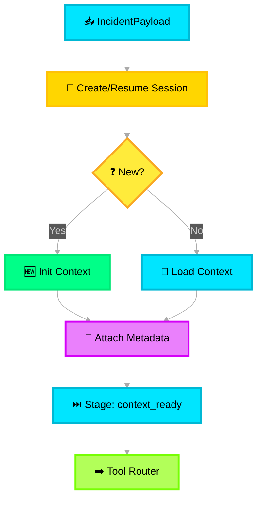

# 📋 Context Manager

> **Purpose**: Manage session context across the pipeline. Tracks conversation state, incident metadata, and ensures all downstream modules operate with shared awareness.

---

## What It Does

The Context Manager acts as the **stateful backbone** of each processing run. It initializes a session when new incident data arrives, maintains a mutable context object that flows through every module, and persists session state for multi-turn or long-running incident processing.

## Design Logic



## Context Object Structure

```json
{
  "session_id": "uuid-v4",
  "incident_id": "INC-2026-001234",
  "created_at": "2026-02-10T17:00:00Z",
  "current_stage": "context_ready",
  "stage_history": [
    { "stage": "ingested", "timestamp": "...", "module": "input_layer" },
    { "stage": "context_ready", "timestamp": "...", "module": "context_manager" }
  ],
  "incident_metadata": {
    "source_type": "email",
    "severity_hint": "sev2",
    "participants": ["alice@contoso.com"],
    "service_tree": "Azure/Compute/VM"
  },
  "accumulated_data": {},
  "flags": {
    "pii_detected": true,
    "high_priority": false
  }
}
```

## Key Behaviors

| Behavior | Logic |
|---|---|
| **Session Resumption** | If an `incident_id` already has an active session, load it rather than creating new — enables multi-turn processing |
| **Stage Tracking** | Every module updates `current_stage` and appends to `stage_history`, creating an audit trail |
| **Context Enrichment** | Downstream modules can write to `accumulated_data` (e.g., Summarizer adds categories, Impact Agent adds severity) |
| **TTL Expiration** | Sessions older than 24h without updates are archived to cold storage |

## Azure Mapping

| Component | Azure Service |
|---|---|
| Session store | Azure Cache for Redis (hot) + Azure Cosmos DB (warm) |
| Session TTL / eviction | Redis TTL policies |
