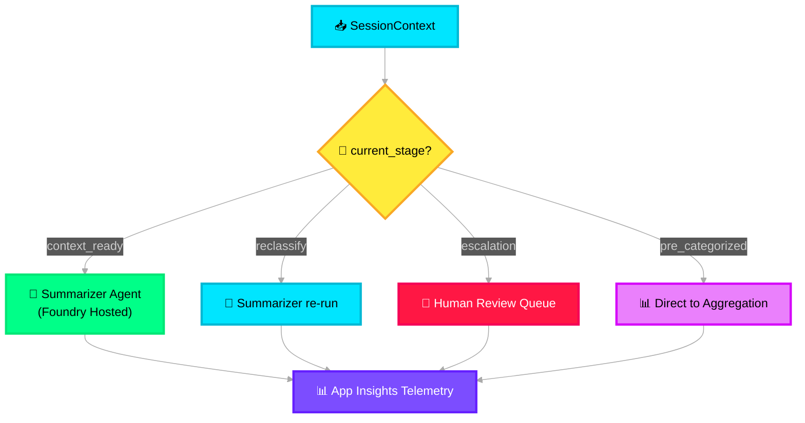

# 🔀 Tool Router — Deep Dive

> **Purpose**: Deterministic dispatch layer that routes contextualized payloads to the appropriate Foundry agents or tools. No LLM — pure rule-based conditional logic.

---

## Architecture Overview



---

## Azure Service Mapping

| Component | Azure Service | Purpose |
|---|---|---|
| Telemetry | **Application Insights** | Log every routing decision with trace correlation |
| Config store | **Azure App Configuration** | Hot-reload the tool registry without redeployment |
| Human escalation queue | **Azure Service Bus** | Dead-letter queue for manual review |

---

## Tool Router Implementation

```python
# src/icm_agents/core/tool_router.py

import os, time
from dataclasses import dataclass
from typing import Callable, Optional
from azure.appconfiguration import AzureAppConfigurationClient
from azure.identity import DefaultAzureCredential
from opentelemetry import trace

from icm_agents.core.context_manager import SessionContext

tracer = trace.get_tracer("icm.tool_router")


@dataclass
class ToolRegistration:
    """A registered tool/agent in the dispatch table."""
    tool_id: str
    description: str
    trigger_stage: str
    priority: int
    enabled: bool
    handler: Callable  # async callable that processes the request


class ToolRouter:
    """
    Deterministic dispatch — no LLM calls.
    Routes based on SessionContext.current_stage and flags.
    Registry is loaded from Azure App Configuration for hot-reload.
    """

    def __init__(self):
        self._registry: list[ToolRegistration] = []
        self._app_config = AzureAppConfigurationClient(
            base_url=os.getenv("APP_CONFIG_ENDPOINT"),
            credential=DefaultAzureCredential(),
        )
        self._load_registry()

    def _load_registry(self) -> None:
        """Load tool registry from Azure App Configuration."""
        settings = self._app_config.list_configuration_settings(
            key_filter="tool-router/*"
        )
        for setting in settings:
            # Keys like: tool-router/summarizer_agent
            tool_id = setting.key.split("/")[-1]
            config = eval(setting.value)  # JSON string → dict
            self._registry.append(ToolRegistration(
                tool_id=tool_id,
                description=config["description"],
                trigger_stage=config["trigger_stage"],
                priority=config["priority"],
                enabled=config.get("enabled", True),
                handler=self._resolve_handler(tool_id),
            ))
        # Sort by priority (lower = higher priority)
        self._registry.sort(key=lambda t: t.priority)

    def _resolve_handler(self, tool_id: str) -> Callable:
        """Resolve tool_id to its handler function."""
        from icm_agents.agents.summarizer import SummarizerAgent
        from icm_agents.core.aggregated_results import AggregatedResultsLayer

        handlers = {
            "summarizer_agent": SummarizerAgent().process,
            "aggregated_results": AggregatedResultsLayer().process,
        }
        return handlers.get(tool_id, self._default_handler)

    async def route(self, ctx: SessionContext) -> dict:
        """
        Match context to the highest-priority enabled tool and dispatch.
        Logs every decision to Application Insights via OpenTelemetry.
        """
        with tracer.start_as_current_span("tool_router.route") as span:
            span.set_attribute("incident_id", ctx.incident_id)
            span.set_attribute("current_stage", ctx.current_stage)

            start = time.monotonic()

            # Find matching tool
            matched = self._find_match(ctx)

            if not matched:
                span.set_attribute("route.result", "no_match")
                span.set_attribute("route.action", "escalate")
                return await self._escalate(ctx)

            span.set_attribute("route.result", matched.tool_id)
            span.set_attribute("route.priority", matched.priority)

            # Dispatch to handler
            result = await matched.handler(ctx)

            elapsed = (time.monotonic() - start) * 1000
            span.set_attribute("route.latency_ms", elapsed)

            return result

    def _find_match(self, ctx: SessionContext) -> Optional[ToolRegistration]:
        """Find first enabled tool whose trigger_stage matches."""
        for tool in self._registry:
            if tool.enabled and tool.trigger_stage == ctx.current_stage:
                return tool
        return None

    async def _escalate(self, ctx: SessionContext) -> dict:
        """No matching tool — send to human review via Service Bus."""
        from azure.servicebus import ServiceBusClient, ServiceBusMessage
        sb = ServiceBusClient(
            fully_qualified_namespace=os.getenv("SERVICE_BUS_NAMESPACE"),
            credential=DefaultAzureCredential(),
        )
        sender = sb.get_queue_sender("human-review")
        await sender.send_messages(
            ServiceBusMessage(body=ctx.model_dump_json(), subject="escalation")
        )
        return {"status": "escalated", "incident_id": ctx.incident_id}

    async def _default_handler(self, ctx: SessionContext) -> dict:
        return {"status": "no_handler", "incident_id": ctx.incident_id}
```

---

## Azure App Configuration — Tool Registry

```json
// Key: tool-router/summarizer_agent
{
  "description": "Normalize and categorize incident data via Foundry Agent",
  "trigger_stage": "context_ready",
  "priority": 1,
  "enabled": true
}

// Key: tool-router/direct_impact
{
  "description": "Skip summarization for pre-categorized incidents",
  "trigger_stage": "pre_categorized",
  "priority": 2,
  "enabled": false
}
```

> **Hot-reload**: Azure App Configuration supports feature flags and dynamic configuration. The Tool Router can poll for changes every 30 seconds, enabling you to enable/disable tools without redeployment.

---

## OpenTelemetry Trace Correlation

Every routing decision emits a structured trace to Application Insights:

```json
{
  "trace_id": "4bf92f3577b34da6a3ce929d0e0e4736",
  "span_name": "tool_router.route",
  "attributes": {
    "incident_id": "INC-2026-001234",
    "current_stage": "context_ready",
    "route.result": "summarizer_agent",
    "route.priority": 1,
    "route.latency_ms": 2.3
  }
}
```

---

## Environment Variables

```env
APP_CONFIG_ENDPOINT=https://icm-appconfig.azconfig.io
SERVICE_BUS_NAMESPACE=icm-bus.servicebus.windows.net
APPLICATIONINSIGHTS_CONNECTION_STRING=InstrumentationKey=...
```

---

## MAF / Foundry Integration

The Tool Router itself is a **non-agent module**, but it dispatches to **Foundry Hosted Agents**. When routing to the Summarizer Agent, it invokes the agent through the Azure AI Foundry Python SDK (`azure-ai-projects`), creating a thread and run on the hosted agent. The MAF Supervisor workflow later uses a similar dispatch pattern for the three workflow agents.
