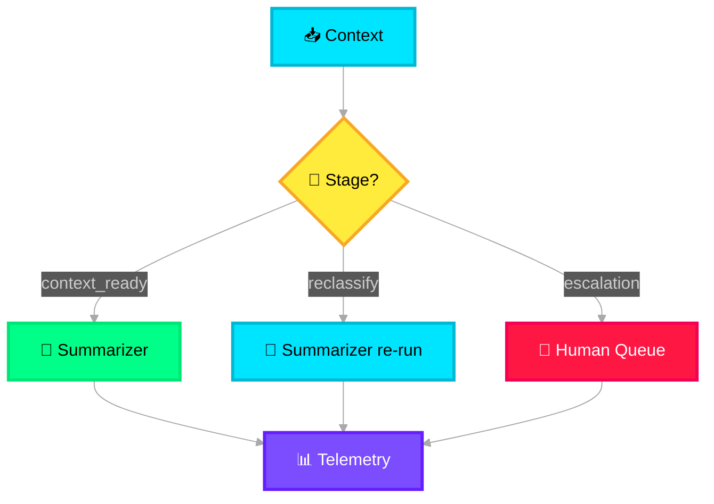

# 🔀 Tool Router

> **Purpose**: Routes contextualized payloads to the appropriate tools and agents. Acts as a dynamic dispatch registry.

---

## What It Does

The Tool Router is a **deterministic dispatch layer** — it does not use AI. It inspects the context and routes to the correct downstream module based on rules and configuration. In the primary flow, it routes to the Summarizer Agent, but it is designed to support dynamic tool registration for extensibility.

## Routing Logic



## Tool Registry Model

```json
{
  "tools": [
    {
      "tool_id": "summarizer_agent",
      "description": "Normalize and categorize incident data",
      "input_schema": "IncidentPayload",
      "trigger_conditions": ["stage == 'context_ready'"],
      "priority": 1,
      "enabled": true
    },
    {
      "tool_id": "direct_impact_assessment",
      "description": "Skip summarization for pre-categorized incidents",
      "input_schema": "IncidentPayload",
      "trigger_conditions": ["stage == 'pre_categorized'"],
      "priority": 2,
      "enabled": false
    }
  ]
}
```

## Key Behaviors

| Behavior | Logic |
|---|---|
| **Rule-based routing** | No LLM calls — pure conditional logic based on `current_stage` and `flags` |
| **Extensible registry** | New tools/agents registered via config, not code changes |
| **Priority resolution** | When multiple tools match, highest priority wins |
| **Telemetry emission** | Logs every routing decision to Observability layer with latency, destination, and context snapshot |

## Connection to Observability

The Tool Router has a **dotted-line connection** to Observability & Control, meaning every routing decision is logged but the router itself is not controlled by the observability layer.
