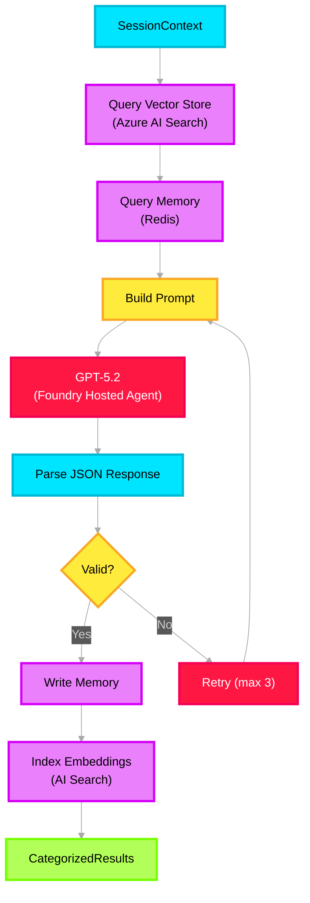

# 🤖 Summarizer Agent — Deep Dive

> **Purpose**: First-pass AI agent — normalizes raw incident data, categorizes into Noise/Impact/Mitigation signals. Deployed as a **Foundry Hosted Agent** using the Azure AI Foundry Agent Service SDK.

---

## Architecture Overview



---

## Azure Service Mapping

| Component | Azure Service | Config |
|---|---|---|
| Agent runtime | **Azure AI Foundry Agent Service** | Foundry Hosted Agent, auto-scaling |
| LLM | **Azure OpenAI GPT-5.2** | Deployed via Foundry model catalog |
| Vector retrieval | **Azure AI Search** | Vector search profile, cosine similarity |
| Session memory | **Azure Cache for Redis** | Via Context Manager |
| Embeddings | **Azure OpenAI** `text-embedding-3-large` | 1536-dim, via Foundry |

---

## Foundry Hosted Agent — SDK Implementation

```python
# src/icm_agents/agents/summarizer.py

import os, json
from azure.ai.projects import AIProjectClient
from azure.ai.agents.models import FunctionTool, ToolSet
from azure.identity import DefaultAzureCredential
from opentelemetry import trace

from icm_agents.agents.base import BaseAgent
from icm_agents.core.context_manager import SessionContext
from icm_agents.core.vector_store import VectorStore
from icm_agents.core.memory_manager import MemoryManager
from icm_agents.models.results import CategorizedResults

tracer = trace.get_tracer("icm.summarizer")


# ── Tool functions the agent can call ────────────────────
def search_similar_incidents(query: str, top_k: int = 5) -> str:
    """Search Vector Store for semantically similar past incidents."""
    vs = VectorStore()
    results = vs.search(query_text=query, top_k=top_k)
    return json.dumps(results)


def read_session_memory(incident_id: str) -> str:
    """Read current session state and accumulated data from Redis."""
    mm = MemoryManager()
    state = mm.read_session(incident_id)
    return json.dumps(state)


def write_session_memory(incident_id: str, key: str, data: str) -> str:
    """Write categorization results back to session memory."""
    mm = MemoryManager()
    mm.write_session(incident_id, key, json.loads(data))
    return json.dumps({"status": "written"})


# ── Tool definitions for Foundry Agent ───────────────────
TOOLS = [
    {
        "type": "function",
        "function": {
            "name": "search_similar_incidents",
            "description": "Search for semantically similar past incidents in the Vector Store",
            "parameters": {
                "type": "object",
                "properties": {
                    "query": {"type": "string", "description": "Text to search for"},
                    "top_k": {"type": "integer", "description": "Number of results", "default": 5},
                },
                "required": ["query"],
            },
        },
    },
    {
        "type": "function",
        "function": {
            "name": "read_session_memory",
            "description": "Read the current session state and accumulated data",
            "parameters": {
                "type": "object",
                "properties": {
                    "incident_id": {"type": "string", "description": "The incident ID"},
                },
                "required": ["incident_id"],
            },
        },
    },
]

# ── Map function names to callables ──────────────────────
TOOL_MAP = {
    "search_similar_incidents": search_similar_incidents,
    "read_session_memory": read_session_memory,
    "write_session_memory": write_session_memory,
}


class SummarizerAgent(BaseAgent):
    """
    Foundry Hosted Agent that categorizes incident data into
    Noise, Impact, and Mitigation signals using GPT-5.2.
    
    Uses the Azure AI Foundry Agent Service SDK:
    - Creates an agent with custom function tools
    - Creates a thread per incident session
    - Runs the agent and processes tool calls
    - Parses structured JSON output
    """

    SYSTEM_PROMPT = """You are an Incident Categorization Agent for a cloud infrastructure 
incident management system. Your role is to analyze raw incident data and 
categorize it into three domains: Noise, Impact, and Mitigation.

BEFORE categorizing:
1. Call search_similar_incidents to find past incidents similar to this one
2. Call read_session_memory to load any existing session context

THEN categorize the incident data:
1. NOISE signals — irrelevant, duplicate, or low-value entries
2. IMPACT signals — business impact, customer impact, SLA breaches  
3. MITIGATION signals — actions taken, runbook references, resolution steps

OUTPUT (strict JSON):
{
  "noise_signals": [{"content": "...", "source": "email|chat|log", "confidence": 0.0-1.0, "reason": "..."}],
  "impact_signals": [{"content": "...", "source": "...", "confidence": 0.0-1.0, "severity": "sev0-3", "affected_service": "..."}],
  "mitigation_signals": [{"content": "...", "source": "...", "confidence": 0.0-1.0, "action_type": "...", "runbook_ref": "..."}],
  "cross_category_notes": "...",
  "confidence_score": 0.0-1.0
}"""

    def __init__(self):
        self.client = AIProjectClient(
            endpoint=os.getenv("PROJECT_ENDPOINT"),
            credential=DefaultAzureCredential(),
        )
        self._agent_id = None

    async def initialize(self) -> None:
        """Create the Foundry agent with function tools."""
        functions = FunctionTool(functions=TOOLS)
        toolset = ToolSet()
        toolset.add(functions)

        agent = self.client.agents.create_agent(
            model=os.getenv("MODEL_DEPLOYMENT_NAME"),  # gpt-5.2
            name="summarizer-agent",
            instructions=self.SYSTEM_PROMPT,
            toolset=toolset,
        )
        self._agent_id = agent.id

    async def process(self, ctx: SessionContext) -> CategorizedResults:
        """Run categorization on incident data through Foundry Agent Service."""
        with tracer.start_as_current_span("summarizer.process") as span:
            span.set_attribute("incident_id", ctx.incident_id)

            if not self._agent_id:
                await self.initialize()

            # 1. Create a thread for this incident session
            thread = self.client.agents.threads.create()

            # 2. Send the incident data as a user message
            self.client.agents.messages.create(
                thread_id=thread.id,
                role="user",
                content=f"Categorize this incident data:\n\n"
                        f"Incident ID: {ctx.incident_id}\n"
                        f"Source: {ctx.incident_metadata.get('source_type')}\n"
                        f"Severity hint: {ctx.incident_metadata.get('severity_hint')}\n"
                        f"Data:\n{json.dumps(ctx.accumulated_data.get('raw_parsed', {}), indent=2)}",
            )

            # 3. Run the agent (handles tool calls automatically with toolset)
            run = self.client.agents.runs.create_and_process(
                thread_id=thread.id,
                agent_id=self._agent_id,
            )

            if run.status == "failed":
                span.set_attribute("error", True)
                raise RuntimeError(f"Summarizer run failed: {run.last_error}")

            # 4. Extract the final message
            messages = self.client.agents.messages.list(thread_id=thread.id)
            last_msg = next(m for m in messages if m.role == "assistant")
            content = last_msg.content[0].text.value

            # 5. Parse into Pydantic model
            result = CategorizedResults.model_validate_json(content)

            span.set_attribute("overall_confidence", result.confidence_score)
            span.set_attribute("noise_count", len(result.noise_signals))
            span.set_attribute("impact_count", len(result.impact_signals))
            span.set_attribute("mitigation_count", len(result.mitigation_signals))

            # 6. Cleanup
            self.client.agents.threads.delete(thread.id)

            return result
```

---

## Foundry Agent Configuration

| Setting | Value |
|---|---|
| **Agent Name** | `summarizer-agent` |
| **Model** | `gpt-5.2` (Foundry model catalog deployment) |
| **Tools** | `search_similar_incidents`, `read_session_memory`, `write_session_memory` |
| **Hosting** | Foundry Hosted Agent (managed containerized runtime, auto-scaling) |
| **Content Filters** | Foundry built-in content safety filters (enabled by default) |
| **Max tokens** | 4096 completion tokens |
| **Temperature** | 0.1 (low — we want deterministic categorization) |

---

## Output Contract — CategorizedResults

```python
# src/icm_agents/models/results.py

from pydantic import BaseModel, Field


class NoiseSignal(BaseModel):
    content: str
    source: str
    confidence: float = Field(ge=0.0, le=1.0)
    reason: str


class ImpactSignal(BaseModel):
    content: str
    source: str
    confidence: float = Field(ge=0.0, le=1.0)
    severity: str
    affected_service: str


class MitigationSignal(BaseModel):
    content: str
    source: str
    confidence: float = Field(ge=0.0, le=1.0)
    action_type: str
    runbook_ref: str | None = None


class CategorizedResults(BaseModel):
    noise_signals: list[NoiseSignal] = Field(default_factory=list)
    impact_signals: list[ImpactSignal] = Field(default_factory=list)
    mitigation_signals: list[MitigationSignal] = Field(default_factory=list)
    cross_category_notes: str = ""
    confidence_score: float = Field(ge=0.0, le=1.0)
```

---

## Environment Variables

```env
PROJECT_ENDPOINT=https://<project>.services.ai.azure.com
MODEL_DEPLOYMENT_NAME=gpt-5.2
```
