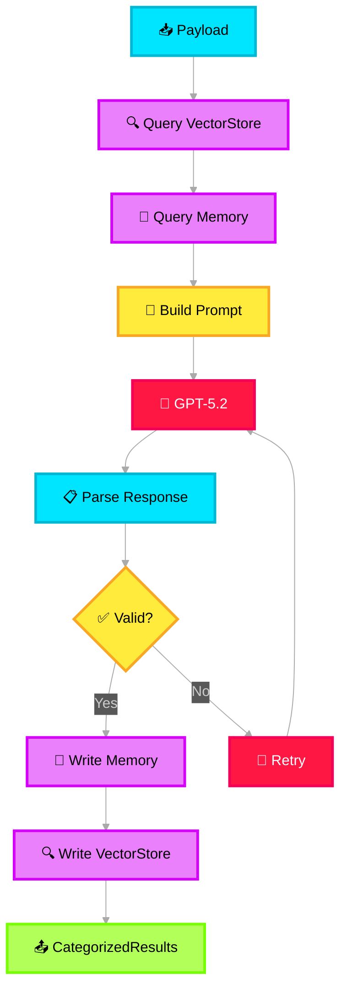

# 🤖 Summarizer Agent

> **Purpose**: First-pass AI agent that normalizes raw incident data, categorizes it into structured topics, clusters related signals, and aggregates them into structured documents. Deployed as a **Foundry Hosted Agent** with the MAF hosting adapter.

---

## What It Does

This is the **first LLM-powered module** in the pipeline, deployed as a **Foundry Hosted Agent**. It takes the contextualized incident payload and uses GPT-5.2 (via Azure AI Foundry) to:

1. Normalize heterogeneous text (emails, chats, logs) into consistent language
2. Categorize content into topic clusters (impact signals, noise signals, mitigation signals)
3. Generate structured summaries for each category
4. Read from and write to both **Memory Manager** and **Vector Store** (bidirectional)

## Processing Pipeline



## Bidirectional Memory Interaction

| Direction | Target | What |
|---|---|---|
| **Read** from Vector Store | Retrieve top-K similar past incidents by semantic similarity to current raw data |
| **Read** from Memory Manager | Load current session state, any partial results from previous runs, and cross-incident learnings |
| **Write** to Vector Store | Index embeddings of the newly categorized content for future retrieval |
| **Write** to Memory Manager | Persist the current processing stage, generated categories, and any new learnings |

## LLM Prompt Design

```
System: You are an Incident Categorization Agent for a cloud infrastructure 
incident management system. Your role is to analyze raw incident data and 
categorize it into three domains: Noise, Impact, and Mitigation.

Context:
- Similar past incidents: {vector_store_results}
- Session history: {memory_state}

Instructions:
1. Read all provided incident data carefully
2. Identify and extract NOISE signals (irrelevant, duplicate, or low-value entries)
3. Identify and extract IMPACT signals (business impact, customer impact, SLA breaches)
4. Identify and extract MITIGATION signals (actions taken, runbook references, resolution steps)
5. For each category, produce a structured summary

Output Format (JSON):
{
  "noise_signals": [...],
  "impact_signals": [...], 
  "mitigation_signals": [...],
  "cross_category_notes": "...",
  "confidence_score": 0.0-1.0
}
```

## Output Contract

```json
{
  "session_id": "...",
  "incident_id": "...",
  "categorization": {
    "noise_signals": [
      { "content": "...", "source": "email", "confidence": 0.92, "reason": "duplicate notification" }
    ],
    "impact_signals": [
      { "content": "...", "source": "log", "confidence": 0.88, "severity": "sev2", "affected_service": "VM Scale Set" }
    ],
    "mitigation_signals": [
      { "content": "...", "source": "chat", "confidence": 0.95, "action_type": "restart", "runbook_ref": "RB-4501" }
    ]
  },
  "overall_confidence": 0.91,
  "token_usage": { "prompt": 2400, "completion": 800 },
  "similar_incidents_used": ["INC-2025-009812", "INC-2025-011023"]
}
```
