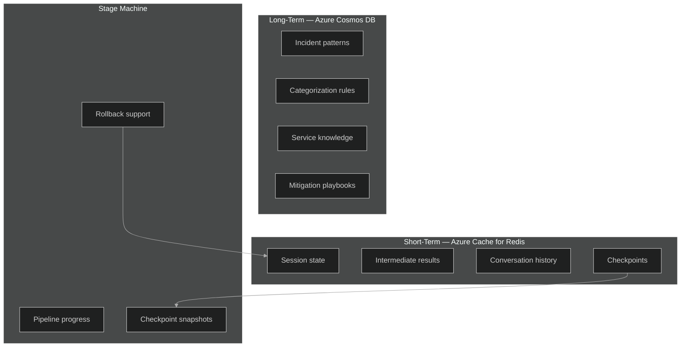

# 💾 Memory Manager — Deep Dive

> **Purpose**: Two-tier memory system — Azure Cache for Redis (short-term) and Azure Cosmos DB (long-term) — with stage management and checkpoint/rollback support.

---

## Architecture Overview



---

## Azure Service Mapping

| Tier | Azure Service | Config | TTL |
|---|---|---|---|
| Short-term | **Azure Cache for Redis** | Premium P1, 6GB, TLS, cluster | 24 hours |
| Long-term | **Azure Cosmos DB** | NoSQL API, serverless, partition `/incident_id` | Indefinite |
| Checkpoints | **Azure Blob Storage** | Hot tier, container `checkpoints` | 7 days (lifecycle policy) |

---

## Implementation

```python
# src/icm_agents/core/memory_manager.py

import os, json
from datetime import datetime, timezone
from typing import Optional
import redis.asyncio as redis
from azure.cosmos.aio import CosmosClient
from azure.storage.blob.aio import BlobServiceClient
from azure.identity import DefaultAzureCredential
from opentelemetry import trace

tracer = trace.get_tracer("icm.memory_manager")


class MemoryManager:
    """
    Two-tier memory: Redis (hot) + Cosmos DB (cold).
    
    Short-term: session-scoped, auto-expires after 24h.
    Long-term: cross-incident patterns and learnings, indefinite retention.
    Checkpoints: full state snapshots stored in Azure Blob Storage.
    """

    SESSION_TTL = 86400   # 24 hours
    KNOWLEDGE_TTL = None  # Indefinite

    def __init__(self):
        # ── Redis (short-term) ───────────────────────────
        self.redis = redis.Redis(
            host=os.getenv("REDIS_HOST"),
            port=6380,
            password=os.getenv("REDIS_KEY"),
            ssl=True,
            decode_responses=True,
        )
        # ── Cosmos DB (long-term) ────────────────────────
        self.cosmos = CosmosClient(
            url=os.getenv("COSMOS_ENDPOINT"),
            credential=DefaultAzureCredential(),
        )
        self.knowledge_container = (
            self.cosmos
            .get_database_client("icm-system")
            .get_container_client("knowledge")
        )
        # ── Blob Storage (checkpoints) ───────────────────
        self.blob = BlobServiceClient(
            account_url=os.getenv("STORAGE_ACCOUNT_URL"),
            credential=DefaultAzureCredential(),
        )
        self.checkpoint_container = self.blob.get_container_client("checkpoints")

    # ═══════════════════════════════════════════════════════
    # SHORT-TERM MEMORY (Redis)
    # ═══════════════════════════════════════════════════════

    async def read_session(self, session_id: str) -> dict:
        """Read full session state from Redis."""
        with tracer.start_as_current_span("memory.read_session"):
            data = await self.redis.hgetall(f"session:{session_id}")
            return {k: json.loads(v) for k, v in data.items()} if data else {}

    async def write_session(self, session_id: str, key: str, value: dict) -> None:
        """Append to session state (hash field). Never overwrites other fields."""
        with tracer.start_as_current_span("memory.write_session"):
            await self.redis.hset(
                f"session:{session_id}",
                key,
                json.dumps(value),
            )
            await self.redis.expire(f"session:{session_id}", self.SESSION_TTL)

    async def get_stage(self, session_id: str) -> str:
        """Return current pipeline stage."""
        stage = await self.redis.hget(f"session:{session_id}", "_stage")
        return stage or "unknown"

    async def set_stage(self, session_id: str, stage: str) -> None:
        """Advance pipeline stage with transition validation."""
        current = await self.get_stage(session_id)
        if not self._valid_transition(current, stage):
            raise ValueError(f"Invalid stage transition: {current} → {stage}")
        await self.redis.hset(f"session:{session_id}", "_stage", stage)
        # Append to stage history
        history = await self.redis.hget(f"session:{session_id}", "_stage_history") or "[]"
        entries = json.loads(history)
        entries.append({
            "stage": stage,
            "timestamp": datetime.now(timezone.utc).isoformat(),
        })
        await self.redis.hset(f"session:{session_id}", "_stage_history", json.dumps(entries))

    # ═══════════════════════════════════════════════════════
    # LONG-TERM MEMORY (Cosmos DB)
    # ═══════════════════════════════════════════════════════

    async def read_knowledge(self, query: str, top_k: int = 5) -> list[dict]:
        """Query cross-incident learnings from Cosmos DB."""
        with tracer.start_as_current_span("memory.read_knowledge"):
            sql = (
                "SELECT TOP @top_k * FROM c "
                "WHERE CONTAINS(LOWER(c.summary), LOWER(@query)) "
                "ORDER BY c._ts DESC"
            )
            items = self.knowledge_container.query_items(
                query=sql,
                parameters=[
                    {"name": "@top_k", "value": top_k},
                    {"name": "@query", "value": query},
                ],
                enable_cross_partition_query=True,
            )
            return [item async for item in items]

    async def write_knowledge(self, incident_id: str, learnings: dict) -> None:
        """Persist new learnings after incident resolution."""
        with tracer.start_as_current_span("memory.write_knowledge"):
            doc = {
                "id": f"learn-{incident_id}",
                "incident_id": incident_id,
                "partitionKey": incident_id,
                "summary": learnings.get("summary", ""),
                "patterns": learnings.get("patterns", []),
                "resolution": learnings.get("resolution", ""),
                "created_at": datetime.now(timezone.utc).isoformat(),
            }
            await self.knowledge_container.upsert_item(body=doc)

    # ═══════════════════════════════════════════════════════
    # CHECKPOINTS (Azure Blob Storage)
    # ═══════════════════════════════════════════════════════

    async def checkpoint(self, session_id: str) -> str:
        """Save full state snapshot to Blob Storage. Returns checkpoint ID."""
        with tracer.start_as_current_span("memory.checkpoint"):
            state = await self.read_session(session_id)
            checkpoint_id = f"{session_id}/{datetime.now(timezone.utc).strftime('%Y%m%dT%H%M%S')}"
            blob = self.checkpoint_container.get_blob_client(f"{checkpoint_id}.json")
            await blob.upload_blob(json.dumps(state), overwrite=True)
            return checkpoint_id

    async def rollback(self, session_id: str, checkpoint_id: str) -> None:
        """Restore session state from a checkpoint."""
        with tracer.start_as_current_span("memory.rollback"):
            blob = self.checkpoint_container.get_blob_client(f"{checkpoint_id}.json")
            download = await blob.download_blob()
            state = json.loads(await download.readall())
            # Clear and restore
            await self.redis.delete(f"session:{session_id}")
            for key, value in state.items():
                await self.redis.hset(f"session:{session_id}", key, json.dumps(value))
            await self.redis.expire(f"session:{session_id}", self.SESSION_TTL)

    # ═══════════════════════════════════════════════════════
    # STAGE VALIDATION
    # ═══════════════════════════════════════════════════════

    VALID_TRANSITIONS = {
        "unknown":                ["ingested"],
        "ingested":               ["context_ready"],
        "context_ready":          ["summarizing"],
        "summarizing":            ["categorized", "error"],
        "categorized":            ["delegating"],
        "delegating":             ["processing_noise", "processing_impact", "processing_mitigation"],
        "processing_noise":       ["evaluated"],
        "processing_impact":      ["evaluated"],
        "processing_mitigation":  ["output_ready"],
        "evaluated":              ["output_ready"],
        "error":                  ["summarizing"],
    }

    def _valid_transition(self, current: str, target: str) -> bool:
        return target in self.VALID_TRANSITIONS.get(current, [])
```

---

## Cosmos DB Knowledge Schema

```json
{
  "id": "learn-INC-2026-001234",
  "incident_id": "INC-2026-001234",
  "partitionKey": "INC-2026-001234",
  "summary": "VM Scale Set CPU spike resolved by scale-out + restart",
  "patterns": ["cpu_spike", "vmss", "scale_out"],
  "resolution": "Scaled to 12 instances, restarted unhealthy nodes 3,7",
  "created_at": "2026-02-10T17:30:00Z"
}
```

---

## Blob Storage Lifecycle Policy

```json
{
  "rules": [{
    "name": "cleanup-checkpoints",
    "type": "Lifecycle",
    "definition": {
      "filters": { "blobTypes": ["blockBlob"], "prefixMatch": ["checkpoints/"] },
      "actions": { "baseBlob": { "delete": { "daysAfterModificationGreaterThan": 7 } } }
    }
  }]
}
```

---

## Environment Variables

```env
REDIS_HOST=icm-redis.redis.cache.windows.net
REDIS_KEY=<primary-access-key>
COSMOS_ENDPOINT=https://icm-cosmos.documents.azure.com:443/
STORAGE_ACCOUNT_URL=https://icmstorage.blob.core.windows.net
```
