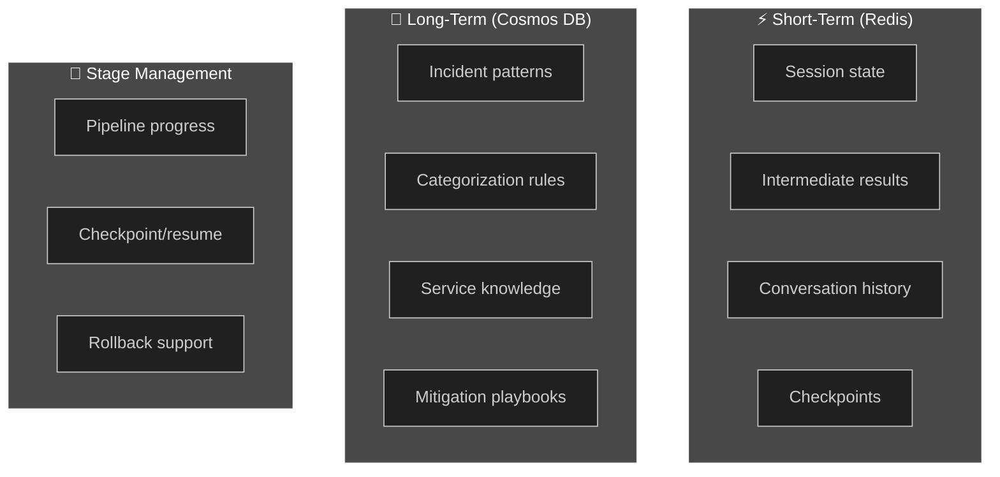
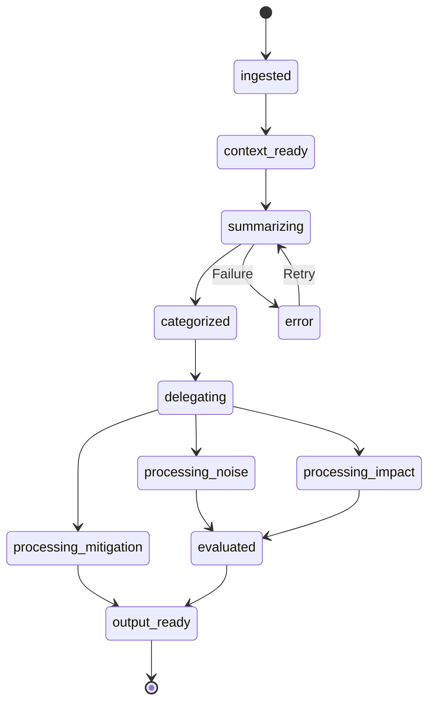

# 💾 Memory Manager

> **Purpose**: Manages short-term (session) and long-term (cross-incident) memory with stage management. Provides contextual awareness across the full pipeline.

---

## What It Does

The Memory Manager is a **two-tier memory system** that gives agents the ability to remember within a session (short-term) and learn across incidents (long-term).

## Memory Architecture

## Key Operations

| Operation | Scope | Description |
|---|---|---|
| `read_session(session_id)` | Short-term | Retrieve current session state and all intermediate results |
| `write_session(session_id, data)` | Short-term | Update session state (append, not overwrite) |
| `read_knowledge(query, top_k)` | Long-term | Retrieve relevant cross-incident learnings |
| `write_knowledge(incident_id, learnings)` | Long-term | Persist new learnings after incident resolution |
| `get_stage(session_id)` | Stage | Return current pipeline stage |
| `set_stage(session_id, stage)` | Stage | Advance pipeline stage (validates transitions) |
| `checkpoint(session_id)` | Stage | Save full state snapshot for rollback |

## Stage State Machine

## Azure Mapping

| Memory Tier | Azure Service | TTL |
|---|---|---|
| Short-term | Azure Cache for Redis | 24 hours |
| Long-term | Azure Cosmos DB (NoSQL) | Indefinite |
| Checkpoints | Azure Blob Storage | 7 days |
