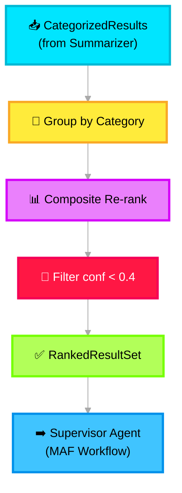

# 📊 Aggregated Results Layer — Deep Dive

> **Purpose**: Collects categorized signals from the Summarizer Agent, applies a composite re-ranking algorithm, filters low-confidence results, and produces a `RankedResultSet` for the Supervisor Agent. No LLM — pure deterministic processing.

---

## Architecture Overview



---

## Implementation

```python
# src/icm_agents/core/aggregated_results.py

from dataclasses import dataclass
from typing import Literal
import math
from datetime import datetime, timezone
from opentelemetry import trace

from icm_agents.models.results import CategorizedResults, RankedResultSet, RankedSignal

tracer = trace.get_tracer("icm.aggregated_results")


@dataclass
class RankWeights:
    """Configurable weights for the composite re-ranking formula."""
    confidence: float = 0.35
    severity_weight: float = 0.30
    recency_decay: float = 0.20
    source_reliability: float = 0.15


SEVERITY_MAP = {"sev0": 1.0, "sev1": 0.8, "sev2": 0.5, "sev3": 0.3}
SOURCE_RELIABILITY = {"log": 0.9, "chat": 0.7, "email": 0.6}


class AggregatedResultsLayer:
    """
    Deterministic ranking module (no LLM).
    
    Receives CategorizedResults from the Summarizer and produces
    a RankedResultSet sorted by composite score within each category.
    """

    def __init__(self, weights: RankWeights | None = None, min_confidence: float = 0.4):
        self.weights = weights or RankWeights()
        self.min_confidence = min_confidence

    async def process(self, categorized: CategorizedResults) -> RankedResultSet:
        """Group → Re-rank → Filter → Return ranked set."""
        with tracer.start_as_current_span("aggregated_results.process") as span:

            ranked_noise = self._rank_signals(categorized.noise_signals, "noise")
            ranked_impact = self._rank_signals(categorized.impact_signals, "impact")
            ranked_mitigation = self._rank_signals(categorized.mitigation_signals, "mitigation")

            result = RankedResultSet(
                noise=ranked_noise,
                impact=ranked_impact,
                mitigation=ranked_mitigation,
                overall_confidence=categorized.confidence_score,
            )

            span.set_attribute("noise_count", len(ranked_noise))
            span.set_attribute("impact_count", len(ranked_impact))
            span.set_attribute("mitigation_count", len(ranked_mitigation))

            return result

    def _rank_signals(self, signals: list, category: str) -> list[RankedSignal]:
        """Compute composite score and sort descending."""
        ranked = []
        for signal in signals:
            score = self._composite_score(signal)
            if score >= self.min_confidence:
                ranked.append(RankedSignal(
                    content=signal.content,
                    source=signal.source,
                    category=category,
                    original_confidence=signal.confidence,
                    composite_score=round(score, 4),
                ))
        return sorted(ranked, key=lambda s: s.composite_score, reverse=True)

    def _composite_score(self, signal) -> float:
        """
        score = (w1 × confidence)
              + (w2 × severity_weight)
              + (w3 × recency_decay)
              + (w4 × source_reliability)
        """
        w = self.weights
        severity = SEVERITY_MAP.get(getattr(signal, "severity", "sev3"), 0.3)
        source = SOURCE_RELIABILITY.get(getattr(signal, "source", "email"), 0.6)
        recency = 1.0  # Default — no timestamp on individual signals yet

        return (
            w.confidence * signal.confidence
            + w.severity_weight * severity
            + w.recency_decay * recency
            + w.source_reliability * source
        )
```

---

## Pydantic Output Contract

```python
# src/icm_agents/models/results.py (additions)

class RankedSignal(BaseModel):
    content: str
    source: str
    category: str  # "noise" | "impact" | "mitigation"
    original_confidence: float
    composite_score: float


class RankedResultSet(BaseModel):
    noise: list[RankedSignal] = Field(default_factory=list)
    impact: list[RankedSignal] = Field(default_factory=list)
    mitigation: list[RankedSignal] = Field(default_factory=list)
    overall_confidence: float
```

---

## Re-ranking Formula

```
score = (0.35 × confidence) + (0.30 × severity) + (0.20 × recency) + (0.15 × source_reliability)
```

| Factor | Weight | Values |
|---|---|---|
| `confidence` | 0.35 | 0.0–1.0 from Summarizer AI |
| `severity` | 0.30 | sev0=1.0, sev1=0.8, sev2=0.5, sev3=0.3 |
| `recency` | 0.20 | Exponential decay by age (default 1.0) |
| `source_reliability` | 0.15 | log=0.9, chat=0.7, email=0.6 |

---

## Foundry / MAF Integration

This module is a **non-agent deterministic layer**. It does not run as a Foundry Hosted Agent and has no LLM calls. It runs in-process within the pipeline and feeds its `RankedResultSet` output directly to the MAF Supervisor workflow.
