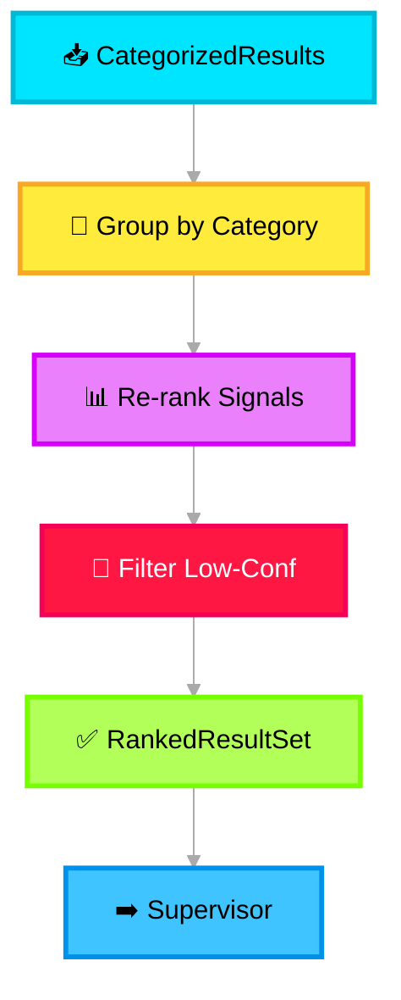

# 📊 Aggregated Results Layer

> **Purpose**: Collects structured documents (Impact, Mitigation, Noise) from the Summarizer Agent, applies re-ranking for relevance, and presents a unified result set to the Supervisor Agent.

---

## What It Does

The Aggregated Results Layer is a **collection and ranking module** (no LLM). It receives the categorized output from the Summarizer and organizes it into a ranked, structured format that the Supervisor can efficiently delegate.

## Processing Logic



## Re-ranking Algorithm

The re-ranker computes a composite score for each signal:

```
score = (w1 × confidence) + (w2 × severity_weight) + (w3 × recency_decay) + (w4 × source_reliability)
```

| Factor | Weight (default) | Description |
|---|---|---|
| `confidence` | 0.35 | AI confidence from Summarizer |
| `severity_weight` | 0.30 | Mapped from severity level (sev0=1.0, sev1=0.8, sev2=0.5, sev3=0.3) |
| `recency_decay` | 0.20 | Exponential decay based on signal age |
| `source_reliability` | 0.15 | Configured per source type (logs=0.9, chat=0.7, email=0.6) |
