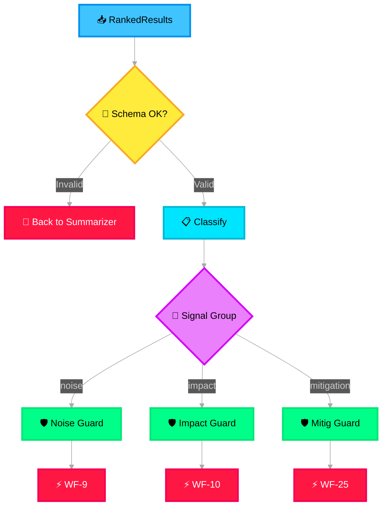

# 🧠 Supervisor Agent

> **Purpose**: The central orchestrator. Validates incoming structured data, classifies it into workflow domains, and delegates to the appropriate specialized agents through guardrails.

---

## What It Does

The Supervisor Agent is the **brain** of the system. It receives ranked results from the Aggregated Results Layer, validates them against expected schemas, and routes each to the matching workflow agent via its guardrail. Implemented as a **MAF Workflow Orchestration** using declarative YAML, it supports both **sequential** and **concurrent** orchestration patterns. It can delegate work to Foundry **connected agents** for cross-agent coordination.

## Delegation Logic

## Delegation Rules

| Condition | Action | Priority |
|---|---|---|
| `noise_signals.count > 0` | Delegate to WF-9 | Normal |
| `impact_signals.count > 0` | Delegate to WF-10 | High |
| `mitigation_signals.count > 0` | Delegate to WF-25 | Critical |
| `overall_confidence < 0.5` | Flag for human review, still delegate | — |
| All categories empty | Reject — return to Input Layer for re-ingestion | — |

## Parallel vs Sequential Delegation

- By default, all three workflow agents are invoked **in parallel** using MAF's **concurrent orchestration** pattern (they are independent)
- **Exception**: If the Mitigation Agent depends on Impact Agent output (e.g., severity-driven mitigation), the Supervisor enforces MAF **sequential orchestration**: Impact → then → Mitigation

## Connection Points

| Direction | Target |
|---|---|
| **Reads from** | Aggregated Results Layer (ranked results) |
| **Writes to** | Guardrails (noise, impact, mitigation data) |
| **Dotted line to** | Safety & Governance (all delegated data passes through PII/safety checks) |
| **Dotted line to** | Memory Manager (retrieves session state) |
