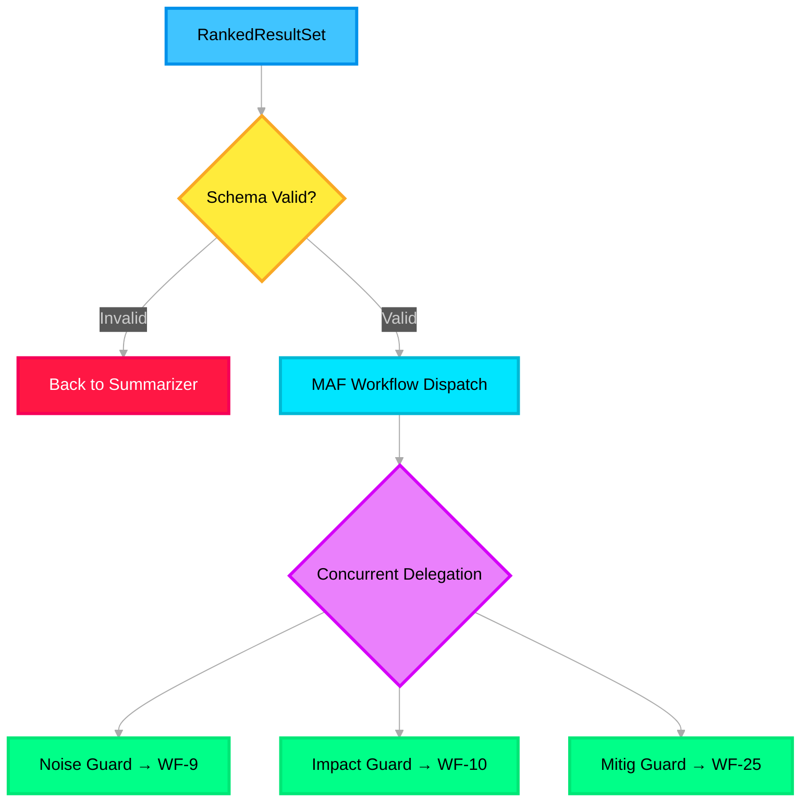

# 🧠 Supervisor Agent — Deep Dive

> **Purpose**: Central orchestrator built with **Microsoft Agent Framework (MAF)** declarative workflows. Validates data, classifies signals, and delegates to Noise/Impact/Mitigation agents via guardrails using concurrent and sequential orchestration patterns.

---

## Architecture Overview



---

## Azure Service Mapping

| Component | Azure Service | Config |
|---|---|---|
| Orchestration | **Microsoft Agent Framework (MAF)** | Declarative YAML workflow |
| Agent hosting | **Azure AI Foundry Agent Service** | Connected agents pattern |
| Workflow execution | **MAF Workflow Runtime** | Sequential + concurrent orchestration |
| State management | **Azure Cache for Redis** | Via Memory Manager |

---

## MAF Declarative Workflow (YAML)

The Supervisor is defined as a **MAF declarative workflow** — no Python orchestration code needed:

```yaml
# workflows/supervisor_workflow.yaml

name: supervisor-workflow
description: "Validate, classify, and delegate incident signals to workflow agents"
version: 1.0

# ── Connected Agents ──────────────────────────────────────
agents:
  noise_agent:
    type: foundry_hosted
    endpoint: "${NOISE_AGENT_ENDPOINT}"
    description: "WF-9 Noise Filter Agent"
  impact_agent:
    type: foundry_hosted
    endpoint: "${IMPACT_AGENT_ENDPOINT}"
    description: "WF-10 Impact Assessment Agent"
  mitigation_agent:
    type: foundry_hosted
    endpoint: "${MITIGATION_AGENT_ENDPOINT}"
    description: "WF-25 Mitigation Orchestration Agent"

# ── Workflow Steps ────────────────────────────────────────
steps:
  # Step 1: Validate schema
  - name: validate_input
    type: function
    function: validate_ranked_results
    input: "${trigger.ranked_result_set}"
    on_failure: reject_and_reclassify

  # Step 2: Classify and prepare delegation payloads
  - name: classify_signals
    type: function
    function: prepare_delegation_payloads
    input: "${steps.validate_input.output}"

  # Step 3: Concurrent delegation to all three agents
  - name: delegate_to_agents
    type: parallel
    branches:
      - name: noise_branch
        condition: "${steps.classify_signals.output.has_noise}"
        steps:
          - name: noise_guardrail
            type: function
            function: apply_noise_guardrail
            input: "${steps.classify_signals.output.noise_payload}"
          - name: run_noise_agent
            type: agent
            agent: noise_agent
            input: "${steps.noise_guardrail.output}"

      - name: impact_branch
        condition: "${steps.classify_signals.output.has_impact}"
        steps:
          - name: impact_guardrail
            type: function
            function: apply_impact_guardrail
            input: "${steps.classify_signals.output.impact_payload}"
          - name: run_impact_agent
            type: agent
            agent: impact_agent
            input: "${steps.impact_guardrail.output}"

      - name: mitigation_branch
        condition: "${steps.classify_signals.output.has_mitigation}"
        steps:
          - name: mitigation_guardrail
            type: function
            function: apply_mitigation_guardrail
            input: "${steps.classify_signals.output.mitigation_payload}"
          - name: run_mitigation_agent
            type: agent
            agent: mitigation_agent
            input: "${steps.mitigation_guardrail.output}"

  # Step 4: Collect outputs
  - name: aggregate_outputs
    type: function
    function: aggregate_agent_outputs
    input:
      noise: "${steps.delegate_to_agents.noise_branch.run_noise_agent.output}"
      impact: "${steps.delegate_to_agents.impact_branch.run_impact_agent.output}"
      mitigation: "${steps.delegate_to_agents.mitigation_branch.run_mitigation_agent.output}"

# ── Error Handling ────────────────────────────────────────
error_handlers:
  reject_and_reclassify:
    type: function
    function: send_back_to_summarizer
    input: "${trigger.ranked_result_set}"
```

---

## MAF Supervisor — Python Implementation

```python
# src/icm_agents/agents/supervisor.py

import os, json
from azure.ai.projects import AIProjectClient
from azure.identity import DefaultAzureCredential
from opentelemetry import trace

from icm_agents.models.results import RankedResultSet
from icm_agents.guardrails.noise_guardrail import NoiseGuardrail
from icm_agents.guardrails.impact_guardrail import ImpactGuardrail
from icm_agents.guardrails.mitigation_guardrail import MitigationGuardrail

tracer = trace.get_tracer("icm.supervisor")


class SupervisorAgent:
    """
    MAF Workflow Orchestration — the brain of the system.
    
    In production, this uses the MAF declarative YAML workflow above.
    This Python class provides programmatic access for testing and
    the demo pipeline (--demo mode).
    """

    def __init__(self):
        self.client = AIProjectClient(
            endpoint=os.getenv("PROJECT_ENDPOINT"),
            credential=DefaultAzureCredential(),
        )
        self.noise_guard = NoiseGuardrail()
        self.impact_guard = ImpactGuardrail()
        self.mitigation_guard = MitigationGuardrail()

    async def orchestrate(self, ranked: RankedResultSet) -> dict:
        """
        Validate → Classify → Delegate (concurrent) → Collect outputs.
        """
        with tracer.start_as_current_span("supervisor.orchestrate") as span:
            span.set_attribute("noise_signals", len(ranked.noise))
            span.set_attribute("impact_signals", len(ranked.impact))
            span.set_attribute("mitigation_signals", len(ranked.mitigation))

            # 1. Validate schema
            if ranked.overall_confidence < 0.3 and not ranked.noise and not ranked.impact:
                span.set_attribute("action", "reject_empty")
                return {"status": "rejected", "reason": "No actionable signals"}

            # 2. Prepare delegation payloads
            import asyncio
            tasks = []

            if ranked.noise:
                validated = self.noise_guard.validate(ranked.noise)
                if validated:
                    tasks.append(self._run_agent("noise", validated))

            if ranked.impact:
                validated = self.impact_guard.validate(ranked.impact)
                if validated:
                    tasks.append(self._run_agent("impact", validated))

            if ranked.mitigation:
                validated = self.mitigation_guard.validate(ranked.mitigation)
                if validated:
                    tasks.append(self._run_agent("mitigation", validated))

            # 3. Concurrent execution (MAF parallel branch pattern)
            results = await asyncio.gather(*tasks, return_exceptions=True)

            # 4. Collect outputs
            outputs = {}
            for result in results:
                if isinstance(result, Exception):
                    span.set_attribute("error", str(result))
                else:
                    outputs.update(result)

            return outputs

    async def _run_agent(self, agent_type: str, payload: dict) -> dict:
        """Invoke a Foundry Hosted Agent via the SDK."""
        # In production, MAF connected agents handle this via YAML
        # This is the programmatic equivalent for demo/testing
        agent_id_map = {
            "noise": os.getenv("NOISE_AGENT_ID"),
            "impact": os.getenv("IMPACT_AGENT_ID"),
            "mitigation": os.getenv("MITIGATION_AGENT_ID"),
        }

        thread = self.client.agents.threads.create()
        self.client.agents.messages.create(
            thread_id=thread.id,
            role="user",
            content=json.dumps(payload),
        )
        run = self.client.agents.runs.create_and_process(
            thread_id=thread.id,
            agent_id=agent_id_map[agent_type],
        )

        if run.status == "failed":
            raise RuntimeError(f"{agent_type} agent failed: {run.last_error}")

        messages = self.client.agents.messages.list(thread_id=thread.id)
        last_msg = next(m for m in messages if m.role == "assistant")
        self.client.agents.threads.delete(thread.id)

        return {agent_type: json.loads(last_msg.content[0].text.value)}
```

---

## Delegation Rules

| Condition | Action | MAF Pattern |
|---|---|---|
| `noise_signals.count > 0` | Delegate to WF-9 via guardrail | Parallel branch |
| `impact_signals.count > 0` | Delegate to WF-10 via guardrail | Parallel branch |
| `mitigation_signals.count > 0` | Delegate to WF-25 via guardrail | Parallel branch |
| Impact → then → Mitigation dependency | Sequential: WF-10 before WF-25 | Sequential step in MAF |
| `overall_confidence < 0.3` + no signals | Reject, return to Input Layer | Error handler |

---

## Environment Variables

```env
PROJECT_ENDPOINT=https://<project>.services.ai.azure.com
NOISE_AGENT_ID=asst_xxxxxxxxxxxx
IMPACT_AGENT_ID=asst_yyyyyyyyyyyy
MITIGATION_AGENT_ID=asst_zzzzzzzzzzzz
```
