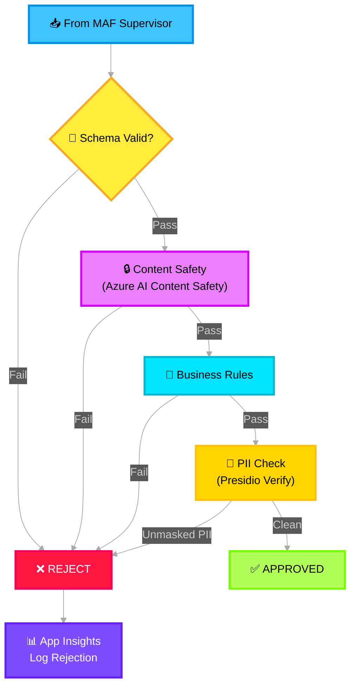

# 🛡️ Guardrails & Gatekeeping — Deep Dive

> **Purpose**: Rule-based validation layers in front of each Foundry Hosted Agent. Prevents malformed, unsafe, or irrelevant data from consuming expensive LLM resources. No AI — pure schema and business rule enforcement.

---

## Architecture Overview



---

## Azure Service Mapping

| Component | Azure Service | Purpose |
|---|---|---|
| Content safety screening | **Azure AI Content Safety** | Detect harmful content before agent processing |
| PII verification | **Microsoft Presidio** | Verify PII was properly masked at ingestion |
| Rejection logging | **Application Insights** | Structured rejection telemetry for audit |
| Rate limiting | **Azure API Management** (optional) | Throttle excessive requests per incident |

---

## Base Guardrail Implementation

```python
# src/icm_agents/guardrails/base.py

import os
from abc import ABC, abstractmethod
from typing import Optional
from azure.ai.contentsafety import ContentSafetyClient
from azure.ai.contentsafety.models import AnalyzeTextOptions, TextCategory
from azure.identity import DefaultAzureCredential
from presidio_analyzer import AnalyzerEngine
from opentelemetry import trace
from pydantic import BaseModel

tracer = trace.get_tracer("icm.guardrails")


class GuardrailResult(BaseModel):
    status: str  # "approved" | "rejected"
    guardrail: str
    reason: Optional[str] = None
    details: Optional[str] = None
    suggestion: Optional[str] = None


class BaseGuardrail(ABC):
    """
    Base guardrail with three-phase validation:
    1. Schema validation (Pydantic)
    2. Content safety (Azure AI Content Safety)
    3. Business rules (subclass-specific)
    """

    def __init__(self, name: str):
        self.name = name
        self.content_safety = ContentSafetyClient(
            endpoint=os.getenv("CONTENT_SAFETY_ENDPOINT"),
            credential=DefaultAzureCredential(),
        )
        self.pii_analyzer = AnalyzerEngine()

    def validate(self, signals: list) -> Optional[list]:
        """Run full validation pipeline. Returns signals if approved, None if rejected."""
        with tracer.start_as_current_span(f"guardrail.{self.name}") as span:
            # Phase 1: Schema validation
            result = self._validate_schema(signals)
            if result.status == "rejected":
                span.set_attribute("rejection_phase", "schema")
                span.set_attribute("rejection_reason", result.reason)
                return None

            # Phase 2: Content safety
            result = self._check_content_safety(signals)
            if result.status == "rejected":
                span.set_attribute("rejection_phase", "content_safety")
                return None

            # Phase 3: Business rules (subclass-specific)
            result = self._check_business_rules(signals)
            if result.status == "rejected":
                span.set_attribute("rejection_phase", "business_rules")
                return None

            # Phase 4: PII verification
            result = self._verify_pii_masked(signals)
            if result.status == "rejected":
                span.set_attribute("rejection_phase", "pii_leak")
                return None

            span.set_attribute("result", "approved")
            return signals

    def _validate_schema(self, signals: list) -> GuardrailResult:
        if not signals:
            return GuardrailResult(
                status="rejected", guardrail=self.name,
                reason="empty_payload", details="No signals provided",
            )
        return GuardrailResult(status="approved", guardrail=self.name)

    def _check_content_safety(self, signals: list) -> GuardrailResult:
        """Screen content with Azure AI Content Safety."""
        combined = " ".join(s.content for s in signals)
        response = self.content_safety.analyze_text(
            AnalyzeTextOptions(text=combined[:10000])  # API limit
        )
        for category_result in response.categories_analysis:
            if category_result.severity and category_result.severity >= 4:
                return GuardrailResult(
                    status="rejected", guardrail=self.name,
                    reason="content_safety",
                    details=f"Category {category_result.category}: severity {category_result.severity}",
                )
        return GuardrailResult(status="approved", guardrail=self.name)

    def _verify_pii_masked(self, signals: list) -> GuardrailResult:
        """Verify that PII was properly masked at ingestion."""
        combined = " ".join(s.content for s in signals)
        results = self.pii_analyzer.analyze(text=combined, language="en")
        high_confidence_pii = [r for r in results if r.score > 0.85]
        if high_confidence_pii:
            return GuardrailResult(
                status="rejected", guardrail=self.name,
                reason="pii_leak",
                details=f"Unmasked PII detected: {[r.entity_type for r in high_confidence_pii]}",
                suggestion="Re-run Presidio anonymizer before proceeding",
            )
        return GuardrailResult(status="approved", guardrail=self.name)

    @abstractmethod
    def _check_business_rules(self, signals: list) -> GuardrailResult:
        """Subclass implements domain-specific business rules."""
        ...
```

---

## Noise Guardrail

```python
# src/icm_agents/guardrails/noise_guardrail.py

from icm_agents.guardrails.base import BaseGuardrail, GuardrailResult


class NoiseGuardrail(BaseGuardrail):
    """Gate for WF-9 Noise Agent."""

    def __init__(self):
        super().__init__("noise_guardrail")

    def _check_business_rules(self, signals: list) -> GuardrailResult:
        # Must have categorized noise signals
        noise = [s for s in signals if s.category == "noise"]
        if not noise:
            return GuardrailResult(
                status="rejected", guardrail=self.name,
                reason="no_noise_signals",
                details="No signals categorized as noise",
            )
        return GuardrailResult(status="approved", guardrail=self.name)
```

## Impact Guardrail

```python
# src/icm_agents/guardrails/impact_guardrail.py

from icm_agents.guardrails.base import BaseGuardrail, GuardrailResult


class ImpactGuardrail(BaseGuardrail):
    """Gate for WF-10 Impact Agent."""

    def __init__(self):
        super().__init__("impact_guardrail")

    def _check_business_rules(self, signals: list) -> GuardrailResult:
        impact = [s for s in signals if s.category == "impact"]
        if not impact:
            return GuardrailResult(
                status="rejected", guardrail=self.name,
                reason="no_impact_signals",
            )
        # All impact signals must have severity and affected_service
        for s in impact:
            if not getattr(s, "severity", None):
                return GuardrailResult(
                    status="rejected", guardrail=self.name,
                    reason="missing_field",
                    details="Field 'severity' is required for impact assessment",
                    suggestion="Re-run Summarizer with severity extraction emphasis",
                )
        return GuardrailResult(status="approved", guardrail=self.name)
```

## Mitigation Guardrail

```python
# src/icm_agents/guardrails/mitigation_guardrail.py

from icm_agents.guardrails.base import BaseGuardrail, GuardrailResult


class MitigationGuardrail(BaseGuardrail):
    """Gate for WF-25 Mitigation Agent."""

    def __init__(self):
        super().__init__("mitigation_guardrail")

    def _check_business_rules(self, signals: list) -> GuardrailResult:
        mitigation = [s for s in signals if s.category == "mitigation"]
        if not mitigation:
            return GuardrailResult(
                status="rejected", guardrail=self.name,
                reason="no_mitigation_signals",
            )
        # Action safety check: high-risk actions require elevated authorization
        high_risk = [s for s in mitigation if getattr(s, "action_type", "") in ("failover", "data_restore", "rollback")]
        if high_risk:
            # Check authorization flag (set by Supervisor based on caller identity)
            pass  # In production, verify Azure AD role claims
        return GuardrailResult(status="approved", guardrail=self.name)
```

---

## Azure AI Content Safety Integration

```python
# Azure AI Content Safety analyzes text for these categories:
# - Hate (severity 0-6)
# - SelfHarm (severity 0-6)
# - Sexual (severity 0-6)
# - Violence (severity 0-6)
# Guardrail rejects if ANY category severity ≥ 4

from azure.ai.contentsafety.models import AnalyzeTextOptions

response = content_safety_client.analyze_text(
    AnalyzeTextOptions(text="<content to check>")
)
for result in response.categories_analysis:
    print(f"{result.category}: severity {result.severity}")
```

---

## Environment Variables

```env
CONTENT_SAFETY_ENDPOINT=https://icm-safety.cognitiveservices.azure.com
```
