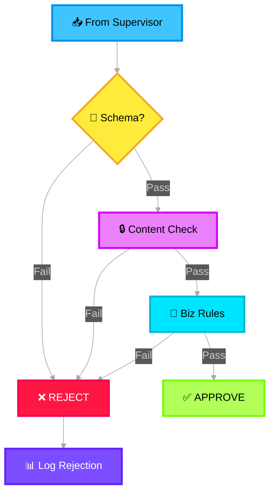

# 🛡️ Guardrails & Gatekeeping

> **Purpose**: Validate, sanitize, and gate data before it reaches each specialized workflow agent. Prevents malformed, unsafe, or irrelevant inputs from consuming expensive LLM resources.

---

## What It Does

Each workflow agent (Noise, Impact, Mitigation) has a dedicated guardrail in front of it. Guardrails are **non-AI, rule-based validation layers** that enforce input quality, safety, and compliance.

## Three Guardrails

| Guardrail | Protects | Key Checks |
|---|---|---|
| **Noise Guardrails & Gatekeeper** | WF-9 Noise Agent | Input is categorized, contains noise signals, not empty payload, PII masked |
| **Impact Guardrails & Gatekeeper** | WF-10 Impact Agent | Impact signals present, severity field populated, affected service identified, data freshness < 24h |
| **Mitigation Guardrails & Gatekeeper** | WF-25 Mitigation Agent | Mitigation signals present, not a duplicate request, authorized caller, action safety check |

## Guardrail Processing Flow



## Guardrail Rejection Response

```json
{
  "status": "rejected",
  "guardrail": "impact_guardrail",
  "reason": "missing_field",
  "details": "Field 'affected_service' is required for impact assessment",
  "suggestion": "Re-run Summarizer with service extraction emphasis",
  "timestamp": "2026-02-10T17:05:00Z"
}
```
