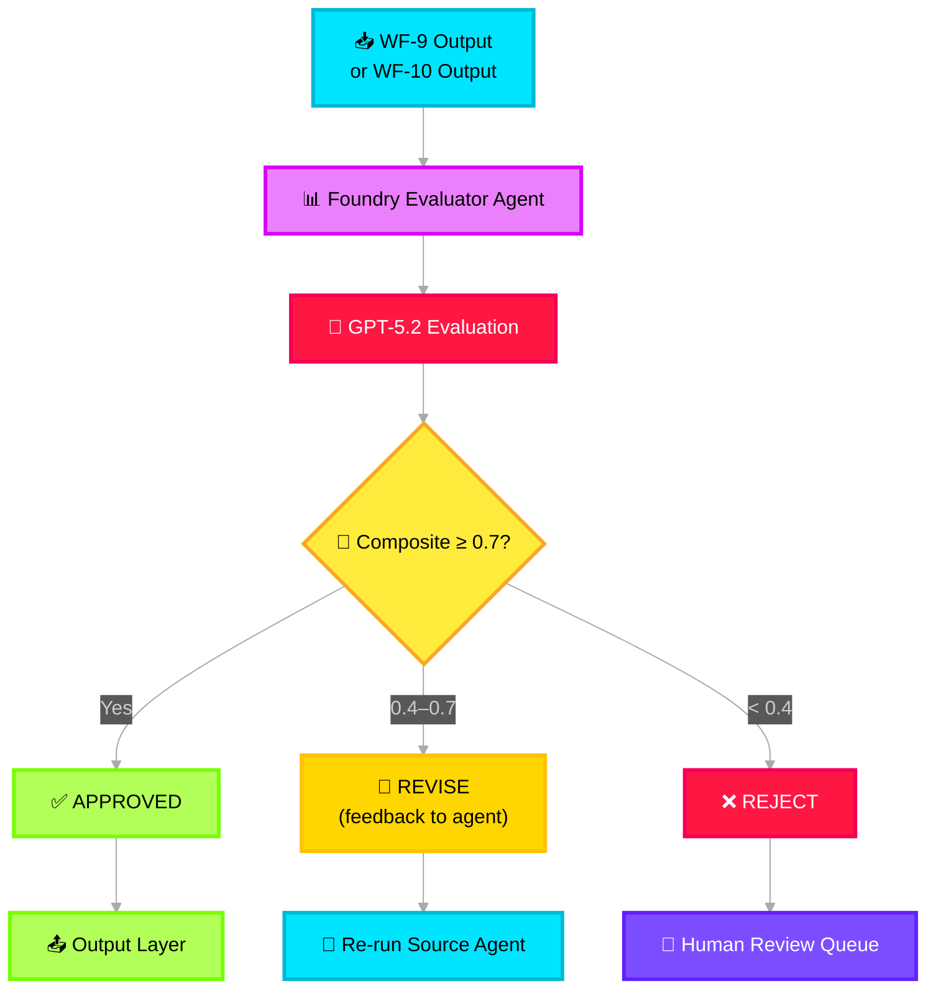

# ✅ Evaluator — Deep Dive

> **Purpose**: LLM-based quality assessment of agent outputs. Scores across factual accuracy, completeness, hallucination, and consistency. Uses a **Foundry Hosted Agent** with specialized evaluation instructions.

---

## Architecture Overview



> **Note**: WF-25 Mitigation Agent **bypasses** the Evaluator — its outputs go directly to the Output Layer for urgency.

---

## Azure Service Mapping

| Component | Azure Service | Config |
|---|---|---|
| Evaluator runtime | **Azure AI Foundry Agent Service** | Foundry Hosted Agent |
| LLM | **Azure OpenAI GPT-5.2** | Low temperature (0.0) for consistent scoring |
| Human review queue | **Azure Service Bus** | Queue `human-review`, dead-letter on timeout |
| Evaluation logs | **Application Insights** | Custom metrics: `evaluation.score`, `evaluation.verdict` |

---

## Foundry Hosted Agent — Evaluator

```python
# src/icm_agents/agents/evaluator.py

import os, json
from azure.ai.projects import AIProjectClient
from azure.identity import DefaultAzureCredential
from opentelemetry import trace, metrics
from pydantic import BaseModel, Field

tracer = trace.get_tracer("icm.evaluator")
meter = metrics.get_meter("icm.evaluator")
eval_score_histogram = meter.create_histogram("evaluation.composite_score")
eval_verdict_counter = meter.create_counter("evaluation.verdict")


class EvaluationResult(BaseModel):
    evaluation_id: str
    source_agent: str
    verdict: str  # "approved" | "revise" | "rejected"
    composite_score: float = Field(ge=0.0, le=1.0)
    dimension_scores: dict
    feedback: str
    token_usage: dict = Field(default_factory=dict)


EVALUATOR_SYSTEM_PROMPT = """You are a Quality Evaluator for an incident management AI system.
You receive the OUTPUT of an AI agent along with the ORIGINAL INPUT data and must score quality.

EVALUATION DIMENSIONS (each 0.0 to 1.0):
1. factual_accuracy  — Are ALL claims supported by the original input data?
2. completeness      — Does the output cover ALL significant signals from input?
3. hallucination     — Are there ANY fabricated facts not in the source? (1.0=none, 0.0=many)
4. consistency       — Does the output contradict itself? (1.0=consistent, 0.0=contradictory)
5. format_compliance — Does the output match the required JSON schema? (1.0=valid, 0.0=invalid)

COMPOSITE SCORE = (0.30 × factual) + (0.25 × completeness) + (0.25 × hallucination) + (0.10 × consistency) + (0.10 × format)

VERDICT:
- composite ≥ 0.70 → "approved"
- 0.40 ≤ composite < 0.70 → "revise" (provide specific feedback)
- composite < 0.40 → "rejected" (flag for human review)

OUTPUT (strict JSON):
{
  "factual_accuracy": 0.0-1.0,
  "completeness": 0.0-1.0,
  "hallucination": 0.0-1.0,
  "consistency": 0.0-1.0,
  "format_compliance": 0.0-1.0,
  "composite_score": 0.0-1.0,
  "verdict": "approved|revise|rejected",
  "feedback": "specific actionable feedback"
}"""


class EvaluatorAgent:
    """
    Foundry Hosted Agent that evaluates quality of Noise and Impact
    agent outputs using GPT-5.2 with structured evaluation rubric.
    """

    def __init__(self):
        self.client = AIProjectClient(
            endpoint=os.getenv("PROJECT_ENDPOINT"),
            credential=DefaultAzureCredential(),
        )
        self._agent_id = None

    async def initialize(self) -> None:
        """Create the Foundry evaluator agent."""
        agent = self.client.agents.create_agent(
            model=os.getenv("MODEL_DEPLOYMENT_NAME"),
            name="evaluator-agent",
            instructions=EVALUATOR_SYSTEM_PROMPT,
            temperature=0.0,  # Deterministic scoring
        )
        self._agent_id = agent.id

    async def evaluate(
        self,
        source_agent: str,
        original_input: dict,
        agent_output: dict,
    ) -> EvaluationResult:
        """Evaluate agent output quality via Foundry Agent Service."""
        with tracer.start_as_current_span("evaluator.evaluate") as span:
            span.set_attribute("source_agent", source_agent)

            if not self._agent_id:
                await self.initialize()

            # Create thread for evaluation
            thread = self.client.agents.threads.create()

            # Send evaluation prompt
            self.client.agents.messages.create(
                thread_id=thread.id,
                role="user",
                content=json.dumps({
                    "original_input": original_input,
                    "agent_output": agent_output,
                    "source_agent": source_agent,
                }),
            )

            # Run evaluation
            run = self.client.agents.runs.create_and_process(
                thread_id=thread.id,
                agent_id=self._agent_id,
            )

            if run.status == "failed":
                raise RuntimeError(f"Evaluator failed: {run.last_error}")

            # Extract result
            messages = self.client.agents.messages.list(thread_id=thread.id)
            last_msg = next(m for m in messages if m.role == "assistant")
            scores = json.loads(last_msg.content[0].text.value)

            result = EvaluationResult(
                evaluation_id=run.id,
                source_agent=source_agent,
                verdict=scores["verdict"],
                composite_score=scores["composite_score"],
                dimension_scores={
                    "factual_accuracy": scores["factual_accuracy"],
                    "completeness": scores["completeness"],
                    "hallucination": scores["hallucination"],
                    "consistency": scores["consistency"],
                    "format_compliance": scores["format_compliance"],
                },
                feedback=scores["feedback"],
                token_usage={
                    "prompt": run.usage.prompt_tokens if run.usage else 0,
                    "completion": run.usage.completion_tokens if run.usage else 0,
                },
            )

            # Emit metrics to Application Insights
            eval_score_histogram.record(result.composite_score, {"agent": source_agent})
            eval_verdict_counter.add(1, {"verdict": result.verdict, "agent": source_agent})

            span.set_attribute("verdict", result.verdict)
            span.set_attribute("composite_score", result.composite_score)

            # Cleanup
            self.client.agents.threads.delete(thread.id)

            return result
```

---

## Evaluation Scoring Formula

```
composite = (0.30 × factual) + (0.25 × completeness) + (0.25 × hallucination) + (0.10 × consistency) + (0.10 × format)
```

| Dimension | Weight | Scoring |
|---|---|---|
| Factual Accuracy | 30% | 0.0–1.0 (are claims supported?) |
| Completeness | 25% | 0.0–1.0 (all signals covered?) |
| Hallucination | 25% | 0.0–1.0 (1.0 = no fabrication) |
| Consistency | 10% | 0.0–1.0 (1.0 = no contradictions) |
| Format Compliance | 10% | 0.0–1.0 (1.0 = valid schema) |

## Verdict Thresholds

| Range | Verdict | Action |
|---|---|---|
| ≥ 0.70 | `approved` | Forward to Output Layer |
| 0.40 – 0.69 | `revise` | Send feedback, re-run source agent |
| < 0.40 | `rejected` | Flag for human review via Service Bus |

---

## Application Insights Custom Metrics

```python
# These metrics are automatically emitted:
# evaluation.composite_score (histogram, per agent)
# evaluation.verdict (counter, per verdict+agent)

# Kusto query for dashboard:
# customMetrics
# | where name == "evaluation.composite_score"
# | summarize avg(value), percentile(value, 50), percentile(value, 95) by tostring(customDimensions["agent"])
```

---

## Environment Variables

```env
PROJECT_ENDPOINT=https://<project>.services.ai.azure.com
MODEL_DEPLOYMENT_NAME=gpt-5.2
```
