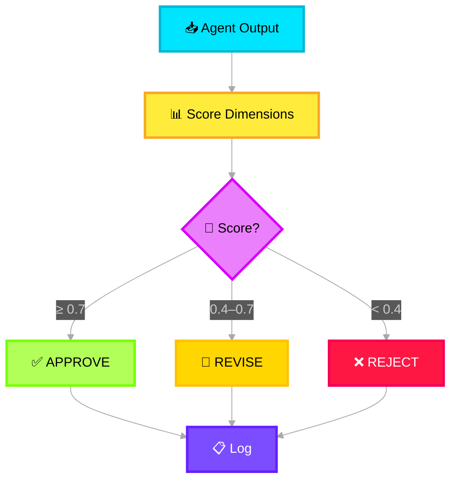

# ✅ Evaluator

> **Purpose**: Assess the quality of agent outputs (Noise and Impact). Provides a feedback loop for continuous improvement and catches hallucinations or low-quality results before they reach the Output Layer.

---

## What It Does

The Evaluator receives outputs from **WF-9 Noise Agent** and **WF-10 Impact Agent** (not WF-25 Mitigation, which bypasses evaluation for urgency). It uses LLM-based evaluation to score outputs across multiple quality dimensions.

## Evaluation Dimensions

| Dimension | Description | Scoring |
|---|---|---|
| **Factual Accuracy** | Are the claims supported by the input data? | 0.0 — 1.0 |
| **Completeness** | Does the output cover all significant signals? | 0.0 — 1.0 |
| **Hallucination Check** | Are there fabricated facts not in the source? | binary: pass/fail |
| **Consistency** | Does the output contradict itself? | binary: pass/fail |
| **Format Compliance** | Does the output match the required schema? | binary: pass/fail |

## Evaluation Flow



## Evaluation Response

```json
{
  "evaluation_id": "eval-uuid",
  "source_agent": "wf9_noise_agent",
  "verdict": "approved",
  "composite_score": 0.87,
  "dimension_scores": {
    "factual_accuracy": 0.92,
    "completeness": 0.85,
    "hallucination_check": "pass",
    "consistency": "pass",
    "format_compliance": "pass"
  },
  "feedback": "Timeline is well-structured with accurate chronological ordering. Minor: consider merging entries #3 and #7 which reference the same alert.",
  "token_usage": { "prompt": 3200, "completion": 400 }
}
```
