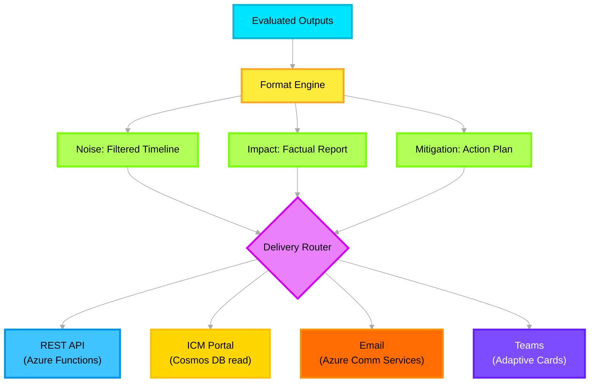

# 📄 Output Layer — Deep Dive

> **Purpose**: Final presentation and delivery layer. Formats validated agent outputs into three deliverable documents and routes them to multiple delivery channels — REST API, ICM Portal, Email, and Teams.

---

## Architecture Overview



---

## Azure Service Mapping

| Component | Azure Service | Config |
|---|---|---|
| REST API delivery | **Azure Functions** (HTTP trigger) | GET `/api/incidents/{id}/output` |
| Document storage | **Azure Cosmos DB** | Container `outputs`, partition `/incident_id` |
| Email delivery | **Azure Communication Services** | Email channel, HTML template |
| Teams notification | **Microsoft Graph API** | Adaptive Cards via incoming webhook |
| File export | **Azure Blob Storage** | Container `output-reports`, PDF/Markdown |
| Template engine | **Jinja2** | HTML/Markdown template rendering |

---

## Implementation

```python
# src/icm_agents/core/output_layer.py

import os, json
from datetime import datetime, timezone
from azure.cosmos.aio import CosmosClient
from azure.storage.blob.aio import BlobServiceClient
from azure.communication.email import EmailClient
from azure.identity import DefaultAzureCredential
from jinja2 import Environment, FileSystemLoader
from opentelemetry import trace

from icm_agents.models.output import FinalOutput, NoiseOutput, ImpactOutput, MitigationOutput

tracer = trace.get_tracer("icm.output_layer")

# Template engine
templates = Environment(loader=FileSystemLoader("templates/"))


class OutputLayer:
    """
    Formats agent outputs and delivers to multiple channels.
    Deployment overlays control which channels are active per environment.
    """

    def __init__(self):
        credential = DefaultAzureCredential()
        self.cosmos = CosmosClient(
            url=os.getenv("COSMOS_ENDPOINT"),
            credential=credential,
        )
        self.output_container = (
            self.cosmos
            .get_database_client("icm-system")
            .get_container_client("outputs")
        )
        self.blob = BlobServiceClient(
            account_url=os.getenv("STORAGE_ACCOUNT_URL"),
            credential=credential,
        )
        self.email = EmailClient(
            os.getenv("COMMUNICATION_SERVICES_CONNECTION"),
        )
        # Active delivery channels (controlled by deployment overlay)
        self.channels = os.getenv("OUTPUT_CHANNELS", "api,cosmos").split(",")

    async def deliver(self, incident_id: str, outputs: dict) -> FinalOutput:
        """Format and deliver all outputs for an incident."""
        with tracer.start_as_current_span("output.deliver") as span:
            span.set_attribute("incident_id", incident_id)
            span.set_attribute("channels", ",".join(self.channels))

            final = FinalOutput(
                incident_id=incident_id,
                generated_at=datetime.now(timezone.utc).isoformat(),
            )

            # Format each output type
            if "noise" in outputs:
                final.noise = self._format_noise(outputs["noise"])
            if "impact" in outputs:
                final.impact = self._format_impact(outputs["impact"])
            if "mitigation" in outputs:
                final.mitigation = self._format_mitigation(outputs["mitigation"])

            # Persist to Cosmos DB (always)
            await self._persist_to_cosmos(incident_id, final)

            # Route to active delivery channels
            if "email" in self.channels:
                await self._send_email(incident_id, final)
            if "teams" in self.channels:
                await self._send_teams_card(incident_id, final)
            if "blob" in self.channels:
                await self._export_to_blob(incident_id, final)

            return final

    def _format_noise(self, data: dict) -> NoiseOutput:
        """Format noise analysis into a filtered timeline."""
        template = templates.get_template("noise_timeline.md.j2")
        rendered = template.render(data=data)
        return NoiseOutput(
            title="Noise Analysis — Filtered Timeline",
            markdown=rendered,
            signal_count=len(data.get("filtered_entries", [])),
        )

    def _format_impact(self, data: dict) -> ImpactOutput:
        """Format impact analysis into a factual report."""
        template = templates.get_template("impact_report.md.j2")
        rendered = template.render(data=data)
        return ImpactOutput(
            title="Impact Summary — Factual Report",
            markdown=rendered,
            severity=data.get("overall_severity", "unknown"),
            affected_services=data.get("affected_services", []),
        )

    def _format_mitigation(self, data: dict) -> MitigationOutput:
        """Format mitigation into an action plan."""
        template = templates.get_template("mitigation_plan.md.j2")
        rendered = template.render(data=data)
        return MitigationOutput(
            title="Mitigation Workflow — Action Plan",
            markdown=rendered,
            action_count=len(data.get("actions", [])),
        )

    async def _persist_to_cosmos(self, incident_id: str, final: FinalOutput) -> None:
        """Store output document for ICM Portal retrieval."""
        await self.output_container.upsert_item(body={
            "id": f"output-{incident_id}",
            "incident_id": incident_id,
            "partitionKey": incident_id,
            **final.model_dump(),
        })

    async def _send_email(self, incident_id: str, final: FinalOutput) -> None:
        """Send HTML email summary via Azure Communication Services."""
        template = templates.get_template("email_summary.html.j2")
        html = template.render(output=final, incident_id=incident_id)

        self.email.begin_send({
            "senderAddress": os.getenv("EMAIL_SENDER"),
            "recipients": {"to": [{"address": os.getenv("EMAIL_RECIPIENT")}]},
            "content": {
                "subject": f"ICM Analysis Complete: {incident_id}",
                "html": html,
            },
        })

    async def _send_teams_card(self, incident_id: str, final: FinalOutput) -> None:
        """Post Adaptive Card to Teams channel via incoming webhook."""
        import httpx
        card = {
            "type": "message",
            "attachments": [{
                "contentType": "application/vnd.microsoft.card.adaptive",
                "content": {
                    "$schema": "http://adaptivecards.io/schemas/adaptive-card.json",
                    "type": "AdaptiveCard",
                    "version": "1.4",
                    "body": [
                        {"type": "TextBlock", "text": f"🔍 ICM Analysis: {incident_id}", "size": "Large", "weight": "Bolder"},
                        {"type": "TextBlock", "text": f"Severity: {final.impact.severity if final.impact else 'N/A'}"},
                        {"type": "TextBlock", "text": f"Signals: Noise({final.noise.signal_count if final.noise else 0}) Impact({1 if final.impact else 0}) Mitigation({final.mitigation.action_count if final.mitigation else 0})"},
                    ],
                    "actions": [{"type": "Action.OpenUrl", "title": "View Full Report", "url": f"https://icm-portal.azurewebsites.net/incidents/{incident_id}"}],
                },
            }],
        }
        async with httpx.AsyncClient() as client:
            await client.post(os.getenv("TEAMS_WEBHOOK_URL"), json=card)

    async def _export_to_blob(self, incident_id: str, final: FinalOutput) -> None:
        """Export Markdown report to Blob Storage."""
        container = self.blob.get_container_client("output-reports")
        blob_name = f"{incident_id}/{datetime.now(timezone.utc).strftime('%Y%m%d')}.md"
        full_md = f"# ICM Analysis: {incident_id}\n\n"
        if final.noise:
            full_md += f"## {final.noise.title}\n\n{final.noise.markdown}\n\n"
        if final.impact:
            full_md += f"## {final.impact.title}\n\n{final.impact.markdown}\n\n"
        if final.mitigation:
            full_md += f"## {final.mitigation.title}\n\n{final.mitigation.markdown}\n\n"
        blob = container.get_blob_client(blob_name)
        await blob.upload_blob(full_md, overwrite=True)
```

---

## Pydantic Output Models

```python
# src/icm_agents/models/output.py

from pydantic import BaseModel, Field
from typing import Optional


class NoiseOutput(BaseModel):
    title: str
    markdown: str
    signal_count: int


class ImpactOutput(BaseModel):
    title: str
    markdown: str
    severity: str
    affected_services: list[str] = Field(default_factory=list)


class MitigationOutput(BaseModel):
    title: str
    markdown: str
    action_count: int


class FinalOutput(BaseModel):
    incident_id: str
    generated_at: str
    noise: Optional[NoiseOutput] = None
    impact: Optional[ImpactOutput] = None
    mitigation: Optional[MitigationOutput] = None
```

---

## Deployment Overlays

| Environment | Active Channels | Template Set |
|---|---|---|
| **Dev** | `api,cosmos` | Simplified markdown |
| **Staging** | `api,cosmos,blob` | Production templates |
| **Prod** | `api,cosmos,blob,email,teams` | Full HTML + Adaptive Cards |

```env
# Dev
OUTPUT_CHANNELS=api,cosmos

# Prod
OUTPUT_CHANNELS=api,cosmos,blob,email,teams
```

---

## Environment Variables

```env
COSMOS_ENDPOINT=https://icm-cosmos.documents.azure.com:443/
STORAGE_ACCOUNT_URL=https://icmstorage.blob.core.windows.net
COMMUNICATION_SERVICES_CONNECTION=endpoint=https://icm-comms.communication.azure.com/;accessKey=...
EMAIL_SENDER=DoNotReply@icm.contoso.com
EMAIL_RECIPIENT=oncall-team@contoso.com
TEAMS_WEBHOOK_URL=https://outlook.office.com/webhook/...
```
