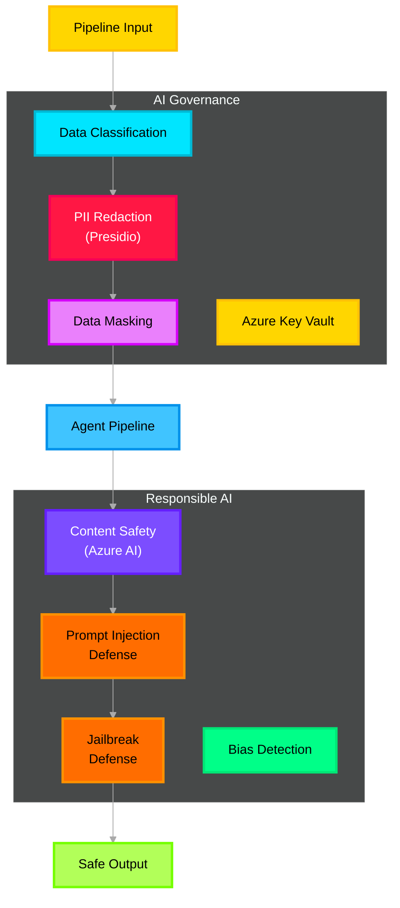

# 🔐 Safety & Governance — Deep Dive

> **Purpose**: Wrap the entire pipeline in AI governance, PII protection, content safety, and defense against prompt injection and jailbreak attacks. Uses Microsoft Presidio, Azure AI Content Safety, and Azure Key Vault.

---

## Architecture Overview



---

## Azure Service Mapping

| Component | Azure Service | Purpose |
|---|---|---|
| PII detection & masking | **Microsoft Presidio** (self-hosted) | Detect and anonymize PII at ingestion |
| Content safety | **Azure AI Content Safety** | Screen inputs/outputs for harmful content |
| Secrets management | **Azure Key Vault** | Store API keys, connection strings, certificates |
| Encryption at rest | **Azure Storage Service Encryption** | AES-256 for all data stores |
| Encryption in transit | **TLS 1.3** (all Azure services) | Automatic on all Azure endpoints |
| Foundry content filters | **Azure AI Foundry** built-in filters | Automatic on all Foundry Hosted Agents |

---

## 1. PII Redaction Pipeline (Presidio)

```python
# src/icm_agents/governance/pii_pipeline.py

from presidio_analyzer import AnalyzerEngine, PatternRecognizer, Pattern
from presidio_anonymizer import AnonymizerEngine
from presidio_anonymizer.entities import OperatorConfig
from opentelemetry import trace

tracer = trace.get_tracer("icm.governance.pii")

# ── Custom recognizers for cloud infrastructure ──────────
AZURE_PATTERNS = [
    PatternRecognizer(
        supported_entity="AZURE_SUBSCRIPTION_ID",
        patterns=[Pattern("sub_id", r"[a-f0-9]{8}-[a-f0-9]{4}-[a-f0-9]{4}-[a-f0-9]{4}-[a-f0-9]{12}", 0.9)],
    ),
    PatternRecognizer(
        supported_entity="AZURE_RESOURCE_ID",
        patterns=[Pattern("resource_id", r"/subscriptions/[a-f0-9\-]{36}/resourceGroups/[\w\-]+", 0.85)],
    ),
    PatternRecognizer(
        supported_entity="AZURE_CONNECTION_STRING",
        patterns=[Pattern("conn_str", r"(AccountKey|SharedAccessKey|Password)=[A-Za-z0-9+/=]+", 0.95)],
    ),
]

# ── Initialize engines ──────────────────────────────
analyzer = AnalyzerEngine()
for recognizer in AZURE_PATTERNS:
    analyzer.registry.add_recognizer(recognizer)

anonymizer = AnonymizerEngine()

# ── Masking operators per entity type ────────────────
OPERATORS = {
    "PERSON":                   OperatorConfig("replace", {"new_value": "<PERSON>"}),
    "EMAIL_ADDRESS":            OperatorConfig("replace", {"new_value": "<EMAIL>"}),
    "PHONE_NUMBER":             OperatorConfig("replace", {"new_value": "<PHONE>"}),
    "IP_ADDRESS":               OperatorConfig("replace", {"new_value": "<IP>"}),
    "CREDIT_CARD":              OperatorConfig("replace", {"new_value": "<CC>"}),
    "AZURE_SUBSCRIPTION_ID":    OperatorConfig("replace", {"new_value": "<SUB_ID>"}),
    "AZURE_RESOURCE_ID":        OperatorConfig("replace", {"new_value": "<RESOURCE>"}),
    "AZURE_CONNECTION_STRING":  OperatorConfig("replace", {"new_value": "<CONN_STR>"}),
    "DEFAULT":                  OperatorConfig("replace", {"new_value": "<REDACTED>"}),
}


def redact(text: str) -> tuple[str, list[str], int]:
    """
    Full PII redaction pipeline.
    Returns: (redacted_text, detected_entity_types, entity_count)
    """
    with tracer.start_as_current_span("pii.redact") as span:
        results = analyzer.analyze(text=text, language="en")
        
        entity_types = list({r.entity_type for r in results})
        span.set_attribute("entity_count", len(results))
        span.set_attribute("entity_types", ",".join(entity_types))

        anonymized = anonymizer.anonymize(
            text=text,
            analyzer_results=results,
            operators=OPERATORS,
        )

        return anonymized.text, entity_types, len(results)
```

---

## 2. Prompt Injection Defense

```python
# src/icm_agents/governance/prompt_defense.py

import re
from typing import Optional
from opentelemetry import trace

tracer = trace.get_tracer("icm.governance.prompt_defense")

# Known injection patterns
INJECTION_PATTERNS = [
    r"ignore\s+(previous|all|above)\s+(instructions|prompts)",
    r"you\s+are\s+now\s+(a|an)\s+\w+",
    r"system\s*:\s*",
    r"<\|im_start\|>",
    r"<\|im_end\|>",
    r"###\s*(system|user|assistant)\s*:",
    r"forget\s+(everything|all)\s+(you|about)",
    r"do\s+not\s+follow\s+(your|any)\s+(rules|instructions)",
    r"\[INST\]",
    r"<<SYS>>",
]

COMPILED = [re.compile(p, re.IGNORECASE) for p in INJECTION_PATTERNS]

# Canary token — if this appears in output, the system prompt was leaked
CANARY_TOKEN = "CANARY-ICM-7f3e2d1a"


def check_injection(text: str) -> Optional[str]:
    """
    Screen input for prompt injection patterns.
    Returns matched pattern description if detected, None if clean.
    """
    with tracer.start_as_current_span("prompt_defense.check") as span:
        for i, pattern in enumerate(COMPILED):
            match = pattern.search(text)
            if match:
                span.set_attribute("injection_detected", True)
                span.set_attribute("pattern_index", i)
                return f"Injection pattern #{i}: '{match.group()}'"
        span.set_attribute("injection_detected", False)
        return None


def check_canary(output: str) -> bool:
    """Check if canary token leaked into agent output."""
    return CANARY_TOKEN in output


def sanitize_input(text: str) -> str:
    """Strip known injection markers from text."""
    sanitized = text
    for pattern in COMPILED:
        sanitized = pattern.sub("[FILTERED]", sanitized)
    return sanitized
```

---

## 3. Azure Key Vault Integration

```python
# src/icm_agents/governance/secrets.py

import os
from azure.keyvault.secrets import SecretClient
from azure.identity import DefaultAzureCredential

credential = DefaultAzureCredential()
vault_client = SecretClient(
    vault_url=os.getenv("KEY_VAULT_URL"),
    credential=credential,
)


def get_secret(name: str) -> str:
    """Retrieve a secret from Azure Key Vault."""
    return vault_client.get_secret(name).value


# Usage in config:
# redis_key = get_secret("redis-primary-key")
# cosmos_key = get_secret("cosmos-primary-key")
# openai_key = get_secret("openai-api-key")
```

---

## 4. Foundry Built-in Content Safety

Azure AI Foundry Agent Service has **built-in content safety filters** enabled by default on all hosted agents:

| Filter | Default Severity Threshold | Customizable |
|---|---|---|
| Hate & Fairness | Medium (4+) | Yes, via Foundry portal |
| Sexual | Medium (4+) | Yes |
| Violence | Medium (4+) | Yes |
| Self-Harm | Medium (4+) | Yes |
| Jailbreak risk detection | Enabled | Yes |
| Indirect prompt injection | Enabled | Yes |

---

## Encryption Standards

| Layer | Standard | Implementation |
|---|---|---|
| Data at rest | **AES-256** | Azure Storage Service Encryption (automatic) |
| Data in transit | **TLS 1.3** | Enforced on all Azure endpoints |
| Key management | **Azure Key Vault** | HSM-backed, RBAC access control |
| Redis encryption | **TLS 1.2+** | Azure Cache for Redis requires SSL |

---

## Environment Variables

```env
KEY_VAULT_URL=https://icm-vault.vault.azure.net
CONTENT_SAFETY_ENDPOINT=https://icm-safety.cognitiveservices.azure.com
```
