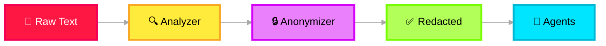

# 🔐 Safety & Governance

> **Purpose**: Ensure all data processing complies with AI governance policies. Protect against data leaks, PII exposure, prompt injection attacks, and jailbreak attempts. This layer wraps the **entire pipeline**.

---

## Two Pillars

### 1. AI Governance

| Concern | Implementation |
|---|---|
| **Data Control** | All incident data classified by sensitivity level. Access control enforced per classification. |
| **PII Redaction** | Microsoft Presidio detects and masks PII (names, emails, phone numbers, IP addresses) at ingestion. Downstream agents never see raw PII. |
| **Data Masking** | Configurable masking rules: full redaction, partial masking (show last 4 digits), or tokenized replacement. |
| **Data Protection** | Encryption at rest (AES-256) and in transit (TLS 1.3). Azure Key Vault for secrets management. |

### PII Redaction Pipeline

### 2. Responsible AI

| Concern | Implementation |
|---|---|
| **Prompt Injection Defense** | Input sanitization layer strips known injection patterns. Delimiter-based prompt isolation. System prompts marked as privileged. |
| **Jailbreak Defense** | Output classification detects jailbreak attempts. Rate limiting on unusual input patterns. Canary tokens in system prompts. |
| **Content Safety** | Azure AI Content Safety screens inputs and outputs for harmful content categories. |
| **Bias Detection** | Periodic model output audits for decision bias across incident severity and service categories. |
