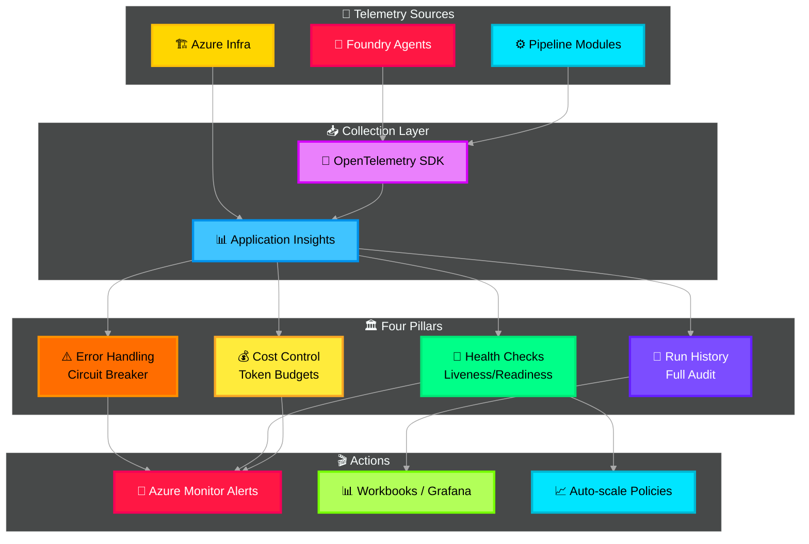

# 🔭 Observability & Control — Deep Dive

> **Purpose**: Full-stack observability using Azure Monitor, Application Insights, and OpenTelemetry. Covers distributed tracing, custom metrics, structured logging, error handling, and cost control for all Foundry agent token usage.

---

## Architecture Overview



---

## Azure Service Mapping

| Component | Azure Service | Config |
|---|---|---|
| Distributed tracing | **Application Insights** + **OpenTelemetry** | Auto-instrumented via `azure-monitor-opentelemetry` |
| Metrics | **Application Insights custom metrics** | Histograms, counters, gauges |
| Alerting | **Azure Monitor Alerts** | Action groups → email, Teams, PagerDuty |
| Dashboards | **Azure Workbooks** | KQL-powered, real-time |
| Log analytics | **Azure Log Analytics** | KQL queries, 90-day retention |
| Foundry agent traces | **Azure AI Foundry** built-in tracing | Automatic for all hosted agents |

---

## OpenTelemetry Setup

```python
# src/icm_agents/observability/telemetry.py

import os
from azure.monitor.opentelemetry import configure_azure_monitor
from opentelemetry import trace, metrics
from opentelemetry.instrumentation.httpx import HTTPXClientInstrumentor
from opentelemetry.instrumentation.redis import RedisInstrumentor


def configure_telemetry():
    """
    Initialize OpenTelemetry with Azure Monitor exporter.
    Auto-instruments HTTP, Redis, and Cosmos DB calls.
    """
    configure_azure_monitor(
        connection_string=os.getenv("APPLICATIONINSIGHTS_CONNECTION_STRING"),
        enable_live_metrics=True,
    )

    # Auto-instrument libraries
    HTTPXClientInstrumentor().instrument()
    RedisInstrumentor().instrument()

    return trace.get_tracer("icm"), metrics.get_meter("icm")


# ── Custom metrics ──────────────────────────────────
tracer, meter = configure_telemetry()

# Token usage tracking
token_counter = meter.create_counter(
    name="icm.tokens.total",
    description="Total tokens consumed across all agents",
    unit="tokens",
)

# Per-agent latency
agent_latency = meter.create_histogram(
    name="icm.agent.latency",
    description="Agent processing time",
    unit="ms",
)

# Pipeline throughput
pipeline_counter = meter.create_counter(
    name="icm.pipeline.completed",
    description="Incidents fully processed through pipeline",
)

# Error rate
error_counter = meter.create_counter(
    name="icm.errors",
    description="Error count by type and module",
)

# Cost tracking
cost_gauge = meter.create_up_down_counter(
    name="icm.cost.daily_usd",
    description="Daily accumulated cost in USD",
    unit="usd",
)
```

---

## Error Handling with Circuit Breaker

```python
# src/icm_agents/observability/circuit_breaker.py

import time
from enum import Enum
from opentelemetry import trace

tracer = trace.get_tracer("icm.circuit_breaker")


class CircuitState(Enum):
    CLOSED = "closed"      # Normal operation
    OPEN = "open"          # Failing — reject all calls
    HALF_OPEN = "half_open"  # Testing recovery


class CircuitBreaker:
    """
    Circuit breaker for Azure service calls.
    Prevents cascade failures when a downstream service is unhealthy.
    """

    def __init__(self, name: str, failure_threshold: int = 5, recovery_timeout: int = 60):
        self.name = name
        self.failure_threshold = failure_threshold
        self.recovery_timeout = recovery_timeout
        self.state = CircuitState.CLOSED
        self.failure_count = 0
        self.last_failure_time = 0.0

    async def call(self, func, *args, **kwargs):
        """Execute function with circuit breaker protection."""
        with tracer.start_as_current_span(f"circuit.{self.name}") as span:
            span.set_attribute("circuit.state", self.state.value)

            if self.state == CircuitState.OPEN:
                if time.time() - self.last_failure_time > self.recovery_timeout:
                    self.state = CircuitState.HALF_OPEN
                    span.set_attribute("circuit.transition", "open → half_open")
                else:
                    span.set_attribute("circuit.action", "rejected")
                    raise CircuitOpenError(f"Circuit {self.name} is OPEN")

            try:
                result = await func(*args, **kwargs)
                if self.state == CircuitState.HALF_OPEN:
                    self.state = CircuitState.CLOSED
                    self.failure_count = 0
                    span.set_attribute("circuit.transition", "half_open → closed")
                return result
            except Exception as e:
                self.failure_count += 1
                self.last_failure_time = time.time()
                if self.failure_count >= self.failure_threshold:
                    self.state = CircuitState.OPEN
                    span.set_attribute("circuit.transition", f"→ open (failures: {self.failure_count})")
                raise


class CircuitOpenError(Exception):
    pass


# ── Pre-configured breakers for Azure services ──────
redis_breaker = CircuitBreaker("redis", failure_threshold=3, recovery_timeout=30)
cosmos_breaker = CircuitBreaker("cosmos", failure_threshold=5, recovery_timeout=60)
foundry_breaker = CircuitBreaker("foundry", failure_threshold=3, recovery_timeout=120)
search_breaker = CircuitBreaker("ai_search", failure_threshold=5, recovery_timeout=60)
```

---

## Cost Control — Token Budget Manager

```python
# src/icm_agents/observability/cost_control.py

import os
from datetime import datetime, timezone
import redis.asyncio as redis_client
from opentelemetry import trace, metrics

tracer = trace.get_tracer("icm.cost_control")
meter = metrics.get_meter("icm.cost_control")
budget_alert = meter.create_counter("icm.cost.budget_alert")


# GPT-5.2 pricing (per 1K tokens)
PRICING = {
    "prompt": 0.005,     # $0.005 per 1K prompt tokens
    "completion": 0.015,  # $0.015 per 1K completion tokens
}

DAILY_BUDGET_USD = float(os.getenv("DAILY_BUDGET_USD", "500"))
ALERT_THRESHOLD = float(os.getenv("BUDGET_ALERT_THRESHOLD", "0.80"))


class CostTracker:
    """
    Track token usage and costs per request, per agent, per day.
    Stores running totals in Redis. Emits alerts when budget threshold reached.
    """

    def __init__(self):
        self.redis = redis_client.Redis(
            host=os.getenv("REDIS_HOST"),
            port=6380,
            password=os.getenv("REDIS_KEY"),
            ssl=True,
            decode_responses=True,
        )

    async def record_usage(
        self,
        agent_name: str,
        incident_id: str,
        prompt_tokens: int,
        completion_tokens: int,
    ) -> dict:
        """Record token usage and compute cost."""
        cost = (
            (prompt_tokens / 1000) * PRICING["prompt"]
            + (completion_tokens / 1000) * PRICING["completion"]
        )

        today = datetime.now(timezone.utc).strftime("%Y-%m-%d")
        key = f"cost:{today}"

        # Atomic increment in Redis
        daily_total = await self.redis.incrbyfloat(key, cost)
        await self.redis.expire(key, 172800)  # 48h TTL

        # Per-agent tracking
        agent_key = f"cost:{today}:{agent_name}"
        await self.redis.incrbyfloat(agent_key, cost)
        await self.redis.expire(agent_key, 172800)

        # Budget alert check
        if daily_total >= DAILY_BUDGET_USD * ALERT_THRESHOLD:
            budget_alert.add(1, {"level": "warning", "daily_total": str(daily_total)})

        if daily_total >= DAILY_BUDGET_USD:
            budget_alert.add(1, {"level": "critical", "daily_total": str(daily_total)})
            # In production: throttle or pause non-critical agents

        return {
            "agent": agent_name,
            "incident_id": incident_id,
            "tokens": {"prompt": prompt_tokens, "completion": completion_tokens},
            "cost_usd": round(cost, 6),
            "daily_total_usd": round(daily_total, 4),
            "budget_remaining_usd": round(DAILY_BUDGET_USD - daily_total, 4),
        }
```

---

## KQL Dashboard Queries

```kql
// ── Agent Latency (P50, P95, P99) ──
customMetrics
| where name == "icm.agent.latency"
| summarize
    p50=percentile(value, 50),
    p95=percentile(value, 95),
    p99=percentile(value, 99)
  by tostring(customDimensions["agent"]), bin(timestamp, 5m)

// ── Daily Token Cost by Agent ──
customMetrics
| where name == "icm.tokens.total"
| summarize total_tokens=sum(value) by tostring(customDimensions["agent"]), bin(timestamp, 1d)

// ── Error Rate by Module ──
customMetrics
| where name == "icm.errors"
| summarize errors=sum(value) by tostring(customDimensions["module"]), bin(timestamp, 15m)

// ── Pipeline Throughput ──
customMetrics
| where name == "icm.pipeline.completed"
| summarize throughput=sum(value) by bin(timestamp, 1h)

// ── Circuit Breaker Status ──
traces
| where message contains "circuit"
| extend circuit=tostring(customDimensions["circuit.state"]),
         transition=tostring(customDimensions["circuit.transition"])
| where isnotempty(transition)
| project timestamp, circuit, transition
```

---

## Environment Variables

```env
APPLICATIONINSIGHTS_CONNECTION_STRING=InstrumentationKey=...;IngestionEndpoint=...
DAILY_BUDGET_USD=500
BUDGET_ALERT_THRESHOLD=0.80
```
