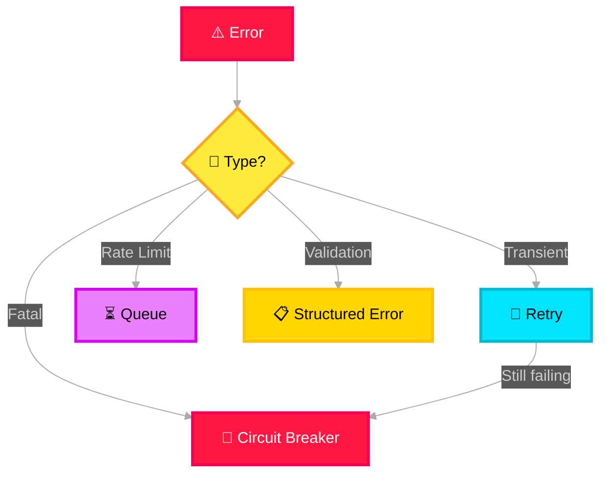

# 🔭 Observability & Control

> **Purpose**: Full observability into system behavior, agent performance, cost management, and operational health. Connected to all modules via dotted-line (non-blocking) connections.

---

## Four Pillars

| Pillar | Module | What It Tracks |
|---|---|---|
| **Error Handling** | Structured errors | Error types, retry counts, circuit breaker states, dead-letter queue |
| **Run History** | Audit trail | Every agent invocation with full input/output, timestamps, latency, decisions made |
| **Health Check** | System health | Module availability, API response times, queue depths, agent readiness |
| **Cost Control** | Token/cost tracking | Token usage per request, per agent, per incident. Budget alerts, rate limiting |

## Error Handling Strategy



## Cost Control Model

```json
{
  "cost_tracking": {
    "per_request": {
      "incident_id": "INC-2026-001234",
      "total_tokens": 14200,
      "total_cost_usd": 0.087,
      "breakdown": {
        "summarizer": { "tokens": 3200, "cost": 0.020 },
        "noise_agent": { "tokens": 2800, "cost": 0.017 },
        "impact_agent": { "tokens": 4100, "cost": 0.025 },
        "mitigation_agent": { "tokens": 2500, "cost": 0.015 },
        "evaluator": { "tokens": 1600, "cost": 0.010 }
      }
    },
    "budget": {
      "daily_limit_usd": 500,
      "monthly_limit_usd": 10000,
      "alert_threshold": 0.80
    }
  }
}
```

## Azure Mapping

| Pillar | Azure Service |
|---|---|
| Telemetry & Logging | Azure Monitor + Application Insights |
| Alerting | Azure Monitor Alerts |
| Dashboard | Azure Workbooks / Grafana |
| Cost tracking | Custom metrics in Application Insights |
