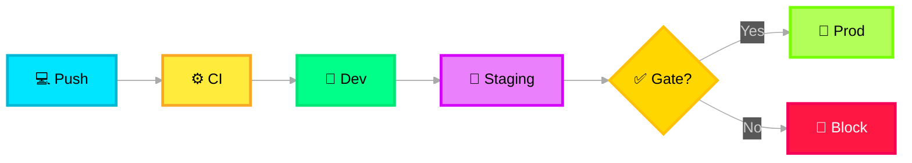

# 🚀 Deployment Model

> **Purpose**: Multi-environment deployment strategy ensuring environment parity and safe progressive rollout.

---

## Environments

| Environment | Purpose | LLM Endpoint | Data |
|---|---|---|---|
| **Dev** | Development and experimentation | GPT-4o (cost-optimized) | Synthetic incidents |
| **Staging** | Pre-production validation | GPT-5.2 (same as prod) | Anonymized real incidents |
| **Prod** | Live production | GPT-5.2 (production SKU) | Real incidents |

## Overlays Architecture

The Deployment Model connects to both Input Layer and Output Layer via **Overlays** connections:

- **Input Overlay**: Controls which data sources are active (dev uses synthetic, prod uses real)
- **Output Overlay**: Controls which delivery channels are active (dev uses logging only, prod uses all channels)

## Deployment Strategy

## Deployment Toolchain

| Tool | Purpose |
|---|---|
| **GitHub Actions** | CI/CD pipeline automation |
| **Azure Developer CLI (`azd`)** | Foundry agent deployment, environment provisioning |
| **Terraform** | Multi-environment infrastructure management |
| **Bicep** | Azure-native resource templates |
| **Docker + ACR** | Hosted agent packaging (Docker → Azure Container Registry → Foundry) |
