# 🚀 Deployment Model — Deep Dive

> **Purpose**: Multi-environment deployment using Azure AI Foundry Agent Service, Azure Container Apps, GitHub Actions CI/CD, and Infrastructure as Code (Terraform + Bicep). Covers Dev/Staging/Prod environments with progressive rollout.

---

## Architecture Overview

```mermaid
%%{init: {'theme': 'dark', 'themeVariables': {'lineColor': '#AAAAAA'}}}%%
graph LR
 A["Git Push"] --> B["GitHub Actions"]
 B --> C["Unit Tests"]
 C --> D["Docker Build"]
 D --> E["ACR Push"]
 E --> F["azd deploy"]
 F --> G["Dev"]
 G --> H["Integration Tests"]
 H --> I["Staging"]
 I --> J{"Approval Gate"}
 J -->|Approved| K["Prod"]
 J -->|Rejected| L["Block"]

 style A fill:#00E5FF,stroke:#00B8D4,stroke-width:3px,color:#000
 style B fill:#FFEB3B,stroke:#F9A825,stroke-width:3px,color:#000
 style C fill:#EA80FC,stroke:#D500F9,stroke-width:3px,color:#000
 style D fill:#7C4DFF,stroke:#651FFF,stroke-width:3px,color:#fff
 style E fill:#FF6D00,stroke:#FF9100,stroke-width:3px,color:#000
 style F fill:#40C4FF,stroke:#0091EA,stroke-width:3px,color:#000
 style G fill:#00FF88,stroke:#00E676,stroke-width:3px,color:#000
 style H fill:#FFEB3B,stroke:#F9A825,stroke-width:3px,color:#000
 style I fill:#EA80FC,stroke:#D500F9,stroke-width:3px,color:#000
 style J fill:#FFD600,stroke:#FFC107,stroke-width:3px,color:#000
 style K fill:#B2FF59,stroke:#76FF03,stroke-width:3px,color:#000
 style L fill:#FF1744,stroke:#F50057,stroke-width:3px,color:#fff
```



---

## Azure Service Mapping

| Component | Azure Service | Purpose |
|---|---|---|
| Agent hosting | **Azure AI Foundry Agent Service** | Foundry Hosted Agents (Summarizer, Evaluator) |
| Container hosting | **Azure Container Apps** | Pipeline modules, Tool Router, non-agent workers |
| Container registry | **Azure Container Registry** | Store Docker images |
| CI/CD pipeline | **GitHub Actions** | Build, test, deploy automation |
| Foundry deployment | **Azure Developer CLI (`azd`)** | Deploy agents and infra to Foundry |
| Infrastructure | **Terraform** + **Bicep** | Multi-env resource provisioning |
| Secrets | **Azure Key Vault** | Per-environment secrets |

---

## Environment Configuration

| | **Dev** | **Staging** | **Prod** |
|---|---|---|---|
| **LLM Model** | GPT-4o (cost-optimized) | GPT-5.2 (same as prod) | GPT-5.2 (production SKU) |
| **Data** | Synthetic incidents | Anonymized real data | Live incidents |
| **Output channels** | `api,cosmos` | `api,cosmos,blob` | `api,cosmos,blob,email,teams` |
| **Redis SKU** | Basic C0 (250MB) | Standard C1 (1GB) | Premium P1 (6GB, cluster) |
| **Cosmos DB** | Serverless | Serverless | Autoscale (400-4000 RU/s) |
| **AI Search** | Free tier | Basic | Standard S1 |
| **Foundry Agents** | 1 replica | 2 replicas | Auto-scale (2-10) |
| **Budget** | $50/day | $100/day | $500/day |

---

## GitHub Actions CI/CD Pipeline

```yaml
# .github/workflows/deploy.yml

name: ICM Pipeline Deploy
on:
  push:
    branches: [main]
  pull_request:
    branches: [main]

env:
  AZURE_SUBSCRIPTION_ID: ${{ secrets.AZURE_SUBSCRIPTION_ID }}
  ACR_NAME: icmregistry
  IMAGE_NAME: icm-pipeline

jobs:
  # ── Stage 1: Test ──────────────────────────────────
  test:
    runs-on: ubuntu-latest
    steps:
      - uses: actions/checkout@v4
      - uses: actions/setup-python@v5
        with:
          python-version: "3.12"
      - run: pip install -e ".[dev]"
      - run: pytest tests/ -v --cov=icm_agents --cov-report=xml
      - uses: codecov/codecov-action@v4

  # ── Stage 2: Build & Push ──────────────────────────
  build:
    needs: test
    runs-on: ubuntu-latest
    steps:
      - uses: actions/checkout@v4
      - uses: azure/login@v2
        with:
          creds: ${{ secrets.AZURE_CREDENTIALS }}
      - run: |
          az acr login --name $ACR_NAME
          docker build -t $ACR_NAME.azurecr.io/$IMAGE_NAME:${{ github.sha }} .
          docker push $ACR_NAME.azurecr.io/$IMAGE_NAME:${{ github.sha }}

  # ── Stage 3: Deploy to Dev ─────────────────────────
  deploy-dev:
    needs: build
    runs-on: ubuntu-latest
    environment: dev
    steps:
      - uses: actions/checkout@v4
      - uses: azure/login@v2
        with:
          creds: ${{ secrets.AZURE_CREDENTIALS }}
      - run: |
          curl -fsSL https://aka.ms/install-azd.sh | bash
          azd env select dev
          azd deploy --no-prompt

  # ── Stage 4: Integration Tests ─────────────────────
  integration-test:
    needs: deploy-dev
    runs-on: ubuntu-latest
    steps:
      - uses: actions/checkout@v4
      - run: pytest tests/integration/ -v --env=dev

  # ── Stage 5: Deploy to Staging ─────────────────────
  deploy-staging:
    needs: integration-test
    runs-on: ubuntu-latest
    environment: staging
    steps:
      - uses: actions/checkout@v4
      - uses: azure/login@v2
        with:
          creds: ${{ secrets.AZURE_CREDENTIALS }}
      - run: |
          azd env select staging
          azd deploy --no-prompt

  # ── Stage 6: Deploy to Prod (manual approval) ─────
  deploy-prod:
    needs: deploy-staging
    runs-on: ubuntu-latest
    environment:
      name: production
      url: https://icm-pipeline.azurewebsites.net
    steps:
      - uses: actions/checkout@v4
      - uses: azure/login@v2
        with:
          creds: ${{ secrets.AZURE_CREDENTIALS }}
      - run: |
          azd env select prod
          azd deploy --no-prompt
```

---

## Azure Developer CLI (`azd`) Configuration

```yaml
# azure.yaml — azd project definition

name: icm-pipeline
metadata:
  template: icm-agents@1.0

services:
  # Foundry Hosted Agents (deployed via azd)
  summarizer-agent:
    project: ./src/icm_agents/agents/summarizer
    host: ai.foundry
    language: python

  evaluator-agent:
    project: ./src/icm_agents/agents/evaluator
    host: ai.foundry
    language: python

  # Pipeline modules (deployed to Container Apps)
  pipeline:
    project: ./src/icm_agents
    host: containerapp
    language: python
    docker:
      path: ./Dockerfile

infra:
  provider: terraform
  path: ./infra
```

---

## Terraform — Multi-Environment Infrastructure

```hcl
# infra/main.tf

variable "environment" {
  type    = string
  default = "dev"
}

locals {
  env_config = {
    dev = {
      redis_sku     = "Basic"
      redis_size    = "C0"
      cosmos_mode   = "Serverless"
      search_sku    = "free"
      budget_daily  = 50
    }
    staging = {
      redis_sku     = "Standard"
      redis_size    = "C1"
      cosmos_mode   = "Serverless"
      search_sku    = "basic"
      budget_daily  = 100
    }
    prod = {
      redis_sku     = "Premium"
      redis_size    = "P1"
      cosmos_mode   = "Autoscale"
      search_sku    = "standard"
      budget_daily  = 500
    }
  }
  config = local.env_config[var.environment]
}

# ── Resource Group ──────────────────────────────────
resource "azurerm_resource_group" "main" {
  name     = "rg-icm-${var.environment}"
  location = "eastus2"
}

# ── Azure Cache for Redis ───────────────────────────
resource "azurerm_redis_cache" "main" {
  name                = "icm-redis-${var.environment}"
  location            = azurerm_resource_group.main.location
  resource_group_name = azurerm_resource_group.main.name
  capacity            = 1
  family              = local.config.redis_sku == "Premium" ? "P" : "C"
  sku_name            = local.config.redis_sku
  minimum_tls_version = "1.2"
  enable_non_ssl_port = false
}

# ── Azure Cosmos DB ─────────────────────────────────
resource "azurerm_cosmosdb_account" "main" {
  name                = "icm-cosmos-${var.environment}"
  location            = azurerm_resource_group.main.location
  resource_group_name = azurerm_resource_group.main.name
  offer_type          = "Standard"
  kind                = "GlobalDocumentDB"

  capabilities {
    name = local.config.cosmos_mode == "Serverless" ? "EnableServerless" : ""
  }

  consistency_policy {
    consistency_level = "Session"
  }

  geo_location {
    location          = azurerm_resource_group.main.location
    failover_priority = 0
  }
}

# ── Azure AI Search ─────────────────────────────────
resource "azurerm_search_service" "main" {
  name                = "icm-search-${var.environment}"
  location            = azurerm_resource_group.main.location
  resource_group_name = azurerm_resource_group.main.name
  sku                 = local.config.search_sku
}

# ── Azure Key Vault ─────────────────────────────────
resource "azurerm_key_vault" "main" {
  name                = "icm-vault-${var.environment}"
  location            = azurerm_resource_group.main.location
  resource_group_name = azurerm_resource_group.main.name
  tenant_id           = data.azurerm_client_config.current.tenant_id
  sku_name            = "standard"
  purge_protection_enabled = true
}

# ── Application Insights ───────────────────────────
resource "azurerm_application_insights" "main" {
  name                = "icm-insights-${var.environment}"
  location            = azurerm_resource_group.main.location
  resource_group_name = azurerm_resource_group.main.name
  application_type    = "web"
}

# ── Container Apps Environment ──────────────────────
resource "azurerm_container_app_environment" "main" {
  name                = "icm-cae-${var.environment}"
  location            = azurerm_resource_group.main.location
  resource_group_name = azurerm_resource_group.main.name
}
```

---

## Foundry Hosted Agent Deployment via `azd`

```bash
# Deploy all agents and infrastructure for a given environment

# 1. Login
azd auth login

# 2. Select environment
azd env select dev  # or staging, prod

# 3. Provision infrastructure (Terraform)
azd provision

# 4. Deploy agents and services
azd deploy

# 5. Monitor
azd monitor --live
```

---

## Docker — Pipeline Module Image

```dockerfile
# Dockerfile

FROM python:3.12-slim

WORKDIR /app

COPY pyproject.toml .
COPY src/ src/
COPY templates/ templates/
COPY workflows/ workflows/

RUN pip install --no-cache-dir -e .

# Health check endpoint
HEALTHCHECK --interval=30s --timeout=5s \
  CMD curl -f http://localhost:8000/health || exit 1

EXPOSE 8000

CMD ["uvicorn", "icm_agents.main:app", "--host", "0.0.0.0", "--port", "8000"]
```

---

## Deployment Overlays — Environment Variables

```env
# ── Shared (all environments) ────────────────────────
PROJECT_ENDPOINT=https://<project>.services.ai.azure.com
APPLICATIONINSIGHTS_CONNECTION_STRING=InstrumentationKey=...

# ── Dev ──────────────────────────────────────────────
MODEL_DEPLOYMENT_NAME=gpt-4o
OUTPUT_CHANNELS=api,cosmos
DAILY_BUDGET_USD=50

# ── Staging ──────────────────────────────────────────
MODEL_DEPLOYMENT_NAME=gpt-5.2
OUTPUT_CHANNELS=api,cosmos,blob
DAILY_BUDGET_USD=100

# ── Prod ─────────────────────────────────────────────
MODEL_DEPLOYMENT_NAME=gpt-5.2
OUTPUT_CHANNELS=api,cosmos,blob,email,teams
DAILY_BUDGET_USD=500
```
