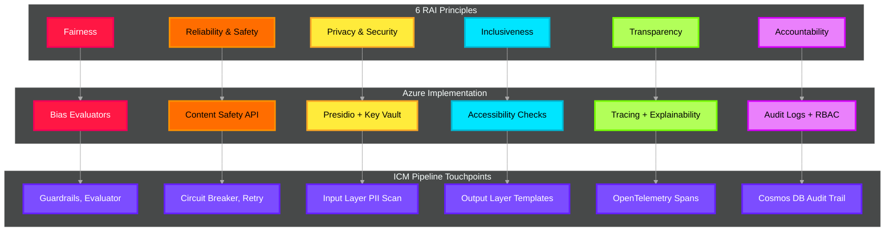

# Responsible AI (RAI) — Microsoft's 6 Principles Deep Dive

> **Purpose**: Operationalize Microsoft's six Responsible AI principles across the ICM pipeline using the `azure-ai-evaluation` SDK, Azure AI Content Safety, and Foundry built-in safety layers. Every agent output is measured against quantifiable RAI metrics before delivery.

---

## The 6 RAI Principles — Architecture Mapping



---

## Azure Service Mapping

| Principle            | Azure Service                                | SDK / Tool                                        |
| -------------------- | -------------------------------------------- | ------------------------------------------------- |
| Fairness             | **Azure AI Evaluation SDK**                  | `azure-ai-evaluation` — bias evaluators           |
| Reliability & Safety | **Azure AI Content Safety**                  | `ContentSafetyEvaluator`, `GroundednessEvaluator` |
| Privacy & Security   | **Microsoft Presidio** + **Azure Key Vault** | PII scan + secrets management                     |
| Inclusiveness        | **Azure AI Content Safety**                  | `HateUnfairnessEvaluator`                         |
| Transparency         | **Application Insights** + **OpenTelemetry** | Distributed tracing, explainability logs          |
| Accountability       | **Azure Cosmos DB** + **Azure Monitor**      | Immutable audit trail, alert rules                |

---

## 1. Fairness

> AI systems should treat all people equitably, without bias based on race, gender, age, or socioeconomic background.

**ICM Implementation**: Ensure that incident classification, severity scoring, and mitigation recommendations are consistent regardless of the submitter's identity or service region.

```python
# src/icm_agents/rai/fairness.py

from azure.ai.evaluation import (
    RelevanceEvaluator,
    CoherenceEvaluator,
)
from azure.identity import DefaultAzureCredential
import os


class FairnessEvaluator:
    """
    Evaluate agent outputs for fairness across demographic slices.
    Checks that classification accuracy and severity scores
    do not vary significantly across service regions or submitter roles.
    """

    def __init__(self):
        self.credential = DefaultAzureCredential()
        self.model_config = {
            "azure_endpoint": os.getenv("AZURE_OPENAI_ENDPOINT"),
            "azure_deployment": os.getenv("MODEL_DEPLOYMENT_NAME"),
        }

    def evaluate_consistency(self, outputs: list[dict]) -> dict:
        """
        Compare agent outputs across different demographic slices.
        Flag statistically significant deviations (>15% variance).
        """
        # Group outputs by region/submitter_role
        groups = {}
        for output in outputs:
            key = output.get("metadata", {}).get("region", "unknown")
            groups.setdefault(key, []).append(output)

        # Calculate severity score variance across groups
        group_means = {}
        for group_name, group_outputs in groups.items():
            scores = [o.get("severity_score", 0.5) for o in group_outputs]
            group_means[group_name] = sum(scores) / len(scores) if scores else 0

        overall_mean = sum(group_means.values()) / len(group_means) if group_means else 0
        max_deviation = max(
            abs(m - overall_mean) / overall_mean if overall_mean > 0 else 0
            for m in group_means.values()
        ) if group_means else 0

        return {
            "principle": "fairness",
            "group_means": group_means,
            "overall_mean": round(overall_mean, 4),
            "max_deviation_pct": round(max_deviation * 100, 2),
            "passed": max_deviation < 0.15,  # <15% variance threshold
            "recommendation": (
                "Within acceptable variance"
                if max_deviation < 0.15
                else f"Severity scores vary by {max_deviation*100:.1f}% across groups — investigate model bias"
            ),
        }
```

| Metric                                 | Threshold | Measurement                                           |
| -------------------------------------- | --------- | ----------------------------------------------------- |
| Severity score variance across regions | < 15%     | Per-group mean vs overall mean                        |
| Classification consistency             | > 90%     | Same inputs, different metadata → same category       |
| Recommendation bias                    | < 10%     | Mitigation actions should not favor specific services |

---

## 2. Reliability & Safety

> AI systems should perform reliably, safely, and consistently under expected and unexpected conditions.

**ICM Implementation**: Content safety screening + groundedness evaluation ensures agent outputs are factual and free from harmful content.

```python
# src/icm_agents/rai/reliability.py

import os
from azure.ai.evaluation import (
    GroundednessEvaluator,
    ContentSafetyEvaluator,
    ViolenceEvaluator,
    SelfHarmEvaluator,
)
from azure.identity import DefaultAzureCredential


class ReliabilitySafetyEvaluator:
    """
    Evaluate agent outputs for groundedness (anti-hallucination)
    and content safety using Azure AI Evaluation SDK.
    """

    def __init__(self):
        self.credential = DefaultAzureCredential()
        self.model_config = {
            "azure_endpoint": os.getenv("AZURE_OPENAI_ENDPOINT"),
            "azure_deployment": os.getenv("MODEL_DEPLOYMENT_NAME"),
        }
        self.project_scope = {
            "subscription_id": os.getenv("AZURE_SUBSCRIPTION_ID"),
            "resource_group_name": os.getenv("RESOURCE_GROUP"),
            "project_name": os.getenv("AI_PROJECT_NAME"),
        }

        # Initialize evaluators
        self.groundedness = GroundednessEvaluator(
            model_config=self.model_config,
        )
        self.content_safety = ContentSafetyEvaluator(
            credential=self.credential,
            azure_ai_project=self.project_scope,
        )
        self.violence = ViolenceEvaluator(
            credential=self.credential,
            azure_ai_project=self.project_scope,
        )
        self.self_harm = SelfHarmEvaluator(
            credential=self.credential,
            azure_ai_project=self.project_scope,
        )

    def evaluate(self, query: str, response: str, context: str) -> dict:
        """Run all reliability & safety evaluations."""

        # Groundedness: is the response supported by context?
        groundedness_result = self.groundedness(
            query=query,
            response=response,
            context=context,
        )

        # Content safety: harmful content check
        safety_result = self.content_safety(
            query=query,
            response=response,
        )

        # Violence check
        violence_result = self.violence(
            query=query,
            response=response,
        )

        # Self-harm check
        self_harm_result = self.self_harm(
            query=query,
            response=response,
        )

        groundedness_score = groundedness_result.get("groundedness", 0)
        violence_score = violence_result.get("violence_score", 0)
        self_harm_score = self_harm_result.get("self_harm_score", 0)

        return {
            "principle": "reliability_safety",
            "groundedness": {
                "score": groundedness_score,  # 1-5 scale (5 = fully grounded)
                "passed": groundedness_score >= 4,
            },
            "content_safety": {
                "overall": safety_result,
                "violence_severity": violence_score,
                "self_harm_severity": self_harm_score,
                "passed": violence_score < 4 and self_harm_score < 4,
            },
            "passed": groundedness_score >= 4 and violence_score < 4 and self_harm_score < 4,
        }
```

| Metric                   | Threshold               | Scale                                         |
| ------------------------ | ----------------------- | --------------------------------------------- |
| Groundedness score       | ≥ 4 out of 5            | 1 = fabricated, 5 = fully grounded in context |
| Violence severity        | < 4 out of 7            | 0 = none, 6 = extreme                         |
| Self-harm severity       | < 4 out of 7            | 0 = none, 6 = extreme                         |
| Content safety (overall) | All categories < Medium | Hate, Sexual, Violence, Self-Harm             |

---

## 3. Privacy & Security

> AI systems should protect user data throughout its lifecycle and comply with privacy regulations.

**ICM Implementation**: PII redaction at ingestion (Presidio), encryption at rest/transit, secrets via Key Vault, and data classification before any LLM processing.

```python
# src/icm_agents/rai/privacy.py

import os
from presidio_analyzer import AnalyzerEngine
from azure.keyvault.secrets import SecretClient
from azure.identity import DefaultAzureCredential
from opentelemetry import trace

tracer = trace.get_tracer("icm.rai.privacy")


class PrivacySecurityEvaluator:
    """
    Verify privacy & security controls are enforced.
    Checks: PII not leaked, secrets not exposed, encryption active.
    """

    def __init__(self):
        self.analyzer = AnalyzerEngine()
        self.vault = SecretClient(
            vault_url=os.getenv("KEY_VAULT_URL"),
            credential=DefaultAzureCredential(),
        )

    def evaluate_output(self, agent_output: str) -> dict:
        """Check that agent output does not contain leaked PII."""
        with tracer.start_as_current_span("rai.privacy.evaluate"):
            # Scan agent output for PII
            results = self.analyzer.analyze(text=agent_output, language="en")
            high_confidence = [r for r in results if r.score > 0.85]

            # Check for leaked secrets patterns
            secret_patterns = [
                "AccountKey=", "SharedAccessKey=", "Password=",
                "Bearer ", "eyJ",  # JWT tokens
            ]
            leaked_secrets = [p for p in secret_patterns if p in agent_output]

            return {
                "principle": "privacy_security",
                "pii_detected": [
                    {"entity": r.entity_type, "score": r.score}
                    for r in high_confidence
                ],
                "pii_count": len(high_confidence),
                "secrets_leaked": leaked_secrets,
                "passed": len(high_confidence) == 0 and len(leaked_secrets) == 0,
                "recommendation": (
                    "No PII or secrets detected"
                    if len(high_confidence) == 0 and len(leaked_secrets) == 0
                    else "PII or secrets detected in output — re-run Presidio anonymizer"
                ),
            }
```

| Metric                | Threshold                 | Enforcement Point               |
| --------------------- | ------------------------- | ------------------------------- |
| PII in agent output   | 0 entities (score > 0.85) | Output Layer validation         |
| Secrets in output     | 0 patterns matched        | Output Layer validation         |
| Encryption at rest    | AES-256 required          | Azure Storage SSE (automatic)   |
| Encryption in transit | TLS 1.3 required          | All Azure endpoints (automatic) |
| Key rotation          | Every 90 days             | Azure Key Vault policy          |

---

## 4. Inclusiveness

> AI systems should engage everyone equitably, regardless of ability, language, or background.

**ICM Implementation**: Hate/unfairness detection in outputs, accessible output formatting, and multi-language support in incident parsing.

```python
# src/icm_agents/rai/inclusiveness.py

import os
from azure.ai.evaluation import HateUnfairnessEvaluator
from azure.identity import DefaultAzureCredential


class InclusivenessEvaluator:
    """
    Evaluate outputs for hate speech, unfairness, and exclusionary language.
    Uses Azure AI Content Safety's HateUnfairness evaluator.
    """

    def __init__(self):
        self.credential = DefaultAzureCredential()
        self.project_scope = {
            "subscription_id": os.getenv("AZURE_SUBSCRIPTION_ID"),
            "resource_group_name": os.getenv("RESOURCE_GROUP"),
            "project_name": os.getenv("AI_PROJECT_NAME"),
        }
        self.hate_evaluator = HateUnfairnessEvaluator(
            credential=self.credential,
            azure_ai_project=self.project_scope,
        )

    def evaluate(self, query: str, response: str) -> dict:
        """Check output for exclusionary or hateful content."""
        result = self.hate_evaluator(query=query, response=response)
        hate_score = result.get("hate_unfairness_score", 0)

        return {
            "principle": "inclusiveness",
            "hate_unfairness_score": hate_score,  # 0-7 severity
            "passed": hate_score < 4,  # Below Medium threshold
            "accessibility_checks": {
                "plain_language": True,  # Enforced by output templates
                "no_jargon_overload": True,  # Controlled by agent prompt
                "screen_reader_compatible": True,  # HTML output uses semantic tags
            },
        }
```

| Metric                     | Threshold           | Measurement                       |
| -------------------------- | ------------------- | --------------------------------- |
| Hate/unfairness severity   | < 4 (Medium)        | Azure AI Content Safety 0–7 scale |
| Plain language readability | Flesch-Kincaid ≤ 12 | Output template enforcement       |
| Accessibility compliance   | WCAG 2.1 AA         | HTML output templates             |

---

## 5. Transparency

> AI systems should be understandable. Users should know how decisions are made, what the system can and cannot do, and how it operates.

**ICM Implementation**: Full OpenTelemetry tracing of every decision, confidence scores on all outputs, and explainability metadata in every agent response.

```python
# src/icm_agents/rai/transparency.py

from opentelemetry import trace
from pydantic import BaseModel, Field
from typing import Optional

tracer = trace.get_tracer("icm.rai.transparency")


class ExplainabilityMetadata(BaseModel):
    """Attached to every agent output for transparency."""
    model_name: str
    model_version: str
    temperature: float
    prompt_tokens: int
    completion_tokens: int
    confidence_score: float = Field(ge=0.0, le=1.0)
    reasoning_summary: str
    source_documents: list[str] = Field(default_factory=list)
    evaluation_scores: dict = Field(default_factory=dict)
    limitations: list[str] = Field(default_factory=list)
    trace_id: Optional[str] = None


class TransparencyEvaluator:
    """
    Verify that all agent outputs include required transparency metadata.
    Every decision must be traceable and explainable.
    """

    REQUIRED_FIELDS = [
        "model_name", "confidence_score", "reasoning_summary",
        "source_documents", "trace_id",
    ]

    def evaluate(self, output: dict) -> dict:
        """Check output for transparency compliance."""
        metadata = output.get("explainability", {})
        missing = [f for f in self.REQUIRED_FIELDS if f not in metadata or not metadata[f]]

        # Check confidence score is provided
        confidence = metadata.get("confidence_score")
        has_reasoning = bool(metadata.get("reasoning_summary", "").strip())
        has_sources = len(metadata.get("source_documents", [])) > 0

        return {
            "principle": "transparency",
            "missing_fields": missing,
            "has_confidence_score": confidence is not None,
            "has_reasoning": has_reasoning,
            "has_source_citations": has_sources,
            "has_trace_id": bool(metadata.get("trace_id")),
            "passed": len(missing) == 0,
            "recommendation": (
                "All transparency requirements met"
                if len(missing) == 0
                else f"Missing transparency fields: {missing}"
            ),
        }
```

| Metric            | Requirement               | Enforcement                 |
| ----------------- | ------------------------- | --------------------------- |
| Confidence score  | Present on every output   | Pydantic model validation   |
| Reasoning summary | Non-empty explanation     | Agent prompt instructions   |
| Source citations  | ≥ 1 source document       | Vector Store search results |
| Trace ID          | OpenTelemetry span linked | Auto-injected by middleware |
| Model version     | Logged per request        | Explainability metadata     |

---

## 6. Accountability

> People who design and deploy AI systems must be accountable for how their systems operate. Clear governance, audit trails, and human oversight mechanisms are required.

**ICM Implementation**: Immutable audit logs in Cosmos DB, role-based access control, human review queues for low-confidence outputs, and automated compliance reporting.

```python
# src/icm_agents/rai/accountability.py

import os
from datetime import datetime, timezone
from azure.cosmos.aio import CosmosClient
from azure.identity import DefaultAzureCredential
from opentelemetry import trace
from pydantic import BaseModel, Field

tracer = trace.get_tracer("icm.rai.accountability")


class AuditEntry(BaseModel):
    """Immutable audit record for every pipeline action."""
    audit_id: str
    incident_id: str
    timestamp: str = Field(default_factory=lambda: datetime.now(timezone.utc).isoformat())
    actor: str  # "system" | "agent:<name>" | "human:<upn>"
    action: str  # "classify" | "evaluate" | "approve" | "reject" | "escalate"
    module: str
    input_hash: str  # SHA-256 of input for tamper detection
    output_hash: str  # SHA-256 of output
    decision: str
    confidence: float = Field(ge=0.0, le=1.0)
    rai_scores: dict = Field(default_factory=dict)
    human_override: bool = False
    justification: str = ""


class AccountabilityManager:
    """
    Manage audit trails and human oversight for the ICM pipeline.
    All entries are immutable once written to Cosmos DB.
    """

    def __init__(self):
        credential = DefaultAzureCredential()
        self.cosmos = CosmosClient(
            url=os.getenv("COSMOS_ENDPOINT"),
            credential=credential,
        )
        self.audit_container = (
            self.cosmos
            .get_database_client("icm-system")
            .get_container_client("audit-trail")
        )

    async def log_action(self, entry: AuditEntry) -> None:
        """Write immutable audit entry to Cosmos DB."""
        with tracer.start_as_current_span("rai.accountability.log") as span:
            span.set_attribute("incident_id", entry.incident_id)
            span.set_attribute("action", entry.action)

            await self.audit_container.create_item(body={
                "id": entry.audit_id,
                "partitionKey": entry.incident_id,
                **entry.model_dump(),
            })

    async def get_audit_trail(self, incident_id: str) -> list[AuditEntry]:
        """Retrieve full audit trail for an incident."""
        query = "SELECT * FROM c WHERE c.incident_id = @id ORDER BY c.timestamp ASC"
        items = self.audit_container.query_items(
            query=query,
            parameters=[{"name": "@id", "value": incident_id}],
            partition_key=incident_id,
        )
        return [AuditEntry(**item) async for item in items]

    async def evaluate_accountability(self, incident_id: str) -> dict:
        """Evaluate accountability compliance for an incident."""
        trail = await self.get_audit_trail(incident_id)

        has_human_review = any(e.actor.startswith("human:") for e in trail)
        has_rai_scores = all(bool(e.rai_scores) for e in trail if e.action in ("classify", "evaluate"))
        all_justified = all(bool(e.justification) for e in trail if e.human_override)

        return {
            "principle": "accountability",
            "total_actions": len(trail),
            "human_reviews": sum(1 for e in trail if e.actor.startswith("human:")),
            "has_required_human_review": has_human_review,
            "all_rai_scored": has_rai_scores,
            "all_overrides_justified": all_justified,
            "passed": has_rai_scores and all_justified,
        }
```

| Metric                 | Requirement                      | Storage                           |
| ---------------------- | -------------------------------- | --------------------------------- |
| Every action logged    | 100% pipeline actions            | Cosmos DB `audit-trail` container |
| Input/output hashes    | SHA-256 tamper detection         | Immutable Cosmos DB records       |
| Human review           | Required for confidence < 0.40   | Service Bus `human-review` queue  |
| Override justification | Required for all human overrides | Audit entry `justification` field |
| Retention              | 7 years minimum                  | Cosmos DB with archival policy    |

---

## Unified RAI Evaluation Pipeline

```python
# src/icm_agents/rai/pipeline.py

from icm_agents.rai.fairness import FairnessEvaluator
from icm_agents.rai.reliability import ReliabilitySafetyEvaluator
from icm_agents.rai.privacy import PrivacySecurityEvaluator
from icm_agents.rai.inclusiveness import InclusivenessEvaluator
from icm_agents.rai.transparency import TransparencyEvaluator
from icm_agents.rai.accountability import AccountabilityManager
from opentelemetry import trace

tracer = trace.get_tracer("icm.rai.pipeline")


class RAIPipeline:
    """
    Run all 6 RAI principle evaluations on agent output.
    Returns a comprehensive RAI scorecard.
    """

    def __init__(self):
        self.reliability = ReliabilitySafetyEvaluator()
        self.privacy = PrivacySecurityEvaluator()
        self.inclusiveness = InclusivenessEvaluator()
        self.transparency = TransparencyEvaluator()

    async def evaluate(
        self,
        query: str,
        response: str,
        context: str,
        output_metadata: dict,
    ) -> dict:
        """Run full RAI evaluation suite."""
        with tracer.start_as_current_span("rai.full_evaluation") as span:

            results = {
                "reliability_safety": self.reliability.evaluate(query, response, context),
                "privacy_security": self.privacy.evaluate_output(response),
                "inclusiveness": self.inclusiveness.evaluate(query, response),
                "transparency": self.transparency.evaluate(output_metadata),
            }

            # Composite pass/fail
            all_passed = all(r.get("passed", False) for r in results.values())

            results["overall"] = {
                "all_principles_passed": all_passed,
                "principles_failed": [
                    name for name, r in results.items() if not r.get("passed", False)
                ],
            }

            span.set_attribute("rai.passed", all_passed)
            return results
```

---

## RAI Scorecard — Application Insights Dashboard

```kql
// RAI Compliance Rate by Principle
customMetrics
| where name startswith "rai."
| extend principle = tostring(customDimensions["principle"])
| summarize
    total = count(),
    passed = countif(value == 1),
    pass_rate = round(100.0 * countif(value == 1) / count(), 2)
  by principle, bin(timestamp, 1d)

// RAI Failures — Drill-down
traces
| where message contains "rai"
| extend principle = tostring(customDimensions["principle"]),
         passed = tobool(customDimensions["rai.passed"])
| where passed == false
| project timestamp, principle, customDimensions
| order by timestamp desc
```

---

## Summary — 6 Principles at a Glance

| #   | Principle                | Key Metric                      | Threshold           | Azure Service                                      |
| --- | ------------------------ | ------------------------------- | ------------------- | -------------------------------------------------- |
| 1   | **Fairness**             | Severity variance across groups | < 15%               | `azure-ai-evaluation`                              |
| 2   | **Reliability & Safety** | Groundedness score              | ≥ 4/5               | `GroundednessEvaluator` + `ContentSafetyEvaluator` |
| 3   | **Privacy & Security**   | PII in output                   | 0 entities          | Presidio + Key Vault                               |
| 4   | **Inclusiveness**        | Hate/unfairness severity        | < 4/7               | `HateUnfairnessEvaluator`                          |
| 5   | **Transparency**         | Missing explainability fields   | 0 missing           | OpenTelemetry + Pydantic                           |
| 6   | **Accountability**       | Audit coverage                  | 100% actions logged | Cosmos DB immutable audit                          |

---

## Environment Variables

```env
AZURE_OPENAI_ENDPOINT=https://<resource>.openai.azure.com
MODEL_DEPLOYMENT_NAME=gpt-5.2
AZURE_SUBSCRIPTION_ID=<sub-id>
RESOURCE_GROUP=rg-icm-prod
AI_PROJECT_NAME=icm-foundry-project
KEY_VAULT_URL=https://icm-vault.vault.azure.net
COSMOS_ENDPOINT=https://icm-cosmos.documents.azure.com:443/
```
