# GenAI Architecture Design Document
## Agentic AI — Incident Management (ICM) System

| Field | Value |
|---|---|
| **Document Version** | 1.0 |
| **Date** | February 10, 2026 |
| **Classification** | Internal — Engineering |
| **Status** | Draft |

---

## Table of Contents

1. [Executive Summary](#1-executive-summary)
2. [Architectural Principles](#2-architectural-principles)
3. [System Overview & Data Flow](#3-system-overview--data-flow)
4. [Module Deep-Dives](#4-module-deep-dives)
   - 4.1 [Input Layer](#41-input-layer)
   - 4.2 [Context Manager](#42-context-manager)
   - 4.3 [Tool Router](#43-tool-router)
   - 4.4 [Summarizer Agent](#44-summarizer-agent)
   - 4.5 [Memory Manager](#45-memory-manager)
   - 4.6 [Vector Store](#46-vector-store)
   - 4.7 [Aggregated Results Layer](#47-aggregated-results-layer)
   - 4.8 [Supervisor Agent](#48-supervisor-agent)
   - 4.9 [Guardrails & Gatekeeping](#49-guardrails--gatekeeping)
   - 4.10 [WF-9 Noise Agent](#410-wf-9-noise-agent)
   - 4.11 [WF-10 Impact Agent](#411-wf-10-impact-agent)
   - 4.12 [WF-25 Mitigation Agent](#412-wf-25-mitigation-agent)
   - 4.13 [Evaluator](#413-evaluator)
   - 4.14 [Output Layer](#414-output-layer)
5. [Cross-Cutting Concerns](#5-cross-cutting-concerns)
   - 5.1 [Safety & Governance](#51-safety--governance)
   - 5.2 [Observability & Control](#52-observability--control)
   - 5.3 [Deployment Model](#53-deployment-model)
6. [Data Contracts & Schemas](#6-data-contracts--schemas)
7. [Technology Stack](#7-technology-stack)

---

## 1. Executive Summary

This document defines the **GenAI Architecture** for the Agentic AI Incident Management (ICM) System — a multi-agent orchestration platform that **ingests raw incident data** (emails, chat transcripts, system logs), processes it through a pipeline of specialized AI agents, and produces three actionable outputs:

| Output | Description |
|---|---|
| **Filtered Timeline** | Noise-free, chronological incident narrative |
| **Impact Summary** | Factual report assessing business and technical impact |
| **Mitigation Workflow** | Step-by-step action plan for incident resolution |

The system employs a **Supervisor-Worker** agent architecture pattern — implemented via **Microsoft Agent Framework (MAF)** on **Azure AI Foundry Agent Service** — where a central Supervisor Agent validates, delegates, and quality-controls the work of three specialized workflow agents (Noise, Impact, Mitigation), each gated by guardrails. The architecture integrates persistent memory, semantic search, AI safety governance, and full observability.

### Key Design Decisions

| Decision | Rationale |
|---|---|
| **Supervisor-Worker pattern** over flat agent mesh | Central orchestration provides deterministic control flow, auditability, and easier debugging |
| **Azure AI Foundry Agent Service** as runtime | Managed agent hosting with built-in conversation state, tool orchestration, content filters, and observability via Application Insights |
| **Microsoft Agent Framework (MAF)** for orchestration | Declarative workflow YAML, connected agents, and support for sequential / concurrent / handoff / magentic orchestration patterns |
| **Guardrails before every agent** | Prevents hallucinated, incomplete, or unsafe inputs from reaching expensive LLM calls |
| **Bidirectional Memory/Vector Store** | Agents both retrieve context and persist learnings, enabling cross-incident knowledge accumulation |
| **Evaluator as separate module** | Decouples output quality assessment from generation, enabling independent iteration on quality metrics |
| **PII Redaction at ingestion** | Ensures no downstream agent ever processes raw PII, reducing blast radius of data leaks |
| **Hosted agents on Foundry** | Containerized agents deployed as Docker images on Foundry's managed pay-as-you-go infrastructure with auto-scaling |

---

## 2. Architectural Principles

| # | Principle | Application |
|---|---|---|
| 1 | **Defense in Depth** | Every workflow agent is fronted by a guardrail/gatekeeper. Safety & Governance wraps the entire pipeline. |
| 2 | **Separation of Concerns** | Each module has a single responsibility. Agents don't cross-cut into routing, memory, or evaluation. |
| 3 | **Fail-Safe Defaults** | If a guardrail rejects input, the pipeline halts gracefully rather than producing low-quality output. |
| 4 | **Observability-First** | Every module emits structured telemetry. Run History provides full audit trail. Cost Control tracks token spend. |
| 5 | **Memory-Augmented Reasoning** | Agents don't operate in isolation — they retrieve relevant context from Memory Manager and Vector Store before reasoning. |
| 6 | **Idempotent Processing** | Re-processing the same incident data produces the same outputs, enabling safe retries. |
| 7 | **Environment Parity** | Dev/Staging/Prod share identical architecture. Only configuration (endpoints, keys, rate limits) differs. |

---

## 3. System Overview & Data Flow

### 3.1 End-to-End Pipeline

```mermaid
%%{init: {'theme': 'dark', 'themeVariables': {'lineColor': '#AAAAAA'}}}%%
flowchart LR
    subgraph Input ["🟡 Input Layer"]
        RawData["📨 **Raw Incident Data**<br>Emails, Chats, Logs"]
    end

    RawData --> CM["📋 **Context Manager**<br>Manage Session Context"]
    CM --> TR["🔀 **Tool Router**<br>Route to Tools/Agents"]
    TR --> SA["🤖 **Summarizer Agent**<br>Normalize & Categorize"]
    SA <--> VS["🔍 **Vector Store**<br>Semantic Embeddings"]
    SA <--> MM["💾 **Memory Manager**<br>Short/Long-Term Memory<br>Stage Management"]
    SA --> ARL["📊 **Aggregated Results**<br>Structured Docs: Impact, Mitigation, Noise<br>Re-ranker for Results"]
    ARL --> SUP["🧠 **Supervisor Agent**<br>Validate & Delegate"]

    SUP -->|Route to| NG["🛡️ Noise Guardrails & Gatekeeper"]
    SUP -->|Route to| IG["🛡️ Impact Guardrails & Gatekeeper"]
    SUP -->|Route to| MG["🛡️ Mitigation Guardrails & Gatekeeper"]

    NG --> WF9["⚡ **WF-9 Noise Agent**<br>Filter Noise"]
    IG --> WF10["⚡ **WF-10 Impact Agent**<br>Assess Impact"]
    MG --> WF25["⚡ **WF-25 Mitigation Agent**<br>Orchestrate Mitigation"]

    WF9 & WF10 --> EV["✅ **Evaluator**<br>Assess Outputs"]
    EV --> OutputNoise
    EV --> OutputImpact
    WF25 --> OutputMitigation

    subgraph Output ["🟢 Output Layer"]
        OutputNoise["📄 **Noise Workflow Outputs**<br>Filtered Timeline"]
        OutputImpact["📄 **Impact Summary**<br>Factual Report"]
        OutputMitigation["📄 **Mitigation Workflow**<br>Action Plan"]
    end

    subgraph Observability ["🔭 Observability & Control"]
        EH["⚠️ Error Handling"]
        RH["📜 Run History"]
        HC["💚 Health Check"]
        CC["💰 Cost Control<br>Tokens, etc."]
    end

    subgraph Safety ["🔐 Safety & Governance"]
        AIGov["🏛️ **AI Governance**<br>Data Control, PII Redaction<br>Masking, Protection"]
        RespAI["🛡️ **Responsible AI**<br>Prompt Injections<br>Jailbreak Defenses"]
    end

    subgraph Deployment ["🚀 Deployment Model"]
        Env["💻 Dev/Staging/Prod Environments"]
    end

    RawData -.-> Safety
    SUP -.-> Safety
    Safety -.-> Observability
    TR -.-> Observability
    MM -.-> Observability
    VS -.-> Observability
    Deployment -.->|Overlays| Input
    Deployment -.->|Overlays| Output

    style RawData fill:#FFD600,stroke:#FFC107,stroke-width:3px,color:#000
    style CM fill:#00E5FF,stroke:#00B8D4,stroke-width:3px,color:#000
    style TR fill:#00E5FF,stroke:#00B8D4,stroke-width:3px,color:#000
    style SA fill:#18FFFF,stroke:#00E5FF,stroke-width:3px,color:#000
    style ARL fill:#00E5FF,stroke:#00B8D4,stroke-width:3px,color:#000
    style SUP fill:#40C4FF,stroke:#0091EA,stroke-width:3px,color:#000
    style MM fill:#EA80FC,stroke:#D500F9,stroke-width:3px,color:#000
    style VS fill:#EA80FC,stroke:#D500F9,stroke-width:3px,color:#000
    style NG fill:#00FF88,stroke:#00E676,stroke-width:3px,color:#000
    style IG fill:#00FF88,stroke:#00E676,stroke-width:3px,color:#000
    style MG fill:#00FF88,stroke:#00E676,stroke-width:3px,color:#000
    style WF9 fill:#FF1744,stroke:#F50057,stroke-width:3px,color:#fff
    style WF10 fill:#FF1744,stroke:#F50057,stroke-width:3px,color:#fff
    style WF25 fill:#FF1744,stroke:#F50057,stroke-width:3px,color:#fff
    style EV fill:#69F0AE,stroke:#00E676,stroke-width:3px,color:#000
    style OutputNoise fill:#B2FF59,stroke:#76FF03,stroke-width:3px,color:#000
    style OutputImpact fill:#B2FF59,stroke:#76FF03,stroke-width:3px,color:#000
    style OutputMitigation fill:#B2FF59,stroke:#76FF03,stroke-width:3px,color:#000
    style AIGov fill:#FF6D00,stroke:#FF9100,stroke-width:3px,color:#000
    style RespAI fill:#FF6D00,stroke:#FF9100,stroke-width:3px,color:#000
    style EH fill:#7C4DFF,stroke:#651FFF,stroke-width:3px,color:#fff
    style RH fill:#7C4DFF,stroke:#651FFF,stroke-width:3px,color:#fff
    style HC fill:#7C4DFF,stroke:#651FFF,stroke-width:3px,color:#fff
    style CC fill:#7C4DFF,stroke:#651FFF,stroke-width:3px,color:#fff
    style Env fill:#FFAB40,stroke:#FF9100,stroke-width:3px,color:#000
```

### 3.2 Data Flow Sequence

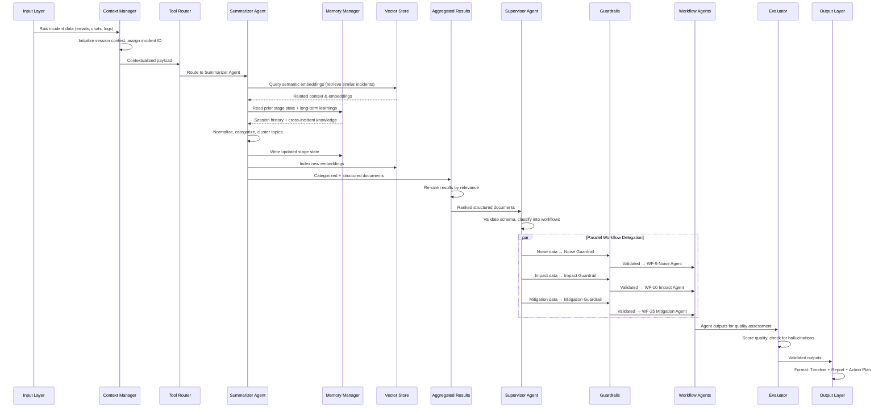

---

## 4. Module Deep-Dives

---

### 4.1 Input Layer

> **Purpose**: Single entry point for all raw incident data. Normalizes heterogeneous inputs into a unified schema.

#### What It Does
The Input Layer receives raw, unstructured incident data from multiple source types and transforms them into a common internal format before passing downstream. It does **not** perform any AI reasoning — it is a pure data ingestion and normalization layer.

#### Input Sources

| Source | Format | Example |
|---|---|---|
| **Emails** | MIME/EML, raw text | Customer escalation emails, auto-generated alert emails |
| **Chat Transcripts** | JSON, structured messages | Teams/Slack ICM channel conversations, bridge call transcripts |
| **System Logs** | Syslog, JSON, CSV | Application logs, infrastructure alerts, monitoring output |

#### Processing Logic

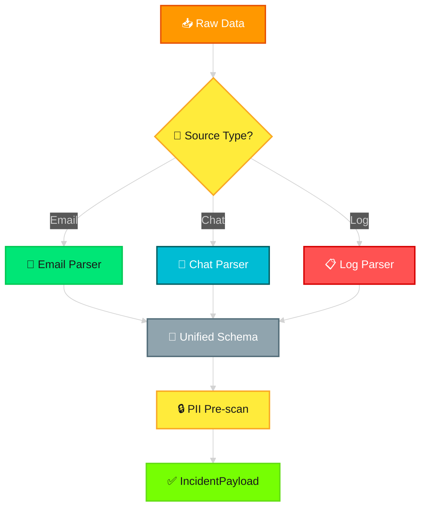

1. **Source Detection** — Identify incoming data type by content headers, file extension, or API endpoint
2. **Type-Specific Parsing** — Extract structured fields from each format using dedicated parsers
3. **Schema Unification** — Map all parsed data into the unified `IncidentPayload` schema
4. **PII Pre-scan** — Tag fields likely to contain PII (email addresses, phone numbers, names) for downstream masking
5. **Validation** — Reject malformed payloads with structured error responses

#### Output Contract

```json
{
  "incident_id": "INC-2026-001234",
  "session_id": "uuid-v4",
  "timestamp": "2026-02-10T17:00:00Z",
  "source_type": "email | chat | log",
  "raw_content": "...",
  "parsed_fields": {
    "subject": "...",
    "participants": ["..."],
    "severity_hint": "sev2",
    "error_codes": ["E4012"],
    "timeline_entries": [
      { "timestamp": "...", "actor": "...", "action": "...", "content": "..." }
    ]
  },
  "pii_tags": ["field_x", "field_y"],
  "metadata": {
    "ingestion_time": "...",
    "parser_version": "1.0",
    "byte_size": 4096
  }
}
```

#### Failure Handling
- **Malformed input** → Return 400 with validation errors; do not forward downstream
- **Unsupported source type** → Log warning, queue for manual review
- **Oversized payload** → Truncate to configurable max (default 100KB), attach truncation flag

#### Azure Mapping
| Component | Azure Service |
|---|---|
| Ingestion endpoint | Azure Functions (HTTP trigger) or Azure API Management |
| Queue buffering | Azure Service Bus |
| Blob storage (raw) | Azure Blob Storage |

---

### 4.2 Context Manager

> **Purpose**: Manage session context across the pipeline. Tracks conversation state, incident metadata, and ensures all downstream modules operate with shared awareness.

#### What It Does
The Context Manager acts as the **stateful backbone** of each processing run. It initializes a session when new incident data arrives, maintains a mutable context object that flows through every module, and persists session state for multi-turn or long-running incident processing.

#### Design Logic

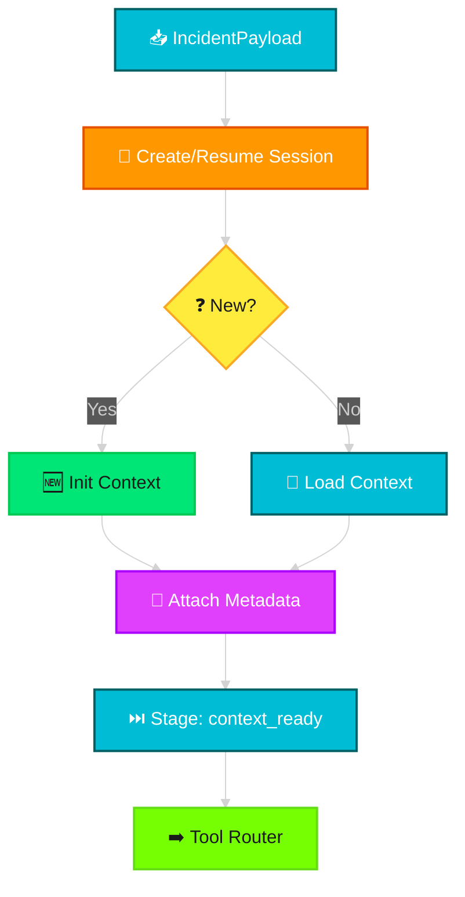

#### Context Object Structure

```json
{
  "session_id": "uuid-v4",
  "incident_id": "INC-2026-001234",
  "created_at": "2026-02-10T17:00:00Z",
  "current_stage": "context_ready",
  "stage_history": [
    { "stage": "ingested", "timestamp": "...", "module": "input_layer" },
    { "stage": "context_ready", "timestamp": "...", "module": "context_manager" }
  ],
  "incident_metadata": {
    "source_type": "email",
    "severity_hint": "sev2",
    "participants": ["alice@contoso.com"],
    "service_tree": "Azure/Compute/VM"
  },
  "accumulated_data": {},
  "flags": {
    "pii_detected": true,
    "high_priority": false
  }
}
```

#### Key Behaviors
| Behavior | Logic |
|---|---|
| **Session Resumption** | If an `incident_id` already has an active session, load it rather than creating new — enables multi-turn processing |
| **Stage Tracking** | Every module updates `current_stage` and appends to `stage_history`, creating an audit trail |
| **Context Enrichment** | Downstream modules can write to `accumulated_data` (e.g., Summarizer adds categories, Impact Agent adds severity) |
| **TTL Expiration** | Sessions older than 24h without updates are archived to cold storage |

#### Azure Mapping
| Component | Azure Service |
|---|---|
| Session store | Azure Cache for Redis (hot) + Azure Cosmos DB (warm) |
| Session TTL / eviction | Redis TTL policies |

---

### 4.3 Tool Router

> **Purpose**: Routes contextualized payloads to the appropriate tools and agents. Acts as a dynamic dispatch registry.

#### What It Does
The Tool Router is a **deterministic dispatch layer** — it does not use AI. It inspects the context and routes to the correct downstream module based on rules and configuration. In the primary flow, it routes to the Summarizer Agent, but it is designed to support dynamic tool registration for extensibility.

#### Routing Logic

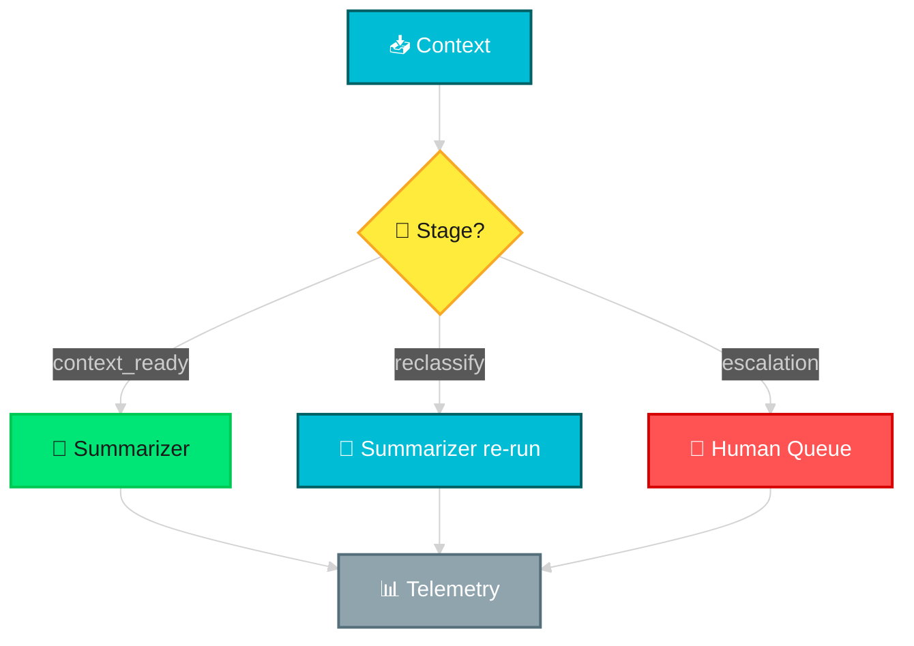

#### Tool Registry Model

```json
{
  "tools": [
    {
      "tool_id": "summarizer_agent",
      "description": "Normalize and categorize incident data",
      "input_schema": "IncidentPayload",
      "trigger_conditions": ["stage == 'context_ready'"],
      "priority": 1,
      "enabled": true
    },
    {
      "tool_id": "direct_impact_assessment",
      "description": "Skip summarization for pre-categorized incidents",
      "input_schema": "IncidentPayload",
      "trigger_conditions": ["stage == 'pre_categorized'"],
      "priority": 2,
      "enabled": false
    }
  ]
}
```

#### Key Behaviors
| Behavior | Logic |
|---|---|
| **Rule-based routing** | No LLM calls — pure conditional logic based on `current_stage` and `flags` |
| **Extensible registry** | New tools/agents registered via config, not code changes |
| **Priority resolution** | When multiple tools match, highest priority wins |
| **Telemetry emission** | Logs every routing decision to Observability layer with latency, destination, and context snapshot |

#### Connection to Observability
The Tool Router has a **dotted-line connection** to Observability & Control, meaning every routing decision is logged but the router itself is not controlled by the observability layer.

---

### 4.4 Summarizer Agent

> **Purpose**: First-pass AI agent that normalizes raw incident data, categorizes it into structured topics, clusters related signals, and aggregates them into structured documents. Deployed as a **Foundry Hosted Agent** with the MAF hosting adapter.

#### What It Does
This is the **first LLM-powered module** in the pipeline, deployed as a **Foundry Hosted Agent**. It takes the contextualized incident payload and uses GPT-5.2 (via Azure AI Foundry) to:
1. Normalize heterogeneous text (emails, chats, logs) into consistent language
2. Categorize content into topic clusters (impact signals, noise signals, mitigation signals)
3. Generate structured summaries for each category
4. Read from and write to both **Memory Manager** and **Vector Store** (bidirectional)

#### Processing Pipeline

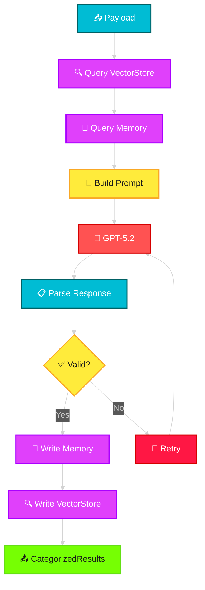

#### Bidirectional Memory Interaction

This is a critical design element. The Summarizer **reads from** Memory and Vector Store to enrich its context, and **writes back** to persist learnings:

| Direction | Target | What |
|---|---|---|
| **Read** from Vector Store | Retrieve top-K similar past incidents by semantic similarity to current raw data |
| **Read** from Memory Manager | Load current session state, any partial results from previous runs, and cross-incident learnings |
| **Write** to Vector Store | Index embeddings of the newly categorized content for future retrieval |
| **Write** to Memory Manager | Persist the current processing stage, generated categories, and any new learnings |

#### LLM Prompt Design

```
System: You are an Incident Categorization Agent for a cloud infrastructure 
incident management system. Your role is to analyze raw incident data and 
categorize it into three domains: Noise, Impact, and Mitigation.

Context:
- Similar past incidents: {vector_store_results}
- Session history: {memory_state}

Instructions:
1. Read all provided incident data carefully
2. Identify and extract NOISE signals (irrelevant, duplicate, or low-value entries)
3. Identify and extract IMPACT signals (business impact, customer impact, SLA breaches)
4. Identify and extract MITIGATION signals (actions taken, runbook references, resolution steps)
5. For each category, produce a structured summary

Output Format (JSON):
{
  "noise_signals": [...],
  "impact_signals": [...], 
  "mitigation_signals": [...],
  "cross_category_notes": "...",
  "confidence_score": 0.0-1.0
}
```

#### Output Contract

```json
{
  "session_id": "...",
  "incident_id": "...",
  "categorization": {
    "noise_signals": [
      { "content": "...", "source": "email", "confidence": 0.92, "reason": "duplicate notification" }
    ],
    "impact_signals": [
      { "content": "...", "source": "log", "confidence": 0.88, "severity": "sev2", "affected_service": "VM Scale Set" }
    ],
    "mitigation_signals": [
      { "content": "...", "source": "chat", "confidence": 0.95, "action_type": "restart", "runbook_ref": "RB-4501" }
    ]
  },
  "overall_confidence": 0.91,
  "token_usage": { "prompt": 2400, "completion": 800 },
  "similar_incidents_used": ["INC-2025-009812", "INC-2025-011023"]
}
```

---

### 4.5 Memory Manager

> **Purpose**: Manages short-term (session) and long-term (cross-incident) memory with stage management. Provides contextual awareness across the full pipeline.

#### What It Does
The Memory Manager is a **two-tier memory system** that gives agents the ability to remember within a session (short-term) and learn across incidents (long-term).

#### Memory Architecture

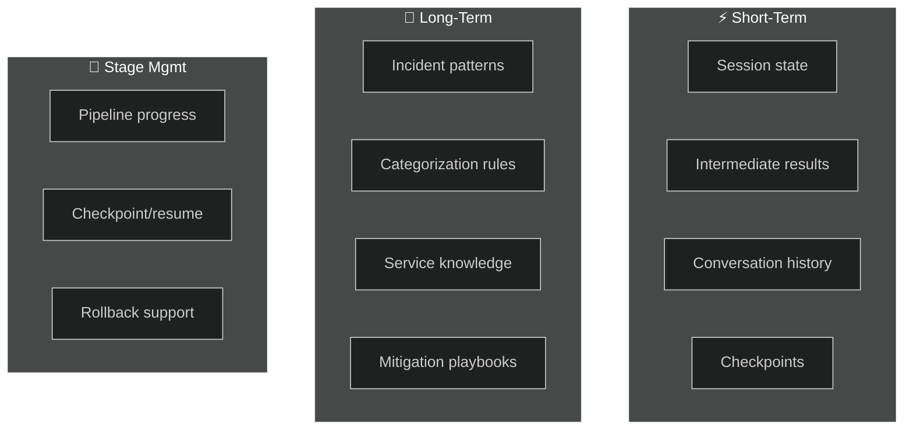

#### Key Operations

| Operation | Scope | Description |
|---|---|---|
| `read_session(session_id)` | Short-term | Retrieve current session state and all intermediate results |
| `write_session(session_id, data)` | Short-term | Update session state (append, not overwrite) |
| `read_knowledge(query, top_k)` | Long-term | Retrieve relevant cross-incident learnings |
| `write_knowledge(incident_id, learnings)` | Long-term | Persist new learnings after incident resolution |
| `get_stage(session_id)` | Stage | Return current pipeline stage |
| `set_stage(session_id, stage)` | Stage | Advance pipeline stage (validates transitions) |
| `checkpoint(session_id)` | Stage | Save full state snapshot for rollback |

#### Stage State Machine

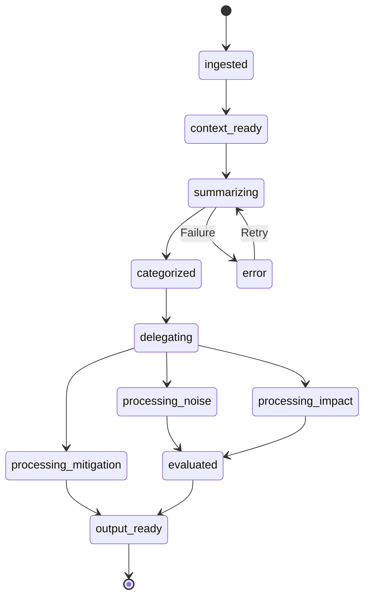

#### Azure Mapping
| Memory Tier | Azure Service | TTL |
|---|---|---|
| Short-term | Azure Cache for Redis | 24 hours |
| Long-term | Azure Cosmos DB (NoSQL) | Indefinite |
| Checkpoints | Azure Blob Storage | 7 days |

---

### 4.6 Vector Store

> **Purpose**: Stores and retrieves semantic embeddings for similarity search across incident data, enabling knowledge retrieval and contextual enrichment.

#### What It Does
The Vector Store maintains a searchable index of **embedding vectors** generated from past incidents, runbooks, and mitigation playbooks. It enables agents to find semantically similar content rather than relying on exact keyword matches.

#### Embedding Pipeline


#### Key Operations

| Operation | Description |
|---|---|
| `index(doc_id, text, metadata)` | Generate embedding and upsert into vector index |
| `search(query_text, top_k, filters)` | Embed query, find top-K similar documents by cosine similarity |
| `search_with_rerank(query, top_k)` | Hybrid search: vector similarity + BM25 keyword, then re-rank |
| `delete(doc_id)` | Remove document from index |
| `batch_index(documents[])` | Bulk indexing for historical data backfill |

#### Indexed Content Types

| Content Type | Fields Indexed | Metadata |
|---|---|---|
| Past incidents | Summary, root cause, resolution | `incident_id`, `severity`, `service`, `date` |
| Runbooks | Steps, prerequisites, commands | `runbook_id`, `service`, `version` |
| Mitigation playbooks | Action sequences, rollback steps | `playbook_id`, `scenario_type` |
| Categorized signals | Noise/Impact/Mitigation summaries | `session_id`, `category`, `confidence` |

#### Azure Mapping
| Component | Azure Service |
|---|---|
| Vector index | Azure AI Search (vector search profile) |
| Embedding model | Azure OpenAI `text-embedding-3-large` |
| Document store | Azure Cosmos DB (source docs) |

---

### 4.7 Aggregated Results Layer

> **Purpose**: Collects structured documents (Impact, Mitigation, Noise) from the Summarizer Agent, applies re-ranking for relevance, and presents a unified result set to the Supervisor Agent.

#### What It Does
The Aggregated Results Layer is a **collection and ranking module** (no LLM). It receives the categorized output from the Summarizer and organizes it into a ranked, structured format that the Supervisor can efficiently delegate.

#### Processing Logic

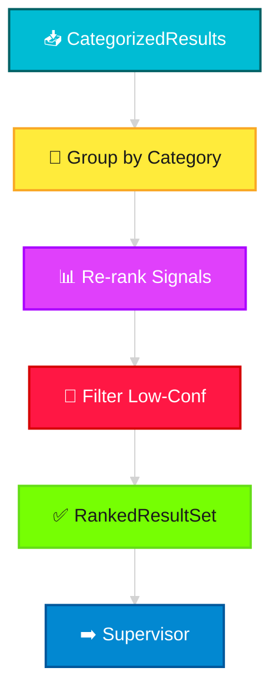

#### Re-ranking Algorithm

The re-ranker computes a composite score for each signal:

```
score = (w1 × confidence) + (w2 × severity_weight) + (w3 × recency_decay) + (w4 × source_reliability)
```

| Factor | Weight (default) | Description |
|---|---|---|
| `confidence` | 0.35 | AI confidence from Summarizer |
| `severity_weight` | 0.30 | Mapped from severity level (sev0=1.0, sev1=0.8, sev2=0.5, sev3=0.3) |
| `recency_decay` | 0.20 | Exponential decay based on signal age |
| `source_reliability` | 0.15 | Configured per source type (logs=0.9, chat=0.7, email=0.6) |

---

### 4.8 Supervisor Agent

> **Purpose**: The central orchestrator. Validates incoming structured data, classifies it into workflow domains, and delegates to the appropriate specialized agents through guardrails.

#### What It Does
The Supervisor Agent is the **brain** of the system. It receives ranked results from the Aggregated Results Layer, validates them against expected schemas, and routes each to the matching workflow agent via its guardrail. Implemented as a **MAF Workflow Orchestration** using declarative YAML, it supports both **sequential** and **concurrent** orchestration patterns. It can delegate work to Foundry **connected agents** for cross-agent coordination.

#### Delegation Logic

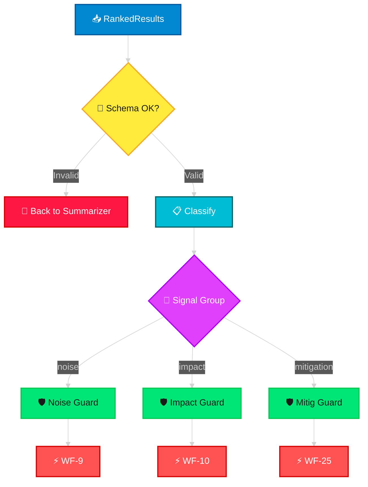

#### Delegation Rules

| Condition | Action | Priority |
|---|---|---|
| `noise_signals.count > 0` | Delegate to WF-9 | Normal |
| `impact_signals.count > 0` | Delegate to WF-10 | High |
| `mitigation_signals.count > 0` | Delegate to WF-25 | Critical |
| `overall_confidence < 0.5` | Flag for human review, still delegate | — |
| All categories empty | Reject — return to Input Layer for re-ingestion | — |

#### Parallel vs Sequential Delegation
- By default, all three workflow agents are invoked **in parallel** using MAF's **concurrent orchestration** pattern (they are independent)
- **Exception**: If the Mitigation Agent depends on Impact Agent output (e.g., severity-driven mitigation), the Supervisor enforces MAF **sequential orchestration**: Impact → then → Mitigation

#### Connection Points
- **Reads from**: Aggregated Results Layer (ranked results)
- **Writes to**: Guardrails (noise, impact, mitigation data)
- **Dotted line to**: Safety & Governance (all delegated data passes through PII/safety checks)
- **Dotted line to**: Memory Manager (retrieves session state)

---

### 4.9 Guardrails & Gatekeeping

> **Purpose**: Validate, sanitize, and gate data before it reaches each specialized workflow agent. Prevents malformed, unsafe, or irrelevant inputs from consuming expensive LLM resources.

#### What It Does
Each workflow agent (Noise, Impact, Mitigation) has a dedicated guardrail in front of it. Guardrails are **non-AI, rule-based validation layers** that enforce input quality, safety, and compliance.

#### Three Guardrails

| Guardrail | Protects | Key Checks |
|---|---|---|
| **Noise Guardrails & Gatekeeper** | WF-9 Noise Agent | - Input is categorized<br/>- Contains noise signals<br/>- Not empty payload<br/>- PII masked |
| **Impact Guardrails & Gatekeeper** | WF-10 Impact Agent | - Impact signals present<br/>- Severity field populated<br/>- Affected service identified<br/>- Data freshness < 24h |
| **Mitigation Guardrails & Gatekeeper** | WF-25 Mitigation Agent | - Mitigation signals present<br/>- Not a duplicate mitigation request<br/>- Authorized caller<br/>- Action safety check (no destructive operations without approval) |

#### Guardrail Processing Flow

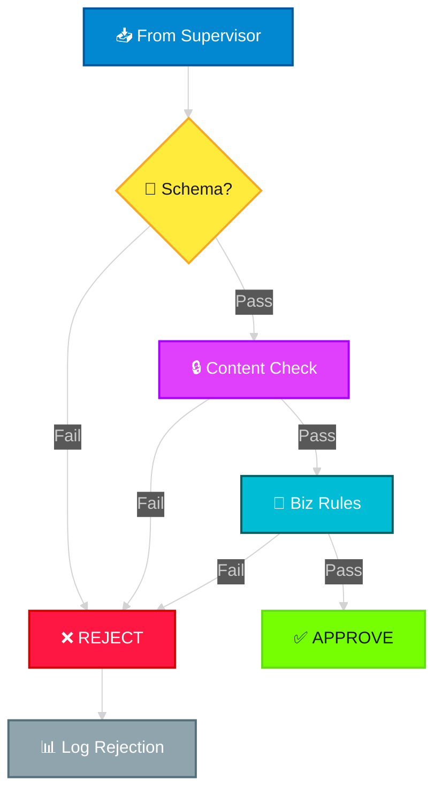

#### Guardrail Rejection Response

```json
{
  "status": "rejected",
  "guardrail": "impact_guardrail",
  "reason": "missing_field",
  "details": "Field 'affected_service' is required for impact assessment",
  "suggestion": "Re-run Summarizer with service extraction emphasis",
  "timestamp": "2026-02-10T17:05:00Z"
}
```

---

### 4.10 WF-9 Noise Agent

> **Purpose**: Filter noise from incident data. Identify irrelevant, duplicate, or low-value entries and produce a cleaned, filtered timeline.

#### What It Does
The Noise Agent receives categorized noise signals and applies a multi-pass filtering process using GPT-5.2 (via **Foundry Agent Service**) to separate genuine incident signals from noise. It produces a **Filtered Timeline** — a chronological, noise-free narrative of the incident. Deployed as a **Foundry Hosted Agent** with custom tools.

#### Processing Pipeline

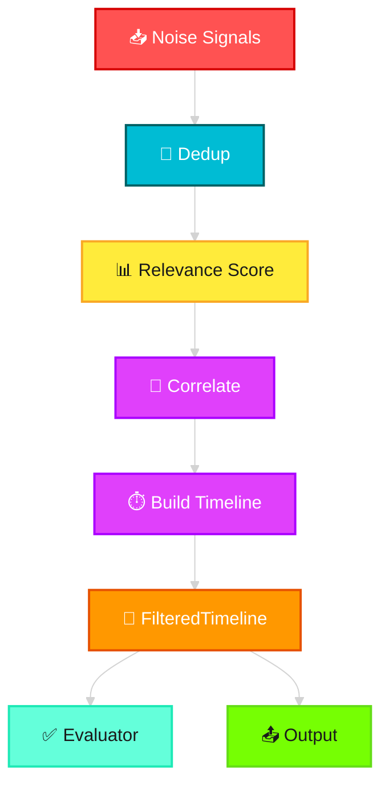

#### Noise Classification Categories

| Category | Description | Action |
|---|---|---|
| **Duplicate** | Same information repeated across sources | Merge into single entry, note sources |
| **Auto-generated** | System health checks, heartbeats, non-error monitoring | Remove unless correlated with timeline |
| **Out-of-scope** | Unrelated conversations, tangential discussions | Remove with annotation |
| **Low-signal** | Acknowledgment messages ("ok", "thanks", "got it") | Remove |
| **Genuine** | Real incident signal, keep in timeline | Retain and order chronologically |

#### LLM Prompt Design

```
System: You are a Noise Filter Agent. Your job is to distinguish genuine 
incident signals from noise in incident communication data.

For each entry, classify as: GENUINE, DUPLICATE, AUTO_GENERATED, OUT_OF_SCOPE, or LOW_SIGNAL.
For GENUINE entries, extract: timestamp, actor, action, significance.
```

#### Output Contract: FilteredTimeline

```json
{
  "incident_id": "INC-2026-001234",
  "filtered_timeline": [
    {
      "sequence": 1,
      "timestamp": "2026-02-10T16:30:00Z",
      "actor": "Monitoring System",
      "action": "Alert triggered",
      "content": "CPU > 95% on vm-prod-west-03",
      "significance": "high",
      "source": "log"
    },
    {
      "sequence": 2,
      "timestamp": "2026-02-10T16:32:00Z",
      "actor": "Alice (On-Call)",
      "action": "Acknowledged",
      "content": "Investigating CPU spike on vm-prod-west-03",
      "significance": "medium",
      "source": "chat"
    }
  ],
  "noise_removed": {
    "total_entries_input": 47,
    "entries_removed": 31,
    "removal_breakdown": {
      "duplicate": 12,
      "auto_generated": 8,
      "out_of_scope": 6,
      "low_signal": 5
    }
  }
}
```

---

### 4.11 WF-10 Impact Agent

> **Purpose**: Assess the business and technical impact of an incident. Produce a factual, structured impact summary report.

#### What It Does
The Impact Agent analyzes impact signals to quantify and qualify the incident's effect on customers, services, SLAs, and business operations. It produces an **Impact Summary** — a factual report with severity scoring and blast radius analysis. Deployed as a **Foundry Hosted Agent**.

#### Processing Pipeline

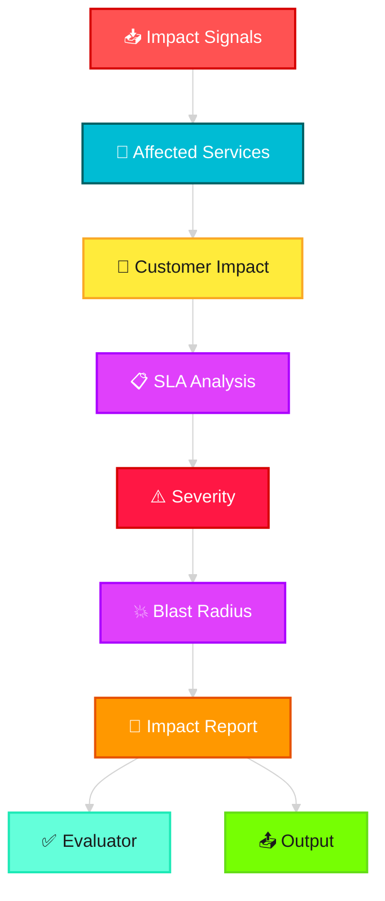

#### Impact Assessment Dimensions

| Dimension | Metrics | Data Sources |
|---|---|---|
| **Customer Impact** | Users affected, error rate increase, feature degradation | Logs, monitoring dashboards |
| **Service Impact** | Services down/degraded, dependency chain depth | Service tree, dependency graph |
| **SLA Impact** | SLA breach status, time-to-breach, penalty exposure | SLA definitions, uptime data |
| **Business Impact** | Revenue impact estimate, brand reputation risk | Business rules, customer tier data |
| **Geographic Impact** | Affected regions, data center scope | Regional deployment data |

#### Output Contract: ImpactSummary

```json
{
  "incident_id": "INC-2026-001234",
  "severity": "sev2",
  "severity_justification": "Multi-region customer impact with SLA breach risk",
  "impact_assessment": {
    "customer_impact": {
      "users_affected": 12500,
      "affected_percentage": 3.2,
      "regions": ["West US", "East US"],
      "impact_type": "degraded_performance"
    },
    "service_impact": {
      "primary_service": "Azure VM Scale Sets",
      "affected_dependencies": ["Load Balancer", "Azure Monitor"],
      "degradation_level": "partial"
    },
    "sla_impact": {
      "sla_at_risk": "99.95% monthly uptime",
      "current_downtime_minutes": 18,
      "breach_threshold_minutes": 22,
      "time_to_breach": "4 minutes"
    },
    "business_impact": {
      "estimated_revenue_impact": "medium",
      "customer_tier_affected": ["enterprise", "standard"]
    }
  },
  "blast_radius": {
    "depth": 2,
    "affected_services": ["VM Scale Sets", "Load Balancer", "Azure Monitor"],
    "visualization": "dependency_graph_url"
  }
}
```

---

### 4.12 WF-25 Mitigation Agent

> **Purpose**: Orchestrate mitigation workflows. Produce a step-by-step action plan for incident resolution, incorporating runbook knowledge and past resolution patterns.

#### What It Does
The Mitigation Agent is the most **action-oriented** agent in the system, deployed as a **Foundry Hosted Agent** with Azure Functions tool bindings. It takes mitigation signals, retrieves relevant runbooks from the Vector Store, and generates a comprehensive mitigation action plan. Unlike the other agents, the Mitigation Agent's output **bypasses the Evaluator** and goes directly to the Output Layer (as shown in the architecture diagram) — because mitigation actions need to be delivered with urgency.

#### Processing Pipeline

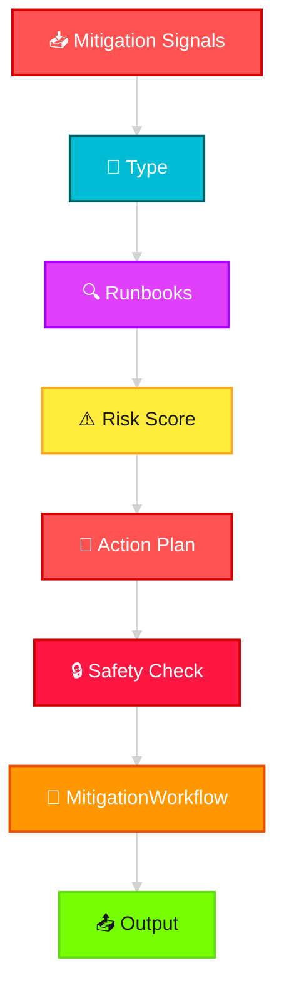

#### Mitigation Action Types

| Type | Description | Risk Level | Requires Approval |
|---|---|---|---|
| **Restart** | Restart affected service/VM | Medium | No |
| **Scale-out** | Add capacity to handle load | Low | No |
| **Failover** | Switch to secondary region | High | Yes |
| **Rollback** | Revert recent deployment | High | Yes |
| **Config Change** | Modify runtime configuration | Medium | Yes |
| **Isolation** | Isolate affected component | Medium | No |

#### Output Contract: MitigationWorkflow

```json
{
  "incident_id": "INC-2026-001234",
  "action_plan": {
    "strategy": "scale_and_restart",
    "estimated_resolution_time": "15 minutes",
    "steps": [
      {
        "step": 1,
        "action": "Scale out VM Scale Set by 4 instances",
        "type": "scale_out",
        "risk": "low",
        "requires_approval": false,
        "command": "az vmss scale --name prod-vmss-west --new-capacity 12",
        "rollback": "az vmss scale --name prod-vmss-west --new-capacity 8",
        "estimated_time": "3 minutes"
      },
      {
        "step": 2,
        "action": "Restart unhealthy instances",
        "type": "restart",
        "risk": "medium",
        "requires_approval": false,
        "command": "az vmss restart --name prod-vmss-west --instance-ids 3 7",
        "rollback": "N/A (non-destructive)",
        "estimated_time": "5 minutes"
      }
    ],
    "runbook_references": ["RB-4501", "RB-4502"],
    "similar_resolutions": ["INC-2025-009812 (resolved in 12 min)"]
  }
}
```

---

### 4.13 Evaluator

> **Purpose**: Assess the quality of agent outputs (Noise and Impact). Provides a feedback loop for continuous improvement and catches hallucinations or low-quality results before they reach the Output Layer.

#### What It Does
The Evaluator receives outputs from **WF-9 Noise Agent** and **WF-10 Impact Agent** (not WF-25 Mitigation, which bypasses evaluation for urgency). It uses LLM-based evaluation to score outputs across multiple quality dimensions.

#### Evaluation Dimensions

| Dimension | Description | Scoring |
|---|---|---|
| **Factual Accuracy** | Are the claims supported by the input data? | 0.0 — 1.0 |
| **Completeness** | Does the output cover all significant signals? | 0.0 — 1.0 |
| **Hallucination Check** | Are there fabricated facts not in the source? | binary: pass/fail |
| **Consistency** | Does the output contradict itself? | binary: pass/fail |
| **Format Compliance** | Does the output match the required schema? | binary: pass/fail |

#### Evaluation Flow

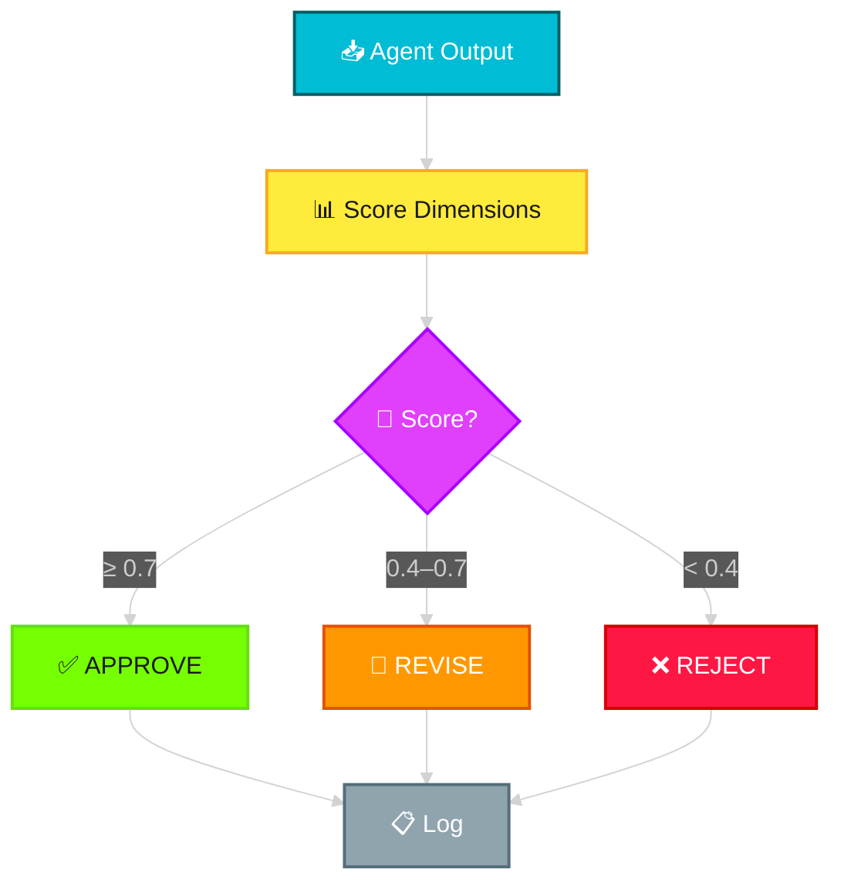

#### Evaluation Response

```json
{
  "evaluation_id": "eval-uuid",
  "source_agent": "wf9_noise_agent",
  "verdict": "approved",
  "composite_score": 0.87,
  "dimension_scores": {
    "factual_accuracy": 0.92,
    "completeness": 0.85,
    "hallucination_check": "pass",
    "consistency": "pass",
    "format_compliance": "pass"
  },
  "feedback": "Timeline is well-structured with accurate chronological ordering. Minor: consider merging entries #3 and #7 which reference the same alert.",
  "token_usage": { "prompt": 3200, "completion": 400 }
}
```

---

### 4.14 Output Layer

> **Purpose**: Final presentation layer. Formats and delivers three structured outputs: Filtered Timeline, Impact Summary, and Mitigation Workflow.

#### What It Does
The Output Layer receives validated outputs and formats them into their final deliverable form. It is a **formatting and delivery layer** — no AI processing.

#### Three Outputs

| Output | Source | Format |
|---|---|---|
| **Noise Workflow Outputs — Filtered Timeline** | WF-9 Noise Agent → Evaluator | Chronological timeline document |
| **Impact Summary — Factual Report** | WF-10 Impact Agent → Evaluator | Structured impact report |
| **Mitigation Workflow — Action Plan** | WF-25 Mitigation Agent (direct) | Step-by-step action plan |

#### Delivery Channels

| Channel | Format | Use Case |
|---|---|---|
| REST API | JSON response | Programmatic consumption |
| ICM Portal | Rendered HTML/Markdown | Human review in IcM |
| Email notification | HTML email | Stakeholder communication |
| Teams/Slack | Adaptive Card / Block Kit | Real-time incident channel |

#### Connection to Deployment Model
The Deployment Model has an **Overlays** connection to the Output Layer, meaning the deployment configuration (dev/staging/prod) controls which delivery channels are active, API endpoints, and formatting templates.

---

## 5. Cross-Cutting Concerns

---

### 5.1 Safety & Governance

> **Purpose**: Ensure all data processing complies with AI governance policies. Protect against data leaks, PII exposure, prompt injection attacks, and jailbreak attempts. This layer wraps the **entire pipeline**.

#### Two Pillars

#### 5.1.1 AI Governance

| Concern | Implementation |
|---|---|
| **Data Control** | All incident data classified by sensitivity level. Access control enforced per classification. |
| **PII Redaction** | Microsoft Presidio detects and masks PII (names, emails, phone numbers, IP addresses) at ingestion. Downstream agents never see raw PII. |
| **Data Masking** | Configurable masking rules: full redaction, partial masking (show last 4 digits), or tokenized replacement. |
| **Data Protection** | Encryption at rest (AES-256) and in transit (TLS 1.3). Azure Key Vault for secrets management. |

#### PII Redaction Pipeline


#### 5.1.2 Responsible AI

| Concern | Implementation |
|---|---|
| **Prompt Injection Defense** | Input sanitization layer strips known injection patterns. Delimiter-based prompt isolation. System prompts marked as privileged. |
| **Jailbreak Defense** | Output classification detects jailbreak attempts. Rate limiting on unusual input patterns. Canary tokens in system prompts. |
| **Content Safety** | Azure AI Content Safety screens inputs and outputs for harmful content categories. |
| **Bias Detection** | Periodic model output audits for decision bias across incident severity and service categories. |

---

### 5.2 Observability & Control

> **Purpose**: Full observability into system behavior, agent performance, cost management, and operational health. Connected to all modules via dotted-line (non-blocking) connections.

#### Four Pillars

| Pillar | Module | What It Tracks |
|---|---|---|
| **Error Handling** | Structured errors | Error types, retry counts, circuit breaker states, dead-letter queue |
| **Run History** | Audit trail | Every agent invocation with full input/output, timestamps, latency, decisions made |
| **Health Check** | System health | Module availability, API response times, queue depths, agent readiness |
| **Cost Control** | Token/cost tracking | Token usage per request, per agent, per incident. Budget alerts, rate limiting |

#### Error Handling Strategy

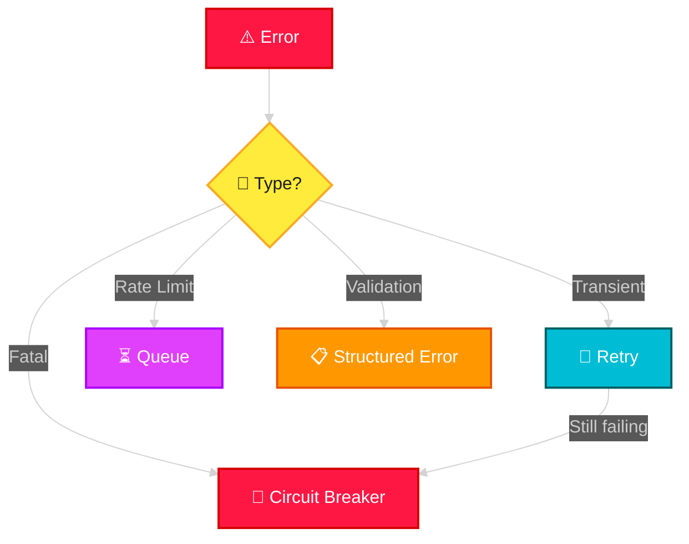

#### Cost Control Model

```json
{
  "cost_tracking": {
    "per_request": {
      "incident_id": "INC-2026-001234",
      "total_tokens": 14200,
      "total_cost_usd": 0.087,
      "breakdown": {
        "summarizer": { "tokens": 3200, "cost": 0.020 },
        "noise_agent": { "tokens": 2800, "cost": 0.017 },
        "impact_agent": { "tokens": 4100, "cost": 0.025 },
        "mitigation_agent": { "tokens": 2500, "cost": 0.015 },
        "evaluator": { "tokens": 1600, "cost": 0.010 }
      }
    },
    "budget": {
      "daily_limit_usd": 500,
      "monthly_limit_usd": 10000,
      "alert_threshold": 0.80
    }
  }
}
```

#### Azure Mapping
| Pillar | Azure Service |
|---|---|
| Telemetry & Logging | Azure Monitor + Application Insights |
| Alerting | Azure Monitor Alerts |
| Dashboard | Azure Workbooks / Grafana |
| Cost tracking | Custom metrics in Application Insights |

---

### 5.3 Deployment Model

> **Purpose**: Multi-environment deployment strategy ensuring environment parity and safe progressive rollout.

#### Environments

| Environment | Purpose | LLM Endpoint | Data |
|---|---|---|---|
| **Dev** | Development and experimentation | GPT-4o (cost-optimized) | Synthetic incidents |
| **Staging** | Pre-production validation | GPT-5.2 (same as prod) | Anonymized real incidents |
| **Prod** | Live production | GPT-5.2 (production SKU) | Real incidents |

#### Overlays Architecture
The Deployment Model connects to both Input Layer and Output Layer via **Overlays** connections:
- **Input Overlay**: Controls which data sources are active (dev uses synthetic, prod uses real)
- **Output Overlay**: Controls which delivery channels are active (dev uses logging only, prod uses all channels)

#### Deployment Strategy

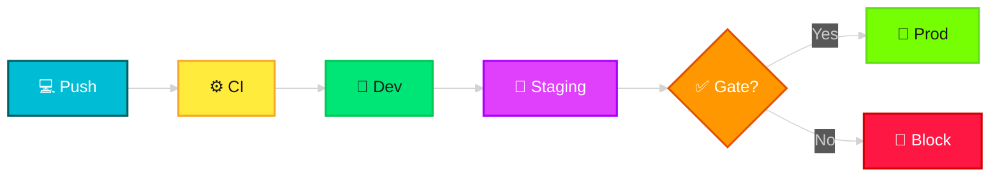

---

## 6. Data Contracts & Schemas

### 6.1 Inter-Module Message Envelope

Every message between modules is wrapped in a standard envelope:

```json
{
  "message_id": "uuid-v4",
  "session_id": "uuid-v4",
  "incident_id": "INC-2026-001234",
  "source_module": "summarizer_agent",
  "target_module": "aggregated_results",
  "timestamp": "2026-02-10T17:05:00Z",
  "stage": "categorized",
  "payload": { "...module-specific data..." },
  "metadata": {
    "trace_id": "uuid-v4",
    "span_id": "uuid-v4",
    "token_usage": { "prompt": 0, "completion": 0 },
    "latency_ms": 1200
  }
}
```

### 6.2 Contract Summary

| From → To | Schema Name | Key Fields |
|---|---|---|
| Input → Context Manager | `IncidentPayload` | `incident_id`, `source_type`, `parsed_fields`, `pii_tags` |
| Context Manager → Tool Router | `ContextualizedPayload` | `session_id`, `current_stage`, `incident_metadata` |
| Summarizer → Aggregated Results | `CategorizedResults` | `noise_signals[]`, `impact_signals[]`, `mitigation_signals[]` |
| Aggregated Results → Supervisor | `RankedResultSet` | Ranked signals grouped by category |
| Supervisor → Guardrails | `DelegationRequest` | `target_workflow`, `signal_data`, `priority` |
| Guardrails → Agents | `ValidatedInput` | `signal_data` (validated and sanitized) |
| Noise Agent → Evaluator/Output | `FilteredTimeline` | `timeline_entries[]`, `noise_removed` |
| Impact Agent → Evaluator/Output | `ImpactSummary` | `severity`, `impact_assessment`, `blast_radius` |
| Mitigation Agent → Output | `MitigationWorkflow` | `action_plan`, `steps[]`, `runbook_references` |
| Evaluator → Output | `EvaluationResult` | `verdict`, `composite_score`, `feedback` |

---

## 7. Technology Stack

| Layer | Technology | Justification |
|---|---|---|
| **Language** | Python 3.12+ | Rich AI/ML ecosystem, MAF SDK support |
| **LLM** | Azure OpenAI GPT-5.2 (via Foundry) | Latest model with best reasoning capabilities, deployed through Foundry model catalog |
| **Embeddings** | Azure OpenAI `text-embedding-3-large` | 1536-dim, optimized for retrieval |
| **Agent Platform** | Azure AI Foundry Agent Service | Managed agent runtime with conversation state, tool orchestration, content filters, and observability |
| **Agent Framework** | Microsoft Agent Framework (MAF) | Declarative workflows (YAML), connected agents, sequential/concurrent/handoff/magentic orchestration patterns |
| **Agent Hosting** | Foundry Hosted Agents | Containerized agents on managed pay-as-you-go infrastructure with auto-scaling, hosting adapter |
| **Interoperability** | A2A Protocol + MCP | Agent-to-Agent communication and Model Context Protocol for cross-agent tool sharing |
| **Vector Search** | Azure AI Search | Managed vector index with hybrid search, integrated as Foundry knowledge tool |
| **Short-term Memory** | Azure Cache for Redis | Sub-ms latency for session state |
| **Long-term Memory** | Azure Cosmos DB (NoSQL) | Global distribution, low latency reads, Foundry conversation storage |
| **PII Detection** | Microsoft Presidio | Open-source, customizable PII engine |
| **Content Safety** | Azure AI Content Safety | Managed content classification, integrated with Foundry content filters |
| **Observability** | Azure Monitor + Application Insights | Unified telemetry, alerting, dashboards, Foundry Agent tracing integration |
| **Secret Management** | Azure Key Vault | HSM-backed key and secret storage |
| **Compute** | Foundry Hosted Agents (primary) + Azure Container Apps (auxiliary) | Foundry manages agent containers; ACA for non-agent microservices |
| **CI/CD** | GitHub Actions + Azure Developer CLI (`azd`) | Native Azure deployment integration, Foundry agent deployment via `azd` |
| **IaC** | Terraform + Bicep | Multi-environment infrastructure management |

### 7.1 Reference Links

| Resource | URL |
|---|---|
| Azure AI Foundry Agent Service Overview | [learn.microsoft.com](https://learn.microsoft.com/en-us/azure/ai-foundry/agents/overview) |
| Create and Manage Foundry Agents (Quickstart) | [learn.microsoft.com](https://learn.microsoft.com/en-us/azure/ai-foundry/agents/quickstart?view=foundry-classic) |
| Hosted Agents Concept | [learn.microsoft.com](https://learn.microsoft.com/en-us/azure/ai-foundry/agents/concepts/hosted-agents?view=foundry) |
| AI Agent Orchestration Patterns | [learn.microsoft.com](https://learn.microsoft.com/en-us/azure/architecture/ai-ml/guide/ai-agent-design-patterns) |
| MAF Workflow Orchestrations | [learn.microsoft.com](https://learn.microsoft.com/en-us/agent-framework/user-guide/workflows/orchestrations/overview) |
| MAF Declarative Workflow Samples | [github.com](https://github.com/microsoft/agent-framework/tree/main/workflow-samples) |

---

*End of Document*
